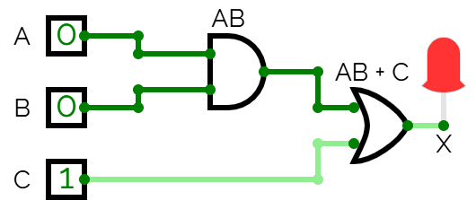

# Appendix A - Större nät och multiplexrar

## A.1 Karnaughdiagram: från sanningstabell till minimerat grindnät
Att läsa av en summa-av-produkter-ekvation direkt ur en sanningstabell, så som
[L01 A.2](../../L01/appendix/a_combinational_logic.md#a2-boolesk-algebra-som-notation) gjorde, fungerar
alltid men ger sällan det minsta nätet: varje `1`-rad blir en egen AND-term, även när flera rader
delar de flesta av sina ingångar och skulle kunna slås ihop.

Ett **Karnaughdiagram** (K-diagram) gör de gemensamma mönstren synliga för hand, för funktioner av 2
till 4 variabler, utan någon formell manipulation av boolesk algebra. Ett genomarbetat exempel
följer; mer övning finns i [Appendix B](./b_exercises.md), och klassisk minimeringsteori
(don't-cares, Quine-McCluskey) ligger utanför kursen.

Idén är att lägga ut sanningstabellen som ett rutnät i stället för som en lista, och ordna
rubrikerna så att varje ruta skiljer sig från var och en av sina grannar i sidled och i höjdled i
exakt ett ingångsvärde, även runt kanterna vänster/höger och upp/ner. Den ordningen är **Graykod**:
för två bitar `00, 01, 11, 10`, där bara en bit ändras i varje steg, inklusive från den sista posten
tillbaka till den första.

Sedan:
1. Skriv en `1` i varje ruta där utgången är `1`, och lämna resten tomma.
2. Rita rektangulära grupper runt `1`:orna:
   * Varje grupp måste vara en rektangel vars bredd och höjd var för sig är en tvåpotens (1, 2
     eller 4), så att också dess storlek är en tvåpotens.
     * en grupp om 4 är alltså antingen en 1x4-linje eller ett 2x2-block, och båda är tillåtna.
     * rutor som bara möts i ett hörn är ingen rektangel, så de kan inte grupperas.
   * Grupper får överlappa, och får gå runt en kant av rutnätet.
3. Gör varje grupp så stor som möjligt, och täck varje `1` minst en gång. En grupp om 1 behåller
   alla sina ingångar i termen, en grupp om 2 stryker en, en grupp om 4 stryker två, och så vidare.
   * Använd sedan så få grupper som räcker: stryk varje grupp vars rutor allihop redan täcks av en
     annan. Ingenting ovan förbjuder en överflödig grupp, och en överflödig grupp är en överflödig
     AND-term i svaret, korrekt men inte minimal.
4. Behåll för varje grupp bara den eller de ingångar som har samma värde i varje ruta i gruppen,
   stryk resten, och skriv det som en AND-term:
   * skriv en behållen ingång direkt om det konstanta värdet är `1`, och primmad om det är `0`.
   * en grupp som bara täcker rutor där `B = 0` bidrar alltså med termen `B'`.
5. `X` är alla gruppernas termer OR:ade med varandra.

### Genomarbetat exempel
Tre ingångar `A`, `B`, `C`, en utgång `X`:

| A | B | C | X |
|---|---|---|---|
| 0 | 0 | 0 | 0 |
| 0 | 0 | 1 | 1 |
| 0 | 1 | 0 | 0 |
| 0 | 1 | 1 | 1 |
| 1 | 0 | 0 | 0 |
| 1 | 0 | 1 | 1 |
| 1 | 1 | 0 | 1 |
| 1 | 1 | 1 | 1 |

Lägg ut den med `AB` i Graykod nedåt i raderna och `C` i sidled i kolumnerna, och fyll i en `1`
överallt där `X = 1`:


Hela `C = 1`-kolumnen är fyra `1`:or, en grupp om 4. Varje ruta delar `C = 1` och inget annat är
konstant (`A` och `B` varierar båda), så den reduceras till envariabeltermen `C`:


En `1` är fortfarande inte täckt, på raden `AB = 11`. Gruppera den med sin granne till höger, som
`C`-gruppen redan täcker. Båda rutorna i paret delar `A = 1` och `B = 1`, och `C` varierar, så det
reduceras till `AB`:


Varje `1` är nu täckt; rutan `AB = 11, C = 1` ligger i båda grupperna, och överlapp är i sin
ordning. Summeringen ger:

```text
X = AB + C
```

Att läsa sanningstabellen direkt, på L01-vis, hade gett fem AND-termer, en per `1`-rad.
K-diagrammet hittade en likvärdig ekvation med två termer, vilket är hela värdet av att göra det
här för hand.

### Att realisera nätet
`X = AB + C` är två grindar: en `AND` som beräknar `AB` och matar en `OR` vars andra ingång är `C`.



Du bygger det här nätet för hand i CircuitVerse under föreläsningen, precis som du byggde
`or_gate`s nät i L01, och översätter det till VHDL i A.2.

---

## A.2 Att översätta Karnaughdiagrammets nät till VHDL
`X = AB + C` översätts rakt av till VHDL. Tre ingångar, en utgång:

```vhdl
library ieee;
use ieee.std_logic_1164.all;

entity gate_network is
    port(a, b, c: in std_logic;
         x      : out std_logic);
end entity;
```

Arkitekturen använder en intern signal `ab` för att hålla `AND`-grindens utgång, och speglar
tvågrindsnätet ett till ett:

```vhdl
architecture behaviour of gate_network is
signal ab: std_logic;
begin
    -- AND gate: AB.
    ab <= a and b;

    -- OR gate: AB + C.
    x <= ab or c;
end architecture;
```

Utan mellansignalen slås det ihop till `x <= (a and b) or c;`. Båda är lika giltiga och syntetiseras
till samma hårdvara; använd den som är mest läsbar för nätet du har framför dig.

Den byggbara versionen i [`../gate_network/gate_network.vhd`](../gate_network/gate_network.vhd)
använder den hopslagna formen, eftersom det vid två grindar inte finns något att vinna på att
namnge mellansignalen. Öppna den vid sidan av versionen ovan och övertyga dig om att de beskriver
samma krets; det är påståendet det här avsnittet gör, och det kostar inget att kontrollera.

För att köra den på hårdvara, tilldela portarna till strömbrytare och en lysdiod med DE0-CV:s pin
planner ([info/quartus_workflow.md](../../../info/quartus_workflow.md)). Ingenting här beror på
specifika pinnummer.

---

## A.3 `std_logic_vector`: mer än en ledning
Allt hittills har varit `std_logic`, en ledning som bär en bit. Att bunta ihop flera ledningar under
ett namn är vad `std_logic_vector` är till för.

```vhdl
signal count: std_logic_vector(3 downto 0);
```

Det deklarerar fyra ledningar: `count(3)` ner till `count(0)`. Intervallet är `3 downto 0` snarare
än `0 to 3` så att biten längst till vänster är den mest signifikanta, så som du skulle skriva talet
på papper. Kursen använder `downto` överallt, och det gör nästan all VHDL du kommer att möta.

En vektor är en porttyp som vilken annan som helst:

```vhdl
entity display is
    port(number: in  std_logic_vector(3 downto 0);
         hex   : out std_logic_vector(6 downto 0));
end entity;
```

### Värden
En enskild bit tar enkla citattecken, en vektor dubbla:

```vhdl
x     <= '1';                -- std_logic: one bit
count <= "1010";             -- std_logic_vector(3 downto 0): four bits
count <= (others => '0');    -- every bit '0', whatever the width
```

Den sista är ett *aggregat*: `(others => '0')` betyder "alla återstående bitar är `'0'`", och
eftersom ingen namngavs individuellt är det allihop. Det fortsätter fungera när bredden ändras, och
det dyker upp genom hela resten av kursen.

### Indexering och slicing
En bit ur en vektor är en `std_logic`; en sammanhängande följd är en *slice*, som själv är en
vektor:

```vhdl
carry     <= count(3);
high_half <= input(7 downto 4);
```

Slicing är hur en bred port matar flera smalare, vilket är vad A.6:s tvåsiffriga display gör med
sina åtta strömbrytaringångar.

En detalj är inte vad en mjukvaruutvecklare väntar sig. `input(7 downto 4)` har indexintervallet
`7 downto 4`, inte `3 downto 0`. Kopplad till en port deklarerad `std_logic_vector(3 downto 0)`
matchas de två **positionellt, från vänster till höger**, inte efter indexnummer: `input(7)` driver
bit 3, `input(6)` driver bit 2, och så vidare. Längderna måste stämma överens. Numreringen behöver
inte det.

### En vektor är ett knippe bitar, inte ett tal
`count <= "1010"` gör inte `count` lika med tio. `std_logic_vector` säger ingenting om vad bitarna
*betyder*, så den erbjuder bara de operationer som är meningsfulla för ett knippe ledningar: de
logiska operatorerna tillämpade bit för bit (`a and b`, `not a`, `a xor b`), jämförelse
(`count = "1010"`) och konkatenering (`"10" & "11"` är `"1011"`).

Aritmetik står inte på den listan. `count + 1` går inte att kompilera, eftersom ingenting har sagt
om de fyra ledningarna är ett teckenlöst tal, ett tecknat, eller fyra orelaterade signaler.

Kursen går inte runt det med en numerisk vektortyp. Allt som räknas är ett vanligt heltal med ett
intervall:

```vhdl
signal count: natural range 0 to 9;
```

som du kan addera till och jämföra direkt, och som syntesen gör om till exakt de vippor intervallet
behöver. Vektorer förblir vad de är: knippen av ledningar, för saker som verkligen är knippen av
ledningar, som åtta strömbrytare eller sju displaysegment.

De två världarna möts bara vid en gräns, och konverteringarna dyker upp där de behövs:

```vhdl
count_v <= std_logic_vector(to_unsigned(count, 4));   -- integer to vector
count   <= to_integer(unsigned(count_v));             -- vector to integer
```

Båda kommer från `ieee.numeric_std`, vilket är varför vissa filer lägger till en tredje `use`-sats.

---

## A.4 Multiplexrar
En **multiplexer** ("mux") kopplar exakt en av flera dataingångar till en enda utgång, vald av en
separat uppsättning **väljaringångar**. En `N`-till-1-mux har `N` dataingångar och `ceil(log2(N))`
väljarbitar.

Det enklaste fallet, en 2-till-1-mux med ingångarna `A`, `B`, väljaren `S` och utgången `X`:

| S | X |
|---|---|
| 0 | B |
| 1 | A |

Som boolesk ekvation, `X = S'B + SA`: för varje kombination av ingångar är exakt en AND-term aktiv,
och den termens dataingång släpps igenom.

Större muxar är samma mönster med fler väljarbitar. En 8-till-1-mux med dataingångarna `A`-`H` och
väljaren `S[2:0]`:

| S[2:0] | X |
|-------:|---|
| 000 | A |
| 001 | B |
| 010 | C |
| 011 | D |
| 100 | E |
| 101 | F |
| 110 | G |
| 111 | H |

Läst som en summa av produkter med en term per rad bidrar raden `000` med `A*S2'S1'S0'` och resten
följer samma form, där var och en grindar sin dataingång med den väljarkombination som väljer den:

```text
X = AS2'S1'S0' + BS2'S1'S0 + ... + HS2S1S0
```

Värt att skriva ut en gång för hand, inte värt att memorera. Mönstret är poängen, och det är
detsamma i vilken storlek som helst.

Som grindar: en `AND` med fyra ingångar per dataingång (databiten plus alla tre väljarbitarna), med
väljarbitarna inverterade efter behov, och alla åtta `AND`-utgångar summerade av ett träd av
`OR`-grindar.


Det här är en verklig byggsten. ATmega328P (chippet på en Arduino Uno/Nano) använder en internt så
att dess analogkapabla pinnar, plus en intern bandgapsreferens och en temperatursensor, kan dela på
en enda analog-till-digital-omvandlare, vald av de fyra `MUX`-bitarna i dess `ADMUX`-register.

---

## A.5 Multiplexrar i VHDL: `process` och `case`
Varje sats hittills har varit **konkurrent**: en stående beskrivning av en ledning, alla aktiva
samtidigt. En multiplexer är den första kretsen som är otymplig att skriva så, och den behöver två
nya konstruktioner:
* en **`process`**, ett block vars innehåll körs sekventiellt, uppifrån och ned, som vanlig kod. Den
  körs om varje gång någon signal i dess **känslighetslista** ändras, och ur arkitekturens synvinkel
  är den fortfarande bara ännu en konkurrent sats. Varje process i kursen har den här formen; L03
  återanvänder den för klockad logik, med klockan i känslighetslistan i stället för de ingångar som
  avkodas.
* en **`case`-sats**, VHDL:s `switch`. Precis som `if` och `for` är den en *sekventiell* sats,
  tillåten bara inuti en process, och varje värde väljaren kan anta måste täckas, vilket
  `when others` garanterar.

"Välj en av flera ingångar utifrån en väljare" *är* en `case`-sats, nästan ord för ord.
2-till-1-muxen från A.4:

```vhdl
MUX_PROCESS: process(a, b, sel) is
begin
    case (sel) is
        when '0'    => x <= b;
        when '1'    => x <= a;
        when others => x <= '0';
    end case;
end process;
```

Två saker att notera:
* Enbitsvärden tar enkla citattecken, `'0'`/`'1'`, till skillnad från de dubbla citattecken som
  används för vektorer som `"000"`.
* `when others` är obligatoriskt snarare än defensivt. VHDL kräver att ett `case` täcker varje värde
  av väljarens typ, och `std_logic` har nio
  ([L01 A.4](../../L01/appendix/a_combinational_logic.md#a4-precis-så-mycket-vhdl-att-du-kan-läsa-och-skriva-ett-grindnät)),
  så `'0'` och `'1'` ensamma gör aldrig ett `case` uttömmande. Det är en språkregel, inte ett
  påstående om ledningen: ett syntetiserat nät bär en `0` eller en `1` och inget annat, och de andra
  sju värdena är simulatorns, där en signal som ligger kvar på `'U'` eller `'X'` är en bugg snarare
  än en nivå.

### Genomarbetat exempel: 8-till-1-muxen
Samma form med en trebitars väljare och åtta grenar, en per rad i A.4:s sanningstabell.
Dataingångarna `A`-`H` blir vektorn `inputs(7 downto 0)`, med `A` som `inputs(7)` ner till `H` som
`inputs(0)`, så väljaren `"000"` kopplar fram `inputs(7)` och `"111"` kopplar fram `inputs(0)`.

Den byggbara modulen ligger i [`../mux_8to1/mux_8to1.vhd`](../mux_8to1/mux_8to1.vhd).

Jämför den med A.4:s ekvation med åtta termer för samma krets. Ekvationen beskriver grindarna;
`case`-satsen beskriver *avsikten* och låter syntesverktyget ta fram grindarna. Båda är korrekta och
båda syntetiseras till samma hårdvara. Det glappet, mellan att beskriva struktur och att beskriva
beteende, är det mesta av vad ett hårdvarubeskrivande språk ger dig.

---

## A.6 Att bygga en design av submoduler
Allt hittills har varit en entitet med en arkitektur. Det slutar räcka i samma stund en design
behöver samma block två gånger.

DE0-CV har sex 7-segmentsdisplayer, och du vill driva två av dem, var och en visande en hexadecimal
siffra. Logiken som gör ett fyrabitars tal till sju segmentsignaler är densamma för båda. Du skulle
kunna skriva den två gånger inuti en arkitektur och ingenting skulle hindra dig, men den andra
kopian är en belastning: varje rättning måste göras i båda, och den dag de glider isär är den dag
du förlorar en kväll på att lista ut vilken av dem som är fel.

Skriv blocket en gång, som en egen entitet, och *instansiera* det två gånger.

### Submodulen
En vanlig modul. Ingenting hos den säger "jag är en submodul":

```vhdl
entity display is
    port(number: in  std_logic_vector(3 downto 0);
         hex   : out std_logic_vector(6 downto 0));
end entity;
```

Om den slutar som en hel design eller som en del av en större avgörs av den som instansierar den,
inte av modulen.

### Att instansiera den
Med `entity work.<name>`, inuti en annan arkitektur:

```vhdl
entity hex_display is
    port(input     : in  std_logic_vector(7 downto 0);
         hex1, hex0: out std_logic_vector(6 downto 0));
end entity;

architecture structure of hex_display is
begin
    display1: entity work.display
        port map(input(7 downto 4), hex1);

    display0: entity work.display
        port map(input(3 downto 0), hex0);
end architecture;
```

* `display1` och `display0` är **instansetiketter**, som namnger de två kopiorna. De måste vara
  unika inom arkitekturen, och de är inte modulens namn: båda instanserna är `display`.
* `entity work.display` väljer modulen. `work` är det bibliotek dina analyserade filer hamnar i som
  förval, i både GHDL och Quartus.
* `port map(...)` kopplar instansens portar till signaler i den omslutande arkitekturen, **i den
  ordning entiteten deklarerar dem**. `display` deklarerar `number` och sedan `hex`, så det första
  objektet driver `number` och det andra drivs av `hex`.
* `input(7 downto 4)` är en **slice**, som instansen ser som en `std_logic_vector(3 downto 0)`.

Lägg märke till vad `hex_display`s arkitektur *inte* innehåller: någon logik alls. Den är
ledningsdragning och inget annat. Varje grind i den färdiga designen kommer från de två
`display`-instanserna.

### Positionell och namngiven associering
`port map` ovan är **positionell** och matchar portar efter ordning. VHDL tillåter också
**namngiven** associering, som du kommer att möta i andras kod:

```vhdl
display1: entity work.display
    port map(number => input(7 downto 4), hex => hex1);
```

De två är likvärdiga. Kursen använder positionell överallt, vilket betyder att ordningen på en
entitets portdeklarationer är något du måste få rätt. Det är ingen formalitet: det är precis vad de
utdelade testbänkarna förlitar sig på, vilket är varför varje övnings självkontrollsrad stavar ut
sina portar *i ordning*.

### Vad det här kostar i hårdvara
Inget överraskande. Att instansiera en modul två gånger lägger två kopior av dess grindar på FPGA:n,
precis som att skriva logiken två gånger skulle göra. Besparingen ligger i källkoden, inte i kislet:
en beskrivning, ett ställe att rätta på, och en design du kan läsa.

---

## A.7 Att kontrollera ditt arbete
Varje VHDL-modul du skriver till en övning kommer med en **självkontrollerande testbänk**: en liten
VHDL-fil som driver dina ingångar, kontrollerar dina utgångar och talar om vilket fall som
misslyckades. L01:s övning 2 delade redan ut en, och L01 A.5 gav dig de tre kommandon som kör den.

Du ombeds inte skriva den testbänk som verifierar en modul du bygger; varenda en av dem delas ut.
Att köra dem räcker för att verifiera varje övning på din egen laptop, utan FPGA-kort. (Ett par
projektövningar från L13 och framåt bjuder in till en kort egen testrigg, men ingenting du bedöms
på vilar på en testbänk du skrivit själv.)

[Appendix C](./c_testbenches.md) är den fullständiga guiden: vad en testbänk är och varför dess
entitet inte har några portar, sekvensen analysera -> elaborera -> köra, hur man läser ett
misslyckat `assert`, och hur din moduls **portordning** måste stämma med vad testbänken förväntar
sig.

Kör en nu, mot den här föreläsningens genomarbetade exempel:

```bash
cd lectures/L02/gate_network
ghdl -a --std=93 gate_network.vhd gate_network_tb.vhd
ghdl -e --std=93 gate_network_tb
ghdl -r --std=93 gate_network_tb --assert-level=error --stop-time=10ms
```

---
