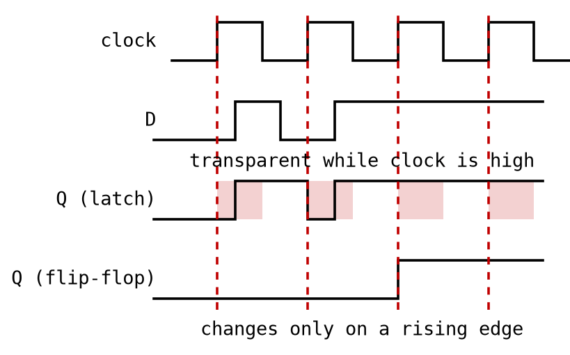
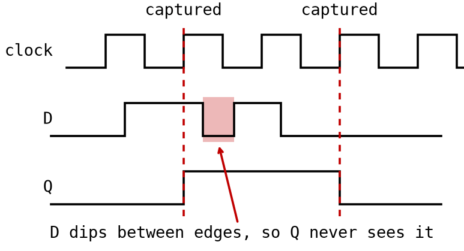

# Appendix A - Sekvensnät

## A.1 Från kombinatorik till sekvensnät
Varje krets i L01 och L02 var **kombinatorisk**: dess utgång är en ren funktion av dess nuvarande
ingångar, så samma ingångar ger alltid samma utgång, och det finns ingen föreställning om "före"
eller "efter" inuti kretsen.

De flesta användbara system behöver mer. En räknare måste minnas sitt räknevärde. Ett register måste
hålla kvar ett värde efter att signalen som producerade det har ändrats. En lysdiod som växlas av en
knapp måste minnas om den är tänd, eftersom det inte alls ligger kodat i knappens ögonblickliga
läge.

Alla dessa behöver **minne**: en utgång som beror på kretsens egen *föregående* utgång. Ett
sekvensnät är kombinatorik med en del av utgången återkopplad till ingången, och den
**återkopplingsslingan** är vad som gör ett tillståndslöst grindnät till en krets med tillstånd. Den
här föreläsningen bygger den primitiv som gör kontrollerad återkoppling praktisk, D-vippan, och
sedan de två saker du bygger direkt av den: register och flankdetektorer.

---

## A.2 D-låset
Det enklaste lagringselementet är **D-låset**: två korskopplade grindar, grindade av en
`enable`-ingång, som lagrar en enda bit.

```text
        ┌────────────┐
   D ──►│            │──► Q
        │   D-LÅS    │
enable─►│            │──► Qn
        └────────────┘
```

`D` är värdet som ska lagras, `enable` styr om låset är *öppet* (genomsläppligt) eller *stängt*
(hållande), `Q` är det lagrade värdet och `Qn` är alltid dess invers.

Varje utgång återkopplas in i den andras ekvation, vilket är precis A.1:s återkopplingsslinga:

```math
Q = (D' \cdot enable + Qn)'
```

```math
Qn = (D \cdot enable + Q)'
```

| `enable` | Beteende | Resultat |
|---|---|---|
| `1` | låset är **öppet** (genomsläppligt) | `Q = D`, `Qn = D'`; utgången följer ingången omedelbart |
| `0` | låset är **stängt** (låst) | `Q` och `Qn` håller kvar det de senast hade |

**Bygg det i CircuitVerse** av en NOT-grind, två AND-grindar och två NOR-grindar (en NOR är en OR
följd av en NOT). Korskoppla återkopplingen så att den NOR som producerar `Q` matar den NOR som
ligger på `Qn`-sidan och tvärtom. Driv `D` och `enable` från ingångsströmbrytare och betrakta `Q`
och `Qn` på lysdioder.

Testa det sedan:
* Med `enable = 1`, ändra `D` och bekräfta att `Q` följer omedelbart. Låset är **genomsläppligt**.
* Med `enable = 0`, bekräfta att `Q` är oförändrad vad `D` än gör. Låset är **låst**.
* Växla `D` några gånger medan du slår om `enable`, och bekräfta att låset alltid fryser det `Q`
  höll i det ögonblick `enable` gick låg. Det är vad **nivåkänslig** betyder: genomsläpplig hela den
  tid `enable` är hög, inte bara i ett enda ögonblick.

Den sista punkten är också låsets grundläggande svaghet. Eftersom det är genomsläppligt hela den tid
`enable = 1` går varje glitch på `D` under det fönstret rakt igenom till `Q`. I ett stort synkront
system är det långt svårare att garantera stabila data under en hel klockfas än att garantera dem
kring ett enda ögonblick. Det är problemet D-vippan löser.

---

## A.3 D-vippan
En **D-vippa** lagrar en bit på samma sätt som ett lås, men är **flanktriggad** i stället för
nivåkänslig: den samplar `D` bara i det *ögonblick* klockan skiftar, inte under hela den tid klockan
är hög eller låg.

Mata båda med samma `D` och samma klocka, så syns skillnaden direkt:



Låset ändrar sig tre gånger: två gånger för att `D` rörde sig medan klockan var hög, och en gång för
att klockan gick hög mot ett `D` som redan hade ändrats. Vippan ändrar sig en gång, eftersom bara en
av de fyra stigande flankerna fann `D` skilt från det värde `Q` redan höll. Båda beter sig korrekt;
de svarar på olika frågor.

```text
        ┌──────────────────┐
   D ──►│                  │──► Q
clock ─►│     D-VIPPA      │
enable─►│ (stigande flank) │──► Qn
reset_n►│                  │
        └──────────────────┘
```

`clock` är tidsreferensen (A.4). `enable` grindar om vippan tar emot ett nytt värde *vid den
triggande flanken*. `reset_n` är en asynkron, aktiv låg reset: närhelst den är `0` tvingas `Q`
omedelbart till `0`, oavsett klockan.

| Villkor | Resultat |
|---|---|
| `reset_n = 0` | `Q = 0`, `Qn = 1`, omedelbart (asynkront, ignorerar klockan helt) |
| `reset_n = 1`, stigande flank på `clock`, `enable = 1` | `Q = D`, `Qn = D'`, samplat i det ögonblicket |
| `reset_n = 1`, stigande flank på `clock`, `enable = 0` | `Q` håller kvar sitt föregående värde |
| `reset_n = 1`, ingen stigande flank på `clock` | `Q` håller kvar sitt föregående värde, vad `D` än gör |

Den sista raden är värd att se snarare än att läsa:



`D` dippar låg och kommer tillbaka inom en enda klockperiod, och `Q` rör sig aldrig, eftersom ingen
flank inträffade medan den var låg. Ett lås i samma läge hade följt med ner och upp igen.

Invärtes är en flanktriggad vippa två D-lås i serie, ett **master-slave**-par. Det ena är
genomsläppligt medan klockan är låg och fångar `D`; det andra är genomsläppligt medan klockan är hög
och för det fångade värdet vidare till `Q`. Nettoeffekten är att `Q` ändrar sig bara i det ögonblick
klockan går från låg till hög, aldrig medan den ligger kvar på någondera nivån. Det yttre beteendet
är vad VHDL:s `rising_edge()` modellerar (A.6).

**Bygg den i CircuitVerse** genom att bygga vidare på ditt lås från A.2:
* Duplicera låset så att två sitter i serie: *mastern* matar *slaven*, vars `Q` är vippans utgång.
* Lägg till `clock`, `reset_n`, `D` och `enable` som ingångar.
* Driv de två låsens genomsläpplighet från klockan och dess invers. För att hålla de två
  betydelserna isär, kalla den interna styrsignalen per lås för `gate`: masterns `gate` är `clock'`
  och slavens är `clock`. Vippans yttre `enable` är en annan signal och kopplas separat, nedan.
* Koppla det yttre `enable` som en 2-till-1-mux (L02 A.4) på masterns dataingång: när `enable = 1`
  släpper muxen igenom `D`, och när `enable = 0` släpper den tillbaka in vippans eget `Q`, så att
  flanken fångar om det värde som redan är lagrat. Grinda *datat*, aldrig klockan.
* Lägg till resetten i **båda** låsen. Att tvinga `Q` låg kräver två ändringar i varje lås, inte en:
  * mata in ett aktivt högt `reset` (`reset_n` genom en NOT) i den NOR som producerar `Q`, vilket
    tvingar `Q` till `0`.
  * AND:a in `reset_n` i termen `D AND gate` i samma lås, vilket frigör `Qn` att gå hög.
* Sätt klockperioden till något långsamt nog att titta på, t.ex. `1000 ms`.

Med resetten inkopplad blir ekvationerna för varje lås:

```math
Q = (D' \cdot gate + Qn + reset)'
```

```math
Qn = (D \cdot gate \cdot reset\_n + Q)'
```

En frestande genväg är att låta `Qn`-ekvationen vara och i stället bryta slingan, genom att AND:a
`reset_n` på den `Qn`-ledning som matar `Q`:s NOR. Det räcker inte. Med `gate = 1` och `D = 1`
lämnar det `Qn` på `0`, vilket är det som håller `Q` på `1`, så resetten gör i tysthet ingenting i
precis det fall du är mest benägen att testa den i. Båda ändringarna, i båda låsen, eller ingendera.

Bekräfta att `Q` uppdateras bara i det ögonblick klockan går hög, och ligger stilla mellan flankerna
även om `D` ändrar sig, och att en låg `reset_n` tvingar `Q` till `0` omedelbart, medan ett släpp av
den inte ändrar något förrän vid nästa stigande flank.

---

## A.4 Klockning
**Klockan** är en periodisk fyrkantvåg, som varje vippa i en synkron krets läser från samma källa.
Två tal beskriver den: **perioden** `T`, tiden för en hel cykel, och **frekvensen** `f = 1/T` i Hz.

Varje period har exakt två **flanker**: en **stigande flank** från `0` till `1`, och en **fallande
flank** från `1` till `0`. En synkron design väljer en av dem, nästan alltid den stigande flanken,
och uppdaterar varje vippa vid den flanken och bara den. Att använda en enda flank överallt är vad
som gör tajmingen i en stor krets analyserbar: varje vippa ändrar sig vid samma väldefinierade
ögonblick, så du kan resonera en klockcykel i taget i stället för att följa varje signal
kontinuerligt.

Simulerade och verkliga klockor går i vitt skilda tidsskalor, och logiken är identisk i båda fallen:
* I CircuitVerse, sätt en period du hinner följa, t.ex. `1000 ms`.
* På DE0-CV är systemklockan fasta `50 MHz`, en period på `20 ns`. Ingen uppfattar enskilda flanker
  i den takten, så du resonerar i termer av "vid nästa stigande flank", aldrig i verklig tid.

---

## A.5 Register: vippor parallellt
Ett **register** lagrar mer än en bit: N D-vippor sida vid sida, en per bit, som alla delar samma
`clock`, `reset_n` och `enable`.

```text
D(0) ──►[D-FF]──► Q(0)
D(1) ──►[D-FF]──► Q(1)
D(2) ──►[D-FF]──► Q(2)
   ⋮        ⋮
D(N-1)──►[D-FF]──► Q(N-1)

  (clock, reset_n, enable delas av varje vippa ovan)
```

Det är hela idén: ett 8-bitars register är åtta D-vippor som uppdateras vid samma klockflank.

I VHDL instansierar du sällan N vippor explicit. Deklarera en `std_logic_vector` och tilldela hela
den inuti en enda synkron process (A.6): varje bit syntetiseras till en egen vippa, och alla delar
processens klocka och reset.

```vhdl
signal q: std_logic_vector(3 downto 0);
...
process (clock, reset_n) is
begin
    if (reset_n = '0') then
        q <= "0000";
    elsif (rising_edge(clock)) then
        if (enable = '1') then
            q <= d; -- d is a std_logic_vector(3 downto 0) input
        end if;
    end if;
end process;
```

Fyra bitar, en process, fyra vippor i hårdvara: i princip inte annorlunda än fyra
`d_flip_flop`-instanser kopplade parallellt.

---

## A.6 Den synkrona processmallen i VHDL
Varje synkront element i den här föreläsningen, vippan, registret och flankdetektorn, använder samma
form. Utan reset är en enda D-vippa:

```vhdl
process (clock) is
begin
    if (rising_edge(clock)) then
        q <= d;
    end if;
end process;
```

`q` tar `d`:s värde vid varje stigande flank och håller kvar det resten av tiden. Den enda raden
inuti `if`-satsen räcker för att syntesen ska härleda en riktig D-vippa.

### Regler
* **`clock` är den enda signalen i känslighetslistan**, om det inte finns en asynkron reset.
  Processen ska köra bara när klockan ändras; den har ingen anledning att reagera på något annat.
* En process reagerar på *varje* ändring hos en signal i känslighetslistan, inte bara stigande, så
  `rising_edge()` filtrerar specifikt ut den stigande flanken. All logik som uppdateras synkront
  ligger inuti det `if`:et.
* Varje signal som tilldelas inuti en sådan process syntetiseras till en vippa, en per bit.

### Med en asynkron reset
En asynkron reset måste också stå i känslighetslistan, eftersom den kan aktiveras oberoende av
klockan, och den har företräde när den är aktiv.

```vhdl
process (clock, reset_n) is
begin
    if (reset_n = '0') then
        q <= '0';
    elsif (rising_edge(clock)) then
        q <= d;
    end if;
end process;
```

Läs den i prioritetsordning: kontrollera resetten först, och leta efter en stigande flank bara om
den är inaktiv. Om ingetdera gäller (en fallande flank, eller att `reset_n` går från `0` tillbaka
till `1`, vilket också triggar om processen) tilldelas ingenting och `q` behåller sitt föregående
värde.

### När tilldelningen faktiskt får effekt
En regel ligger under allt ovanstående, och det är det enda stället där `<=` beter sig olikt
tilldelning i alla språk du har skrivit mjukvara i.

En signaltilldelning får inte effekt när dess rad körs. Den **schemalägger** ett värde, som
tillämpas först när processen avslutat det här varvet och suspenderar. Fram till dess ger varje
läsning av den signalen det värde den höll *innan varvet började*, hur många tilldelningar som än
redan har körts.

Det låter som en teknikalitet. Det är skälet till att mallen ovan är en vippa och inte en ledning:

```vhdl
process (clock) is
begin
    if (rising_edge(clock)) then
        b <= a;
        c <= b;
    end if;
end process;
```

Läst som mjukvara slutar både `b` och `c` med att hålla `a`. I hårdvara gör de inte det. Vid varje
flank schemaläggs `b` att ta `a`:s värde, och `c` schemaläggs att ta det värde `b` höll *på väg in i
den flanken*, inte det som just schemalagts på den. Resultatet är två vippor i en kedja: `a` når `b`
efter en flank och `c` efter två. Byt plats på raderna och ingenting ändras, eftersom ingen av
tilldelningarna kan observera den andras resultat.

Två konsekvenser värda att ta med sig:
* **Ordningen spelar ingen roll** mellan tilldelningar till *olika* signaler i samma klockade
  process. Alla läser de gamla värdena och alla får effekt samtidigt. Det är motsatsen till den
  sekventiella läsning som ordet "process" inbjuder till, och det är därför en kedja av vippor kan
  skrivas i vilken ordning som helst.
* **Tilldela samma signal två gånger i ett varv och bara den sista tilldelningen överlever.** De
  tidigare kastas utan att någonsin nå signalen.

A.7:s flankdetektor är precis tvåelementskedjan ovan, och fungerar av precis det här skälet. L05
återvänder till regeln från andra hållet, med en `variable`, som uppdateras omedelbart och därför
beter sig så som den mjukvarumässiga läsningen väntar sig.

---

## A.7 Flankdetektering
Vippans andra vardagsuppgift är att detektera det *ögonblick* en signal ändras, snarare än att läsa
av dess nivå: lagra signalens föregående värde i en vippa och jämför det sedan med det nuvarande
värdet med en grind.

* **Detektering av stigande flank** (`0` till `1`):
  ```math
  edge = current \cdot previous'
  ```
* **Detektering av fallande flank** (`1` till `0`):
  ```math
  edge = current' \cdot previous
  ```

```text
signal ──┬───────────────────────────► AND ──► edge
         │                              ▲
         └──►[D-FF]── previous ──(NOT)──┘
                ▲
           clock, reset_n
```

`edge` är hög i exakt en klockcykel, den omedelbart efter övergången, eftersom `previous` kommer
ikapp först vid *nästa* flank. Det är mekanismen bakom "gör något en gång per knapptryckning" i
stället för "gör något varje klockcykel knappen hålls nere", vilket är precis vad A.9 löser.

---

## A.8 Genomarbetat exempel: en D-vippa i VHDL
[`d_flip_flop.vhd`](../d_flip_flop/d_flip_flop.vhd) implementerar A.3 och A.6 tillsammans: ett
enable som grindar om en stigande flank fångar `d`, och en asynkron aktiv låg reset.

```vhdl
entity d_flip_flop is
    port(clock, reset_n, d, enable: in std_logic;
         q, q_n                   : out std_logic);
end entity;
```

Dess enda process är varianten med reset plus enable av A.6:s mall: resetten har företräde, sedan
fångar en stigande flank `d` in i en intern signal `q_s` om `enable = '1'`. `q_s` finns eftersom en
*utgångsport* inte kan läsas tillbaka inuti samma arkitektur; `q` och `q_n` drivs båda
kombinatoriskt från den, utanför processen.

För att prova den på hårdvara, tilldela `clock` till systemklockan på `50 MHz`, `reset_n` till en
tryckknapp, `d` och `enable` till två skjutströmbrytare, och `q`/`q_n` till två lysdioder. Slå sedan
på `enable` och ändra `d`, så följer lysdioden med; slå av `enable` och ändra `d`, så gör den inte
det.

Det finns ingen klockflank du kan uppfatta vid `50 MHz`, så vad du egentligen bekräftar är att
logiken fortfarande håller när du inte längre kan se de enskilda flankerna. Vippan ser ut att svara
på din strömbrytare; i själva verket svarade den på en av femtio miljoner klockflanker den sekunden,
och strömbrytaren avgjorde bara vilket värde den flanken fångade.

---

## A.9 Genomarbetat exempel: flankdetekterad lysdiodsväxling
[`led_toggle.vhd`](../led_toggle/led_toggle.vhd) kombinerar A.5, A.6 och A.7 till ett litet system:
två oberoende tryckknappar, som var och en växlar sin egen lysdiod exakt en gång per tryck.

```vhdl
entity led_toggle is
    port(clock, reset_n: in std_logic;
         button_n      : in std_logic_vector(1 downto 0);
         led           : out std_logic_vector(1 downto 0));
end entity;
```

Tre 2-bitars signaler, två hållna i klockade processer och en beräknad mellan dem:
* `button_prev_n` är ett 2-bitars register (A.5) som håller förra cykelns `button_n`, resatt till
  `"11"` eftersom knapparna är aktiva låga.
* `button_edge <= (not button_n) and button_prev_n` är A.7:s detektor för fallande flank tillämpad
  på båda bitarna samtidigt, hög i en cykel exakt när en knapp går från släppt till nedtryckt.
* `led_s` är ett andra 2-bitars register som, i stället för att fånga ett nytt värde varje cykel,
  **växlar** bit `i` bara när `button_edge(i) = '1'`. Utan den grindningen skulle det växla varje
  klockcykel i stället för en gång per tryck, vilket är hela poängen med att beräkna `button_edge`.

**På kortet**, demonstrerat under föreläsningen: skapa Quartus Prime Lite-projektet mot DE0-CV:s
`5CEBA4F23C7N` precis som i L01, tilldela sedan `clock` till oscillatorn på `50 MHz`, `reset_n` och
`button_n(1 downto 0)` till tre tryckknappar, och `led(1 downto 0)` till två lysdioder. Varje tryck
ska växla exakt en lysdiod, en gång, hur länge du än håller den nere.

**En reservation, medvetet lämnad öppen:** `button_n` är en rå signal rakt från en fysisk
tryckknappspinne. I simulering är det en ren, ögonblicklig övergång; på riktig hårdvara är den
varken ögonblicklig (kontakter studsar) eller synkroniserad till `clock`. Den här flankdetektorn är
logiskt korrekt men *osäker* att koppla direkt till en riktig knapp på en FPGA utan mer arbete
först, och det arbetet är precis vad L04 tar upp.

---
