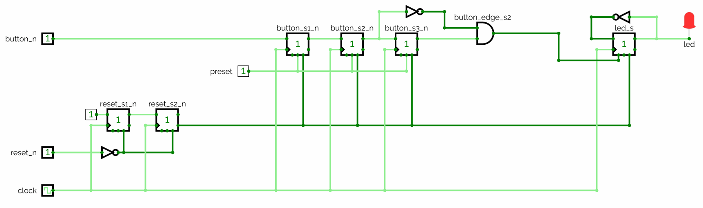

# Appendix A - Metastabilitet och synkronisering

## A.1 Problemet: en knapp är inte en testbänkssignal
I [L03](../../L03/README.md) byggde du flankdetektorer och resonerade om dem mot en ren klocka, där
varje ingång ändrades prydligt mellan flankerna, precis så som en simulator ritar det. En
tryckknapp, en extern resetledning, eller vilken signal som helst från en annan klockdomän ändras
när omvärlden bestämmer sig för det, helt oberoende av din FPGA:s klocka.

Varje D-vippa har två tidskrav kring den aktiva klockflanken:
* en **setup-tid**: hur länge `D` måste vara stabil *före* flanken.
* en **hold-tid**: hur länge `D` måste förbli stabil *efter* den.

Om en ingång ändras inuti det fönstret är vippan inte garanterad att fånga en ren `0` eller `1`, och
du kan aldrig lova att den hamnar utanför, eftersom du inte styr när en extern signal ändras. Resten
av den här föreläsningen löser det inte genom att undvika problemet utan genom att innesluta det.

---

## A.2 Metastabilitet: vad som faktiskt händer inuti vippan
En D-vippa är byggd av korskopplade grindar som slår om till `0` eller `1` i samma ögonblick som
klockan samplar ingången. Om `D` ändras för nära flanken kan den interna återkopplingsslingan lämnas
i balans mellan de två tillstånden, varken helt hög eller helt låg, längre än väntat. Det är
**metastabilitet**.

Tänk dig en kula som balanserar exakt på toppen av en kulle. Med tillräckligt med tid rullar den ner
åt ena hållet, men exakt när den bestämmer sig, och åt vilket håll, går inte att förutsäga från det
ögonblick den placerades där, och så länge den fortfarande balanserar är dess position inte något
giltigt digitalt värde alls.

En metastabil utgång beter sig likadant:
* den stabiliserar sig nästan alltid till en giltig `0` eller `1` av sig själv, givet tillräckligt
  med tid.
* "tillräckligt med tid" är inte gratis, och är inte densamma varje klockcykel.
* om den ostabiliserade spänningen når logik nedströms innan den lagt sig kan olika grindar med all
  rätt läsa den olika: en ser `0`, en annan `1`, i samma ögonblick.

Den oenigheten är där riktiga system beter sig fel: en räknare som räknar upp i en del av kretsen
men inte i en annan, eller en tillståndsmaskin i ett omöjligt tillstånd. Allt i den här
föreläsningen finns till för att se till att metastabiliteten stabiliserar sig *innan* en signal rör
resten av din design.

I tid ser hela problemet ut så här:


Läs det från vänster till höger. Det skuggade bandet är fönstret från A.1, `t_su` före flanken och
`t_h` efter den. `D` ändras inuti det, vilket är precis vad en ingång du inte styr står fritt att
göra. `Q` är sedan varken `0` eller `1` under en stund, och när den väl lägger sig är både *när* den
lägger sig och *vilken nivå* den lägger sig på utanför din kontroll. Båda de streckade
fortsättningarna är legitima utfall av samma ingång.

Lägg märke till vad diagrammet inte visar: ett felaktigt svar. Att sampla en signal mitt i en
övergång får ge dig endera nivån, och det är i sig harmlöst, eftersom ingången faktiskt höll på att
ändras i det ögonblicket. Problemet är fördröjningen innan du får ett svar över huvud taget, och det
är den nästa avsnitt köper tid för.

---

## A.3 Dubbelvippsynkroniseraren
Standardlösningen är **dubbelvippsynkroniseraren**:
* Placera två D-vippor i serie på varje asynkron ingång: varje ingång som ändras utan någon fast
  relation till din klocka. En tryckknapp, en resetledning, en signal som anländer från en annan
  klockdomän.
* En ingång som redan klockas av *denna* klocka är inte asynkron, och får **inte** synkroniseras.
  Att göra det fördröjer den bara, och förskjuter dess tidsläge relativt allt runt omkring.
  `seq_detect_mealy` i L08 är precis det fallet: dess `din` är synkron seriell data, så den går rakt
  in i maskinen medan `reset_n` fortfarande får en synkroniserare.
* Använd aldrig något annat än den *andra* vippans utgång på andra ställen i designen.

```text
async_in
   │
   ▼
 [FF1] ──────► [FF2] ──────► synkroniserad, säker att använda
   (kan bli       (extremt sannolikt
   metastabil)     stabil)
```

Samma två vippor, i tid:


`FF1` är den som är exponerad för den asynkrona ingången, så den är den som kan bli metastabil. Dess
utgång behöver bara nå `FF2`, och den har en hel klockperiod på sig. Sannolikheten att en metastabil
nod fortfarande är ostabiliserad efter en hel period är liten, och krymper ju längre tid den får, så
när `FF2` samplar på nästa flank har `FF1` nästan alltid lagt sig. `FF2`:s utgång är det du bygger
resten av din synkrona logik på.

Det här är sannolikhetsbaserat, inte absolut, och A.4 säger vad det innebär. Vid de hastigheter som
används i den här kursen, tiotals MHz, är två steg det gängse, industriaccepterade svaret.

En regel knyter ihop det: **varje asynkron ingång får sin egen dubbelvippkedja innan den används
någon annanstans.** Externa resetknappar, tryckknappar, och senare varje **enbitssignal** som korsar
från en annan klockdomän.

Det sista ordet är bärande, och det är den enda begränsning som är värd att lära sig innan du
överanvänder regeln. En dubbelvippkedja synkroniserar **en bit**. Kör en flerbitsbuss genom en kedja
per bit och varje bit är säker för sig men de är inte säkra *tillsammans*: var och en stabiliserar
sig oberoende till det gamla eller det nya värdet på samma flank, så mottagaren kan sampla en
kombination som aldrig fanns på bussen. En räknare som stegar från `0111` till `1000` har alla bitar
ändrade på en gång, och en synkroniserare per bit kan ge dig `1111` eller `0000`, värden räknaren
aldrig höll.

Bussar som korsar klockdomäner behöver en handskakning, en FIFO, eller Gray-kodning, som ordnar det
så att bara en bit någonsin ändras åt gången. Ingenting i L01-L08 korsar klockdomäner med en buss,
så du kommer inte att behöva dem här; grupprojektet återkommer till begränsningen i L12, där samma
synkroniserare skrivs en gång och återanvänds. Att veta att tvåvippsvaret stannar vid en bit räcker
för nu.

---

## A.4 Intuition för tidsförhållandena: varför "nästan säkert" duger
En synkroniserare köper inte "ingen metastabilitet". Den köper metastabilitet som får en hel
klockperiod på sig att stabilisera sig innan den kan påverka något annat, och det är ett statistiskt
argument snarare än ett bevis. Den korrekta hållningen är "rimligt säker, med stöd av en extremt
låg, väl karakteriserad felfrekvens", inte "bevisbart säker under alla förhållanden", vilket är
skälet till att extra steg finns för extremfall i stället för att två förklaras tillräckliga av en
naturlag.

Sambandet har en standardform, värd att se en gång även om du inte kommer att räkna med den här:

```text
MTBF = e^(t_r / tau) / (T_w * f_clock * f_data)
```

Läs den för vad den säger snarare än för siffror. `t_r` är den stabiliseringstid ett steg får,
ungefär en klockperiod; `tau` och `T_w` är båda egenskaper hos vippan, där `tau` är hur snabbt ett
metastabilt värde avklingar och `T_w` bredden på det fönster kring klockflanken där ingången över
huvud taget kan framkalla ett sådant. Att lägga till ett steg köper ytterligare ett `t_r` i
exponenten, så **täljaren växer exponentiellt med varje steg du lägger till**, mot en klockcykels
ökad latens. Nämnaren växer linjärt med klockfrekvensen och, precis lika viktigt, med `f_data`: hur
ofta den asynkrona ingången faktiskt ändras. En knapp som trycks en gång i sekunden och en
dataledning som växlar i 10 MHz skiljer sig sju tiopotenser åt enbart i den termen, vilket är skälet
till att argumentet för ett tredje steg är en fråga om ingången, inte om klockan.

---

## A.5 Att synkronisera en resetsignal: aktivera asynkront, släpp synkront
Reset förtjänar ett eget mönster, som `reset_sync` demonstrerar. Det finns ingen `reset_sync.vhd`
att öppna i det här repot: den är [övning 8](./b_exercises.md), och du skriver den. Listningen nedan
är hela modulen.

```vhdl
process(clock, reset_n) is
begin
    if (reset_n = '0') then
        reset_s1_n <= '0';
        reset_s2_n <= '0';
    elsif (rising_edge(clock)) then
        reset_s1_n <= '1';
        reset_s2_n <= reset_s1_n;
    end if;
end process;
```

* **Aktivera asynkront.** När `reset_n` går låg tvingas båda stegen omedelbart till `0`, utan något
  beroende av klockan. En reset som väntade på en klockflank skulle omintetgöra sitt eget syfte: den
  måste få verkan i samma ögonblick som den behövs, med eller utan klocka.
* **Släpp synkront.** När `reset_n` återgår till `1` försvinner inte resetvillkoret överallt på en
  gång. Det skiftas ut genom de två stegen som vilken annan asynkron ingång som helst, så
  `reset_s2_n`, den signal designen faktiskt använder, släpper rent på en klockflank tillsammans med
  allt annat. Utan detta skulle olika vippor kunna lämna reset på olika cykler och för ett ögonblick
  vara oense om systemets tillstånd, samma sorts fel som metastabilitet orsakar.

Det är därför `reset_n` synkroniseras av sin egen kedja innan något annat beror på den, inklusive
knappsynkroniseraren, vars resetingång är `reset_s2_n` snarare än den råa `reset_n`.

---

## A.6 Att återanvända kedjan för flankdetektering - och, i förbigående, studsfiltrering
Knappen behöver synkroniseras, och från [L03](../../L03/README.md) behöver du dessutom detektera
*när* den trycks ned snarare än dess nivå. `button_sync`, som är [övning 9](./b_exercises.md) och
därmed också din att skriva snarare än en fil i det här repot, får båda ur en enda kedja av **tre**
vippor:

```text
button_n
   │
   ▼
[FF1] → [FF2] → [FF3]
        │        │
        │        └─ föregående värde
        └─ nuvarande värde
```

Vippa 1 och 2 är A.3:s synkroniserare, vilket gör `button_s2_n` till det stabila nuvarande värdet.
Vippa 3 lagrar förra cykelns `button_s2_n` som `button_s3_n`, det föregående värdet. Vippa 1 och 2
är värda att lägga märke till för sig: [L05 övning 4](../../L05/appendix/b_exercises.md) bryter ut
den dubbelvippkedjan till en återanvändbar `sync`-modul, och lämnar den tredje vippan här som
flankdetektorns egen. Att jämföra steg 2 mot steg 3 ger flankdetektering gratis:

`button_edge_s2 = (not button_s2_n) and button_s3_n`

vilket är sant under exakt en klockcykel: den där knappen läses som nedtryckt nu och inte var det
cykeln före.

**Synkronisering löser i sig bara metastabilitet.** Den säger ingenting om en mekanisk knapps
benägenhet att studsa: att sluta och bryta kontakt flera gånger under den första millisekunden eller
så, där varje studs ser ut som ett eget tryck. Det som håller den här kursens övningar från att
dränkas i studs är *kombinationen* av kedjan och ett detekteringsfönster som är långsamt i
förhållande till studsen:
* I den här föreläsningens CircuitVerse-övningar är klockperioden en hel sekund. Studsen lägger sig
  på långt mindre än så, så vid nästa flank läser `button_s2_n` en enda ren nivå. Kedjan ser ut att
  studsfiltrera, men den samplar egentligen bara för sällan för att se studsen.
* På FPGA:n är klockan `50 MHz`, ett sampel var `20 ns`, medan studsen varar från under en
  millisekund till några tiotals millisekunder, många tusen cykler. Vid den hastigheten detekterar
  `button_sync` troget *varje* studsövergång som en egen flank, och lysdioden kan växla flera gånger
  för ett enda fysiskt tryck.

Så exakt: dubbelvippsynkroniseraren löser metastabilitet tillförlitligt vid de hastigheter som
används här. Om den dessutom *ser ut* att studsfiltrera beror helt på att klockperioden är långsam i
förhållande till knappens studstid, vilket stämmer i CircuitVerse och inte automatiskt stämmer på
FPGA:n.

---

## A.7 Vad en riktig studsfiltrering i hårdvara tillför
Den här kursen har ingen egen föreläsning om studsfiltrering, och de genomarbetade exemplen
fortsätter medvetet att använda A.6:s krets, studs och allt. Den duger för en demolysdiod. En
produktionsdesign lägger till något av följande *ovanpå*:
* **Ett analogt RC-lågpassfilter**, eventuellt med en Schmitt-triggerbuffert, på knappingången innan
  den når en FPGA-pinne. RC-paret jämnar ut de snabba slut- och brytövergångarna till en enda
  gradvis flank, och Schmitt-triggern, med sina två omslagströsklar, gör tillbaka det till en enda
  ren digital övergång. Det löser studsen innan signalen ens är digital, men kostar komponenter på
  kortet och hjälper inte för ingångar som inte är mekaniska kontakter.
* **En digital studsfiltreringsräknare.** I stället för att agera på nästa detekterade flank, kräv
  att ingången håller en ny nivå under någon minsta tid, några millisekunders värde av klockcykler,
  innan den accepteras. Det bygger ditt eget konstgjort långsamma detekteringsfönster på chippet,
  samma effekt som CircuitVerses 1-sekundersklocka ger gratis, utan att sakta ner systemklockan. Du
  möter räknare i [L06](../../L06/README.md) och timers, som den här tekniken behöver, i
  [L07](../../L07/README.md).

Båda sitter ovanpå synkroniseraren, inte i stället för den: även en perfekt studsfiltrerad signal är
fortfarande asynkron mot din klocka och behöver fortfarande en dubbelvippkedja.

---

## A.8 Generics: en modul, flera storlekar
`reset_sync` och `button_sync` är byggda av samma idé, men bara den ena har en fråga att besvara. En
reset är en bit och kommer alltid att vara det. Hur många *knappar* har en design? Den här
föreläsningens `led_toggle_sync` har en, L08:s `fsm_led` har två. Att skriva ut samma trevippskedja
en gång per bredd är precis den dubblering som uppdelningen i moduler var till för att undvika.

En **generic** besvarar den: ett värde som en entitet deklarerar vid sidan av sina portar, fastlagt
när designen byggs snarare än föränderligt medan den kör.

```vhdl
entity button_sync is
    generic(COUNT: natural range 1 to 3 := 1);
    port(clock, reset_s2_n: in  std_logic;
         button_n         : in  std_logic_vector(COUNT-1 downto 0);
         button_edge_s2: out std_logic_vector(COUNT-1 downto 0));
end entity;
```

* `COUNT` beter sig som en konstant inuti arkitekturen. Den kan inte ändras medan kretsen kör; den
  avgörs innan en enda grind placerats.
* `:= 1` är dess standardvärde, som används av varje instansiering som inte säger något.
* Portbredderna är skrivna *i termer av den*, och så är varje intern signal som följer.

### Att åsidosätta den
En instansiering skickar generics med en `generic map`, före sin `port map`:

```vhdl
button_sync1: entity work.button_sync
    generic map(2)
    port map(clock, reset_s2_n, button_n, button_edge_s2);
```

Generics matchas **positionellt**, i deklarationsordning, precis som portar gör i
[L02 A.6](../../L02/appendix/a_larger_networks.md#a6-att-bygga-en-design-av-submoduler). Att
utelämna `generic map` tillämpar standardvärdet; den här kursen skriver ut den explicit även när den
stämmer, eftersom en läsare inte ska behöva öppna modulen för att ta reda på hur bred en instans är.

### När en generic gör rätt för sig
`button_sync` har en och `reset_sync` har ingen, och den skillnaden är hela regeln: **lägg till en
generic när något genuint varierar mellan instanser, inte av princip.**

`button_sync` instansieras med `COUNT = 1` av A.9:s `led_toggle_sync` och med `COUNT = 2` av L08:s
`fsm_led`: två bredder, en fil. `reset_sync` är en bit överallt, så en `WIDTH`-generic på den vore
en parameter som ingen någonsin skickar något annat än `1` till, och en sak till för en läsare att
kontrollera. Den andra instansieringen är det som gör en generic värd att ha; en parameter med exakt
ett värde i hela kursen vore bara ett extra mellanled. `button_sync`s egen testbänk instansierar den
med *båda* bredderna i samma simulering, just för att bevisa att en fil verkligen betjänar båda.

Du möter ytterligare en generic i L07: `timer`s `TICK_COUNT`, som är ett antal snarare än en bredd,
och som är det som låter samma fil mäta en femtiondels sekund i en design och en hel sekund i en
annan.

---

## A.9 Genomarbetat exempel: `led_toggle_sync`
Det här knyter ihop A.1-A.6 till L03:s växlingskrets, gjord säker för en riktig, asynkron knapp och
reset.

| Port | Riktning | Beskrivning |
|---|---|---|
| `clock` | in | `50 MHz` systemklocka på DE0-CV-kortet. |
| `reset_n` | in | Aktiv låg asynkron reset, kopplad till en tryckknapp. |
| `button_n` | in | Aktiv låg tryckknapp; växlar lysdioden på sin fallande flank. |
| `led` | out | Lysdiod, växlas vid varje synkroniserat, flankdetekterat knapptryck. |

Interna signaler: `led_s` håller lysdiodens tillstånd, `reset_s2_n` är reseten efter
tvåvippsynkroniseraren (suffixet `s2` är den här föreläsningens konvention för "synkroniserad med
två vippor"), och `button_edge_s2` är den encykelspuls som markerar en synkroniserad fallande flank
på `button_n`.

Liksom L02:s tvåsiffriga display är den här designen byggd av mer än en entitet, med instansieringen
från
[L02 A.6](../../L02/appendix/a_larger_networks.md#a6-att-bygga-en-design-av-submoduler) och
genericen från [A.8](#a8-generics-en-modul-flera-storlekar). Skillnaden är vad delarna gör:
displayen instansierade en modul två gånger för att göra samma jobb på två halvor av sin ingång,
medan den här instansierar två *olika* moduler med ett jobb var. Båda är samma mekanism. Att
komponera en design av moduler är inte en särskild teknik för upprepad logik; det är så designer
byggs när de vuxit ur en enda fil.

De två kedjorna bor i två subkomponenter:
* `reset_sync` är A.5:s tvåvippsresetsynkroniserare. Den tar den råa `reset_n` och returnerar
  `reset_s2_n`.
* `button_sync` är A.6:s trevippssynkroniserare med flankdetektor. Den tar den redan synkroniserade
  `reset_s2_n` och pulsar `button_edge_s2` en gång per tryck.

Att hålla dem åtskilda betyder mer än det ser ut. En design utan egen knapp behöver ändå sin reset
synkroniserad, och med två moduler instansierar den helt enkelt den den vill ha, som L08:s
`seq_detect_mealy` gör. Hopsvetsade till en modul skulle den designen behöva instansiera alltihop
och koppla bort den halva den inte använder.

`button_sync` tar en *vektor* av knappar så att en fil kan betjäna en design med två knappar. Den
här designen har en, så `led_toggle_sync.vhd` deklarerar ett par enelementsvektorer att koppla till
den:

```vhdl
signal button_n_v, button_edge_s2_v: std_logic_vector(0 downto 0);
...
button_n_v(0)     <= button_n;
button_edge_s2 <= button_edge_s2_v(0);
```

Det är rördragning, inte logik: två ledningar omdöpta.

Toppnivåarkitekturen innehåller ingenting annat än själva växlingsprocessen, och den rör aldrig
annat än de redan synkroniserade `reset_s2_n` och `button_edge_s2`, aldrig de råa ingångarna:

```vhdl
LED_PROCESS: process(clock, reset_s2_n) is
begin
    if (reset_s2_n = '0') then
        led_s <= '0';
    elsif (rising_edge(clock)) then
        if (button_edge_s2 = '1') then
            led_s <= not led_s;
        end if;
    end if;
end process;
```

Fullständig källkod för toppnivån: [`led_toggle_sync.vhd`](../led_toggle_sync/led_toggle_sync.vhd).
De två subkomponenterna finns inte i repot, eftersom att skriva dem är
[övning 8 och 9](./b_exercises.md): `reset_sync` är [A.5](#a5-att-synkronisera-en-resetsignal-aktivera-asynkront-släpp-synkront)
ovan, och `button_sync` är [A.6](#a6-att-återanvända-kedjan-för-flankdetektering---och-i-förbigående-studsfiltrering)
och [A.8](#a8-generics-en-modul-flera-storlekar), båda utskrivna i sin helhet. Kopiera in dina egna
i `led_toggle_sync/` för att bygga den.

**För hand, i CircuitVerse först.** Innan du rör VHDL, bygg den som ett grindnät: två D-vippor i
serie för resetsynkroniseraren; två för `button_n` plus en tredje som lagrar det föregående
synkroniserade värdet; en AND-grind som kombinerar det inverterade nuvarande värdet med det
föregående för att producera `button_edge_s2`; och en växlingsvippa för `led_s`, med sin inverterade
utgång återkopplad till sin ingång, aktiverad endast när `button_edge_s2 = 1`. Sätt klockperioden
till `1000 ms` så att du hinner följa varje steg med ögat.



En sak i ritningen behöver läsas noga: vipporna har en `preset`-ingång, och på knappsynkroniserarens
tre steg är den bunden till `1`. Det är ingen dekoration. I CircuitVerse är `preset` det värde en
vippa laddar när dess reset aktiveras, så att binda den till `1` är det som gör att `button_s1_n`,
`button_s2_n` och `button_s3_n` kommer ur reset med värdet `1` snarare än `0`.

Det stämmer med `button_sync`, som resettar samma tre steg till `(others => '1')`, och det spelar
roll av samma skäl: knapparna är aktivt låga, så `1` betyder "släppt". Resetta kedjan till `0` i
stället och den startar med påståendet att knappen redan hålls nedtryckt. Resetvipporna lämnar
`preset` i fred, eftersom en reset till `0` där verkligen är allt kretsen ber om.

Tryck på knappen i simuleringen och följ hur det fortplantar sig. Lysdioden växlar inte omedelbart:
den väntar på att den synkroniserade, flankdetekterade pulsen ska nå växlingsvippan, vilket tar ett
litet, fast antal klockpulser, precis den latens A.3 kallade priset för säkerheten.

**På FPGA:n:** samma design demonstreras på Terasic DE0-CV (enheten `5CEBA4F23C7N`) under
föreläsningen, med `clock` på `50 MHz`-oscillatorn, `reset_n` och `button_n` på två tryckknappar,
och `led` på en lysdiod. Lysdioden växlar vid varje tryck, och enligt A.6 kan ett riktigt tryck
ibland ge mer än en växling på grund av kontaktstuds.

---
