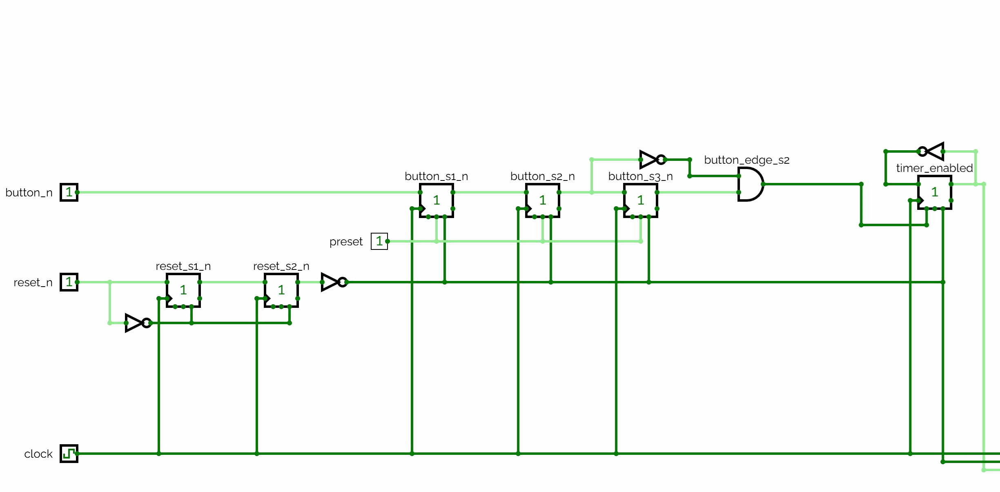
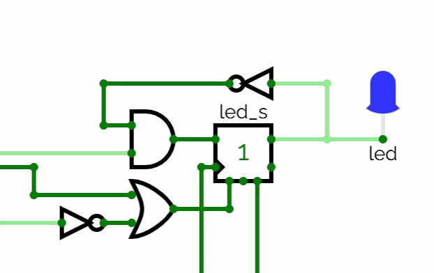

# Appendix A - Timers

## A.1 Timers: en räknare med ett målvärde
En **timer** svarar på en annan fråga än räknaren från
[L06 A.1](../../L06/appendix/a_counters_and_shift_registers.md#a1-från-register-till-räknare). En
räknare svarar på "vad är räkningen just nu?"; en timer svarar på "har en viss tid gått?"

Den gör det med tre delar: en intern räknare som är osynlig utifrån, ett målvärde `TICK_COUNT` som
är fast per instans, och en jämförelse som när den är sann nollställer räknaren och pulsar
utgångsflaggan `timeout` under en klockcykel.

Eftersom systemklockan tickar med en känd, fast frekvens är att räkna tick samma sak som att mäta
förfluten tid. På DE0-CV är det 50 000 000 tick per sekund:

```text
TICK_COUNT = seconds x 50,000,000
```

* `TICK_COUNT = 50,000,000`: timeout en gång per sekund.
* `TICK_COUNT = 25,000,000`: två gånger per sekund.
* `TICK_COUNT = 5,000,000`: tio gånger per sekund.

Strikt taget löper räknaren `0` till och med `TICK_COUNT`, så en full period är `TICK_COUNT + 1`
cykler. Det där extra ticket är mellan 0,02 och 0,2 ppm vid de här värdena, långt under
kortoscillatorns egen tolerans, så de runda talen ovan används för tydlighetens skull; för ett exakt
cykelantal, använd `TICK_COUNT = seconds x 50,000,000 - 1`.

Det här är motsatsen till en blockerande `_delay_ms()`. En blockerande fördröjning stoppar hela
programmet för att vänta; en timer går permanent parallellt med allt annat och höjer helt enkelt en
flagga, och ingenting i designen blockeras någonsin i väntan på den.

---

## A.2 Att bygga en timer för hand i CircuitVerse
Innan någon VHDL skrivs: bygg en timer som ett grindnät, precis som du gjorde för L01-L02:s
kombinatoriska nät och L03:s vippor. En timer är liten nog att rita i sin helhet, och det är att
rita den som gör att A.3:s VHDL läses som en beskrivning av något du redan förstår snarare än ett
nytt idiom att lära utantill.

Bygg den i en storlek du kan följa: en **4-bitars räknare** med `TICK_COUNT = 10`, vilket är `1010`.
Den riktiga designen räknar till 50 000 000; ingenting i strukturen ändras, bara bredden.

**Utgå från räknaren du redan byggt** i
[L06 A.1](../../L06/appendix/a_counters_and_shift_registers.md#a1-från-register-till-räknare): ett
4-bitars register `Q0` till `Q3` som delar en klocka, en adderare och en konstant `1` med summan
återkopplad till `D`-ingångarna, och ingenting mer. Om du inte sparade den är det tre element och
ungefär fem minuter att rita om. Bekräfta att den fortfarande räknar och slår över innan du lägger
till något, så att du vet att räknaren under är sund när timern senare krånglar.

Allt här lägger **två saker ovanpå det**: en jämförelse som säger "räkningen är framme", och en
nollställning som får den att upprepa. Det är hela skillnaden mellan en räknare och en timer.

**Lägg till jämförelsen.** Du vill ha `timeout` hög exakt när de fyra bitarna stavar `1010`, och det
rena sättet att bygga "är de här två talen lika?" är en **XNOR-grind per bit**. En XNOR ger `1` när
dess ingångar är *lika*, vilket är L01 A.1:s XNOR-kolumn läst som ett likhetstest. Koppla in fyra,
var och en som jämför en räknarutgång mot motsvarande målbit (`Q3` mot `1`, `Q2` mot `0`, `Q1` mot
`1`, `Q0` mot `0`), och driv målsidan från en konstant i CircuitVerse snarare än från en ledning du
senare kan råka ta för en signal. Kombinera sedan de fyra utgångarna med AND; den enda AND-grinden
är `timeout`:

Med `⊙` för XNOR, den enda operator som L01 A.2 inte gav någon symbol:

```math
timeout = (Q3 \odot 1) \cdot (Q2 \odot 0) \cdot (Q1 \odot 1) \cdot (Q0 \odot 0)
```

Alla fyra bitar måste stämma samtidigt, vilket är vad "räknaren har nått `1010`" betyder. Det här är
en **allmän likhetsjämförare**, värd att känna igen som ett eget byggblock: samma fyra XNOR plus en
AND jämför mot vilket 4-bitars värde som helst, och bara konstanterna ändras.

**Lägg till nollställningen**, så att timern startar om i stället för att fortsätta: koppla tillbaka
`timeout` för att tvinga räknaren till `0000` vid nästa flank, genom att grinda varje vippas
`D`-ingång så att `timeout = 1` går före adderarens utgång. Utan den fortsätter räknaren till `1111`
och slår över av sig själv, så `timeout` slår till var sextonde flank i stället för var elfte. Båda
är periodiska; bara den ena har den period du bad om.

**Bekräfta sedan, en klockflank i taget:**
* Räknaren går från `0000` till och med `1010`, och `timeout` är låg för varje räknarvärde utom
  `1010`. Håll ögonen på de fyra XNOR-utgångarna medan den räknar och lägg märke till hur ofta tre
  är höga samtidigt. Tre bitar som stämmer är ingen träff; det är AND-grinden som insisterar på alla
  fyra.
* Vid flanken efter att `timeout` slagit till är räknaren tillbaka på `0000` och `timeout` är låg,
  så den är hög under exakt en klockcykel, aldrig två.
* Hela cykeln är alltså elva flanker, räknarvärdena `0` till och med `10`, upprepade i all
  oändlighet. Det är A.1:s ettfel `TICK_COUNT + 1`, och det här är kursens enklaste ställe att se
  det på, eftersom du kan räkna flankerna med ögat.


Ritningen är beskuren till den del som det här avsnittet lägger till. Den märker räknarens bitar
`counter[3]` ned till `counter[0]` där texten ovan kallar dem `Q3` till `Q0`, och uppräkningen som
matar dem är ritad som carry-logik på grindnivå snarare än det enda adderarblock L06 A.1 använde,
eftersom det är vad CircuitVerse ger dig när du bygger den en bit i taget. De fyra XNOR-grindarna,
deras konstanter `1`, `0`, `1`, `0`, och den AND som kombinerar dem är allt som är nytt här.

Två saker är värda att lägga märke till före VHDL:en, eftersom båda är vad språket köper dig:
* **Jämföraren är fast kopplad till ett målvärde.** Att ändra `TICK_COUNT` från `10` till `12`
  innebär att gå tillbaka in i ritningen och vända på två konstanter. Det är en liten ändring, men
  det är en ändring i *kretsen*, och varje instans behöver sin egen kopia. I A.3 blir målvärdet en
  generic.
* **Bredden är fast kopplad också.** Att räkna till 50 000 000 kräver 26 vippor och en 26-bitars
  jämförare, 26 XNOR över 52 ingångar: samma krets, en orimlig ritning. I A.3 är det samma sex rader
  VHDL hur som helst.

Det är avvägningen den här kursen gör hela tiden: rita kretsen en gång, i en storlek du kan se, för
att veta vad verktyget bygger åt dig, och låt sedan verktyget bygga den i en storlek du inte hade
kunnat rita.

---

## A.3 Modulen `timer` i VHDL
Samma krets som en återanvändbar modul. Den byggs live under föreläsningen, och
[övning 4](./b_exercises.md) ber dig skriva den själv efteråt, så den är tryckt här i sin helhet
snarare än utdelad som en fil:

```vhdl
entity timer is
    generic(TICK_COUNT: natural := 50_000_000);
    port(clock, reset_s2_n, enable: in std_logic;
         timeout                  : out std_logic);
end entity;

architecture behaviour of timer is
-- Internal tick counter.
signal counter: natural range 0 to TICK_COUNT;
begin
    process(clock, reset_s2_n) is
    begin
        if (reset_s2_n = '0') then
            timeout <= '0';
            counter <= 0;
        elsif (rising_edge(clock)) then
            timeout <= '0';
            if (enable = '1') then
                if (TICK_COUNT > counter) then
                    counter <= counter + 1;
                else
                    timeout <= '1';
                    counter <= 0;
                end if;
            end if;
        end if;
    end process;
end architecture;
```

* `TICK_COUNT` är en **generic**, inte en konstant inbakad i arkitekturen, så samma entitet betjänar
  vilken frekvens som helst genom att instansieras med en annan `generic map`. Den interna räknarens
  intervall är skrivet i termer av den, så registret dimensioneras efter målvärdet snarare än efter
  vad ett obegränsat `natural` skulle ge, samma poäng som
  [L06 A.1](../../L06/appendix/a_counters_and_shift_registers.md#a1-från-register-till-räknare)
  gör om `natural range 0 to 15`. En generic kan dimensionera en signal just för att den är fastlåst
  innan syntesen körs.
* `reset_s2_n` är den redan *synkroniserade* reset-signalen (A.4), aldrig den råa asynkrona
  `reset_n`. En timer rör aldrig en rå asynkron ingång direkt.
* `enable` **fryser** timern snarare än nollställer den. Medan den är `'0'` håller `counter` sitt
  värde och `timeout` förblir låg, och en avstängd timer fortsätter där den slutade snarare än
  startar om. L08:s `fsm_led` hänger på det.
* `timeout` är en encykelspuls. Den `else`-gren som sätter den nås vid bara en flank: den flank där
  `counter` redan står på `TICK_COUNT` och nollställs tillbaka till `0`. Vid den följande flanken
  körs den villkorslösa `timeout <= '0';` utan något efter sig som kan skriva över, så pulsen är
  exakt en cykel bred.

Jämför det här med A.2:s grindnät. Logiken är densamma, och A.2 namngav redan vad genericen köper.
En skillnad namngav den inte: A.2:s `timeout` är en kombinatorisk avkodning, hög under den cykel då
räkningen visar `1010`, medan den här är registrerad, hög en cykel senare, under den cykel då
`counter` visar `0`. Samma period, annan fas, och annat glitchbeteende, vilket är den distinktion
som L08:s diskussion om Moore kontra Mealy vilar på.

---

## A.4 Att komponera en komplett timerkrets
En timer ensam pulsar bara `timeout`; något måste reagera på den pulsen, och en knapp måste styra
timern. Med L04:s dubbelvippsynkroniserare återanvänd ser en komplett knappstyrd, timerdriven
lysdiodskrets ut så här:


Läs den som en planritning snarare än som ett kopplingsschema. Det är en bred krets, så i sidstorlek
blir dess etiketter små; vad den är till för är att visa hur få delar det finns och ungefär var var
och en sitter. De två närbilderna nedan är där signalnamnen går att läsa, och tillsammans täcker de
allt i den.

Från vänster till höger:
* **Synkronisering och flankdetektering.** `button_n` passerar två vippor för metastabilitetsskydd,
  och en tredje låter sedan kretsen jämföra "nu" mot "föregående" och detektera en fallande flank,
  vilket ger en `button_edge_s2`-puls på en cykel:

  

* **Timern** (A.3), aktiverad eller avstängd av `timer_enabled`, som i sin tur växlas av
  `button_edge_s2`.
* **Att växla lysdioden.** Timerns `timeout`-puls vänder lysdiodens läge varje gång den slår till,
  och lysdioden tvingas släckt så snart timern är avstängd eller kretsen resettas:

  

Två mönster spelar roll här, oberoende av den här kretsen:
* **Varje asynkron ingång synkroniseras innan den rör någon annan logik**, och varje enable- eller
  växlingssignal som härleds ur en knapp är en synkron signal från den punkten och framåt. Du
  återanvänder det oförändrat i A.5 och igen för L08:s tillståndsmaskiner.
* **En klocka, och allt annat är enable.** `timeout` taktar lysdioden genom att vara en *enable* på
  en cykel för en vippa som går på systemklockan, inte genom att kopplas in i en klockingång. Det är
  frestande att dra en räknar- eller timerutgång in i en klockport för att "sakta ned"; låt bli. En
  design med en klocka är en design vars tajming verktyget kan analysera, och det är det enskilt
  vanligaste misstaget en programmerare gör när en baudgenerator ska skrivas.

---

## A.5 FPGA-implementation: ett skiftregister med vandrande lysdiod
`walking_led` är den första designen som komponerar tre föreläsningars byggblock till en krets som
går att demonstrera i hårdvara: en enda tänd lysdiod som vandrar längs en rad, en position per
timertick, startad och stoppad med en knapp. Den byggs live under föreläsningen, och
[övning 6](./b_exercises.md) ber dig skriva den själv efteråt, så den är tryckt här i sin helhet
snarare än utdelad som en fil.

Den skriver nästan ingen ny logik, utan återanvänder `reset_sync` och `button_sync` oförändrade
([L04 A.5](../../L04/appendix/a_metastability_and_synchronization.md#a5-att-synkronisera-en-resetsignal-aktivera-asynkront-släpp-synkront)
och [A.6](../../L04/appendix/a_metastability_and_synchronization.md#a6-att-återanvända-kedjan-för-flankdetektering---och-i-förbigående-studsfiltrering))
för att synkronisera och flankdetektera knappen, `timer` ([A.3](#a3-modulen-timer-i-vhdl)) för
att takta hastigheten, och skiftregistret från
[L06 A.2-A.4](../../L06/appendix/a_counters_and_shift_registers.md#a2-skiftregister) för själva
vandringen. Det är det de fyra senaste föreläsningarna har samlat på sig: en liten uppsättning
moduler som går att komponera.

Alla tre skriver du själv: `reset_sync` och `button_sync` i
[L04 övning 8 och 9](../../L04/appendix/b_exercises.md), `timer` i
[övning 4](./b_exercises.md) i den här föreläsningen. Kopiera in dina egna i övningskatalogen innan
du bygger den här. Att återanvända en modul förutsätter att man har en, och det här är den första
designen som ber dig om dem du redan byggt.

```vhdl
entity walking_led is
    generic(LED_COUNT : natural := 8;
            TICK_COUNT: natural := 25_000_000);
    port(clock, reset_n, button_n: in std_logic;
         led                     : out std_logic_vector(LED_COUNT-1 downto 0));
end entity;

architecture behaviour of walking_led is
signal reset_s2_n, button_edge_s2: std_logic;
signal button_n_v, button_edge_s2_v: std_logic_vector(0 downto 0);
signal shift_enable, shift_tick  : std_logic;
signal shift_reg: std_logic_vector(LED_COUNT-1 downto 0);

begin
    led <= shift_reg;

    button_n_v(0)     <= button_n;
    button_edge_s2 <= button_edge_s2_v(0);

    reset_sync1: entity work.reset_sync
        port map(clock, reset_n, reset_s2_n);

    button_sync1: entity work.button_sync
        generic map(1)
        port map(clock, reset_s2_n, button_n_v, button_edge_s2_v);

    timer1: entity work.timer
        generic map(TICK_COUNT)
        port map(clock, reset_s2_n, shift_enable, shift_tick);

    SHIFT_ENABLE_PROCESS: process(clock, reset_s2_n) is
    begin
        if (reset_s2_n = '0') then
            shift_enable <= '0';
        elsif (rising_edge(clock)) then
            if (button_edge_s2 = '1') then
                shift_enable <= not shift_enable;
            end if;
        end if;
    end process;

    SHIFT_PROCESS: process(clock, reset_s2_n) is
    begin
        if (reset_s2_n = '0') then
            shift_reg <= (0 => '1', others => '0');
        elsif (rising_edge(clock)) then
            if (shift_tick = '1') then
                shift_reg <= shift_reg(LED_COUNT-2 downto 0) & shift_reg(LED_COUNT-1);
            end if;
        end if;
    end process;
end architecture;
```

Designval värda att notera:
* `button_n_v`/`button_edge_s2_v` överbryggar bara en breddskillnad: `walking_led`:s knappsignaler
  är enskilda bitar medan `button_sync`:s portar är vektorer med bredden `COUNT`. De två konkurrenta
  tilldelningarna kopplar skalären till element `0` och tillbaka. De kostar ingen hårdvara.
* Det här är ett PISO-register (L06 A.4) i sin enklaste form: parallellt laddat exakt en gång, vid
  reset, med en enda tänd bit på position 0, och därefter bara skiftande. Det finns ingen `load`
  under körning, eftersom den här designen aldrig laddar ett nytt mönster.
* Det är ett **cirkulärt** skiftregister. Skiftningen är L06 A.2:s uttryck oförändrat, så den tända
  biten vandrar mot MSB; den enda skillnaden mot ett vanligt PISO är vad som matar bit 0, vilket är
  biten som faller av toppen snarare än ett `serial_in` någon annanstans ifrån. Ett engångsregister
  som "skiftar ut ett mönster" blir en oändligt upprepande mönstergenerator gratis, bara genom att
  återcirkulera sin egen utgång.
* `shift_enable` är A.4:s växlingsvippa återanvänd ordagrant: knappens synkroniserade flankpuls
  vänder en enda bit, och den biten blir timerns `enable`.
* `shift_tick` är timerns `timeout`-puls, återanvänd som skiftregistrets klockenable i stället för
  att driva en lysdiodsväxling. Samma byggblock, en annan konsument, och precis regeln "en klocka,
  allt annat är enable" från A.4.
* Både `LED_COUNT` och `TICK_COUNT` är generics, så `generic map(4, 25_000_000)` ger en rad med 4
  lysdioder och `generic map(8, 5_000_000)` ett snabbare steg på 100 ms, utan att modulen rörs.

På kortet, demonstrerat under föreläsningen, tilldelas portarna via Pin Planner (se
Quartus-arbetsflödet från föreläsning 1): `clock` till 50 MHz-oscillatorn, `reset_n` och `button_n`
till två tryckknappar, och `led` till en rad lysdioder på kortet. Tryck på knappen en gång för att
sätta biten i rörelse, en gång till för att frysa den.

Du kan se samma beteende utan kort genom att köra referenstestbänken, som skriver över båda generics
så att ett helt varv tar en handfull klockcykler:

```bash
cd lectures/L07/exercises/walking_led
cp ../../../L04/exercises/reset_sync/reset_sync.vhd .   # the three you wrote yourself
cp ../../../L04/exercises/button_sync/button_sync.vhd .
cp ../timer/timer.vhd .
ghdl -a --std=93 reset_sync.vhd button_sync.vhd timer.vhd \
                 walking_led.vhd walking_led_tb.vhd
ghdl -e --std=93 walking_led_tb
ghdl -r --std=93 walking_led_tb --assert-level=error --stop-time=10ms
```

---
