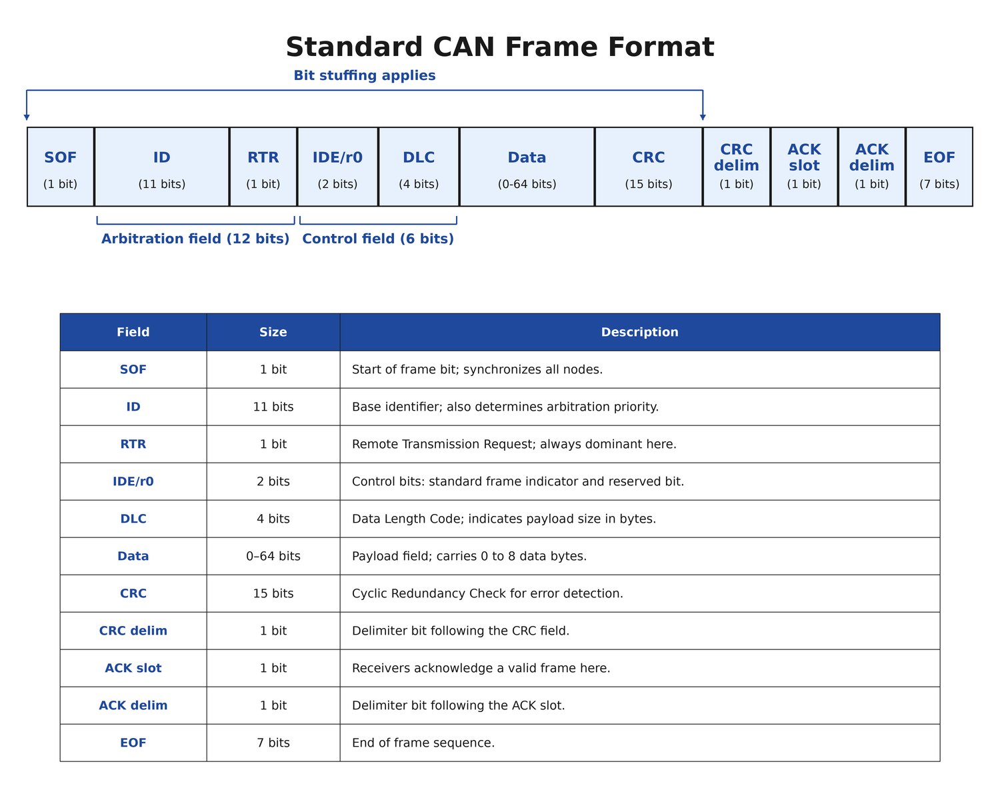

# Appendix A

## Introduktion till CAN

### Varför en delad buss över huvud taget
CAN konstruerades för fordons- och industrisystem: många oberoende styrenheter (motor, bromsar,
instrumentpanel, sensorer) som utbyter korta meddelanden tillförlitligt, utan någon enskild
felpunkt.

Punkt-till-punkt-kablage slutar skala nästan omedelbart. Det ramade protokollet i introduktionen om
ramar förutsatte en enda delad länk; en styrenhet som pratar med en instrumentpanel, en ABS-enhet
och tre sensorer skulle behöva fem separata länkar, var och en med eget kablage, egna kontakter och
egen transceiver.

En enda delad buss ersätter allihop: varje nod kopplas in på samma ledningspar, och varje nod kan
både lyssna och sända på den.

---

### Den fysiska bussen
En riktig CAN-buss är ett tvinnat differentialpar, `CAN_H` och `CAN_L`. En nod signalerar en bit
genom att driva isär de två ledningarna (**dominant**) eller låta dem flyta ihop genom ett motstånd
(**recessiv**). Ett externt transceiverchip sköter det analoga lagret.

Den här kursen arbetar helt ovanför det: ett logiskt värde per bit, `0` för dominant och `1` för
recessiv. Det är exakt vad en transceiver presenterar för, och tar emot från, den digitala logiken
på vardera sidan.

### Dominant och recessiv
Hela arbitreringsschemat vilar på en enda egenskap:
* **Recessiv (`1`)** är bussens viloläge. Varje nod släpper bussen och transceivrarnas
  förspänningsnät drar båda ledningarna till samma nivå.
* **Dominant (`0`)** hävdas genom att aktivt driva isär ledningarna. Om *någon* nod driver dominant
  medan resten är recessiva läser bussen dominant, oavsett hur många noder som är inblandade eller
  vilken som hävdade det först.

Det är precis en **wired-AND**: betrakta varje nods utgång som en ingång till en busstäckande
AND-grind, och `0` dominerar. Riktiga transceivrar implementerar det i hårdvara med öppen
dränering; `can_controller_tb` (L17) modellerar identiskt beteende digitalt genom att kombinera
varje nods `(tx_bus, bus_en)`-par på samma sätt.

---

### Multimaster, och varför det kräver arbitrering
De flesta inbyggda bussar besvarar frågan "vem får sända?" med dekret: SPI har en enda master, och
I2C, som visserligen definierar en wired-AND-arbitrering ungefär som den nedan, körs nästan alltid
med en enda master den också. CAN gör multimaster till normalfallet: **vilken nod som helst får
sända så snart bussen är ledig**, och om två startar i samma ögonblick avgör bussen själv vem som
fortsätter. Det finns ingen omsändningsfördröjning och en kollision är inget fel alls. Det här är
CAN:s signaturidé, **arbitrering**.

Mekanismen i korthet; det genomräknade exemplet kommer längre fram i det här appendixet:
1. Varje meddelande börjar med sin identifierare, sänd bit för bit, MSB först.
2. Varje sändande nod övervakar också bussen medan den sänder varje identifierarbit.
3. Så länge biten den sände stämmer med det bussen läser fortsätter den sända.
4. I det ögonblick en nod sänder recessivt (`1`) men observerar dominant (`0`) sänder någon annan
   nod en `0` där den själv sände en `1`. Den har förlorat arbitreringen: den slutar sända
   omedelbart och blir mottagare. Noden som fortsatte driva dominant vinner, utan att ha märkt
   någonting.

Två följder av det:
* **Lägre identifierare vinner alltid**, eftersom de bär fler inledande dominanta bitar. Därav
  "prioriteter" i CAN-folkloren.
* **Varje identifierare måste vara unik.** CAN lägger det kravet på nätverkskonstruktören;
  kontrollern upprätthåller det inte i hårdvara.

**En förenkling att flagga tidigt.** Steg 4 beskriver en *produktionsfärdig* kontroller, och att
sömlöst bli mottagare mitt i en ram är en del av varför riktig CAN behandlar en kollision som en
icke-händelse. Den här kursens `can_controller` (L16-L17) slutar driva i exakt samma ögonblick,
vilket är den del som spelar roll för bussen, men överger sedan ramen och sätter `error` i stället
för att avkoda vinnarens meddelande. L19 återkommer till det i sin lista över skillnader mot en
produktionsfärdig kontroller.

---

### Broadcast, inte adressering
Det ramade protokollet i introduktionen om ramar behövde DST och SRC eftersom fler än en nod kunde
lyssna. CAN står inför samma problem på samma sorts buss och besvarar det helt annorlunda: **en
CAN-ram bär ingen destinationsadress alls.**

Varje nod ser varje ram. Identifieraren som vinner arbitreringen namnger ingen mottagare; den
namnger *sortens meddelande*, utsänt till alla och relevant för den som bryr sig. Varje nod avgör
själv om en identifierare betyder något, typiskt genom att jämföra den mot en liten uppsättning den
är intresserad av, i mjukvara eller i kontrollerns filtreringshårdvara. En nod som inte är
intresserad kastar helt enkelt ramen; ingenting på protokollnivå styrde undan den.

**Exempel.** Anta att en konstruktion reserverar identifierare enligt konvention,
`StatusReq = 0x300 + nodeId` och `StatusResp = 0x400 + nodeId`. Sensornod 3 tillfrågas om status på
`0x303` och svarar på `0x403`. Varje nod tar emot ramen `0x303`; bara den som känner igen den som
sin egen förfrågningsidentifierare svarar. Inget fält sa "det här är till nod 3".

Det är ett genuint annorlunda designval. Protokollet i introduktionen om ramar skalar adressering
genom att bredda DST och SRC när antalet noder växer; CAN skalar genom konvention för hur
identifierare tilldelas och filtreras, och det finns inget adressfält att bredda.

---

## CAN-ramformatet



### Översikt
Den här kursen implementerar CAN:s **standarddataram (basformatet)**, bit för bit som standarden
definierar den: en 11-bitars identifierare och upp till 8 databytes. Fjärramar, utökade 29-bitars
identifierare och allt standarden definierar *runt* dataramar (fel- och överlastramar, och den
3-bitars intermission som skiljer en ram från nästa) ligger utanför kursens ram, men varje ram den
här kontrollern lägger ut på ledningen är en fullt standardenlig dataram. Det är samma förenkling
som riktiga konstruktioner ofta utgår från, och den räcker gott och väl för att bygga en genuin,
fungerande kontroller.

Diagrammet ovan ger sändningsordningen och varje fälts bredd. Bitstoppning gäller varje fält från
**SOF till och med CRC-fältet**, och inte CRC-avgränsaren, ACK-fältet eller EOF.

---

### Fält för fält
Vad som följer är varför varje fält finns, och var den här kursen förenklar.

**SOF, 1 bit, alltid dominant.** Sänds ut på en i övrigt ledig, recessiv buss, så den producerar den
enda recessiv-till-dominant-flank varje nod väntar på. Den flanken markerar både att en ram börjar
och resynkroniserar varje nods bittajming mot den; `bit_timer.resync` i L12 är precis det här.

**Identifierare, 11 bitar, MSB först.** Fungerar samtidigt som meddelandets arbitreringsprioritet.
Varje sändande nod jämför varje bit den sänder mot vad bussen faktiskt läser, och faller ifrån i det
ögonblick den sänder recessivt men observerar dominant.

**RTR, 1 bit, alltid dominant här.** Remote Transmission Request-biten avslutar det 12 bitar långa
arbitreringsfältet: dominant markerar en dataram, recessiv en *fjärram*, en begäran om att den som
äger identifieraren sänder sin data. Den här kursen stöder bara dataramar, så dess kontroller sänder
alltid RTR dominant, och en mottagare som samplar den recessiv överger ramen och sätter `error` (L17
implementerar den kontrollen). Formellt spänner arbitreringen över identifieraren *och* RTR; i
riktig CAN är det det som låter en dataram slå en fjärram med samma identifierare. När varje nod här
sänder RTR dominant avgör identifieraren alltid ensam.

**Kontrollfält, 6 bitar: IDE, r0, DLC.**
* **IDE** är alltid `0` här; `1` skulle markera en ram med utökad identifierare, utanför den här
  kursens ram.
* **r0** är reserverad, alltid `0`.
* **DLC** är det 4 bitar breda längdfältet, `0`-`8` bytes kodade som `0000`-`1000`. Det är
  längdfältet från introduktionen om ramar i ny skepnad: utan det skulle en mottagare inte kunna
  avgöra om datafältet slutar efter den här byten eller fortsätter.

**Datafält, 0 till 8 bytes.** Sänds MSB först, byte 0 först, med den längd DLC annonserade. När DLC
är `0` saknas fältet helt och CRC:n följer direkt på kontrollfältet.

**CRC-fält, 15 bitar plus en avgränsare.** CRC:n täcker varje bit från SOF till och med datafältets
slut, och är långt mer robust än den summerade checksumman i introduktionen om ramar. En detalj
spelar roll längre fram: den täcker bara de *riktiga* bitarna. Stoppbitar sätts in efter att CRC:n
beräknats på vägen ut och kastas innan den kontrolleras på vägen in, så de kommer aldrig in i
beräkningen (L14 och L15 är där den grindningen byggs). L13:s motor beräknar den bitseriellt, en bit
i taget medan ramen sänds eller tas emot, utan något separat "beräkna checksumman"-steg på
slutet.

**CRC-avgränsaren** är den 16:e biten, alltid recessiv och aldrig stoppad. Den finns för att en bit
som är oberoende av stoppbitsregeln alltid ska följa på CRC-värdet, vilket är det som låter en
mottagare hitta gränsen mellan CRC- och ACK-fälten.

**ACK-fält, 2 bitar.** Sändaren sänder båda recessiva. Varje *annan* nod som tog emot ramen korrekt
(ramningen intakt, stoppningen respekterad, CRC:n giltig) drar ACK-luckan dominant. Sändaren
kontrollerar aldrig sin egen CRC mot sig själv, så den dominanta biten från någon annan är dess enda
bekräftelse på att ramen kom fram intakt någonstans. **ACK-avgränsaren** är recessiv och ostoppad,
och markerar gränsen av samma skäl som CRC-avgränsaren.

**EOF, 7 recessiva bitar, ostoppade.** Sju identiska bitar i rad är långt fler än stoppbitsregeln
någonsin skulle tillåta inuti ett stoppat fält, vilket är precis det som gör EOF omisskännligt. Det
håller bara om varje nod är överens om att inte stoppa det, vilket är varför EOF och de två
avgränsarna definieras som undantagna från stoppning.

---

### Bitstoppning
**Regeln.** Genom varje stoppat fält, SOF till och med CRC-fältet: efter **fem bitar i följd med
samma värde** sätter sändaren in en extra bit med *motsatt* värde. Den biten bär ingen data, och
varje mottagare kastar den genom att räkna på samma sätt.

**Varför den finns**, av två besläktade skäl:

1. **Klockåtervinning.** Varje nods bittimer går på sin egen oscillator. En lång följd av identiska
   bitar innehåller inga övergångar, så en mottagare har ingenting som bekräftar att den fortfarande
   ligger i linje med sändarens bitgränser. Att garantera en övergång minst var femte riktig bit
   begränsar hur långt dess tajming kan driva. Riktig CAN resynkroniserar på de flanker
   bitstoppningen garanterar; den här kursens kontroller är enklare och resynkroniserar bara vid SOF
   (`bit_timer.resync`, L12), vilket gör den begränsade driften ännu viktigare.
2. **Att skilja riktig data från EOF.** EOF är sju identiska recessiva bitar, ostoppade. Ett stoppat
   fält kan aldrig av misstag producera den följden, vilket är det som gör sju ostoppade recessiva
   bitar till ett otvetydigt ramslut snarare än något identifieraren eller datafältet kunde ha
   producerat av en slump.

**Genomräknat exempel.** För att sända den 8 bitar långa sekvensen `11111000` slår regeln till efter
den femte `1`:an i följd: sätt in en `0`, fortsätt sedan med den riktiga datan. Varje kolumn nedan
är en bit som faktiskt ligger på ledningen, så raden med riktiga bitar lämnar en lucka där
stoppbiten sitter:

```text
Riktiga bitar:            1  1  1  1  1  -  0  0  0
Sänd bitström:            1  1  1  1  1  0* 0  0  0
Antal i följd:            1  2  3  4  5  1  2  3  4
                                         ^ stoppbit - inte riktig data
```

Läs antalsraden mot den sända raden, inte mot raden med riktiga bitar: regeln räknar bitar på
ledningen. Stoppbiten är själv den första biten i den nya följden, vilket är varför antalet står som
`1` under den och `2` under den första riktiga `0` som följer. L14 bygger precis den här räknaren i
hårdvara.

En mottagare räknar samma fem `1`:or, förväntar sig att nästa bit är en stoppbit, och kastar den om
den inverterar följden. Dyker det i stället upp en *sjätte* `1` i följd där stoppbiten skulle ha
suttit är det en stoppningsöverträdelse: ett detekterat ramfel, behandlat som fatalt, rapporterat av
`rx_shift_reg.stuff_error` i L15.

**En finess värd att nämna redan nu, eftersom den överraskar folk senare.** Räkningen av bitar i
följd nollställs *inte* vid fältgränser. En följd som börjar i ett fält och fortsätter in i nästa
räknas rakt igenom, och kan utlösa en stoppbit precis vid gränsen. Stoppningen bryr sig bara om
bitarna som faktiskt ligger på ledningen, aldrig om vilket namngivet fält de tillhör.

---

### Arbitrering, genomräknad i sin helhet
Noderna P (identifierare `0x0F0`) och Q (identifierare `0x100`) börjar sända vid samma SOF. Båda
sänder SOF som `0`, så ingen strid uppstår än. Sedan identifierarna, MSB först:

```text
             bit:  1  2  3  4  5  6  7  8  9 10 11
P (0x0F0) sänder:  0  0  0  1  1  1  1  0  0  0  0
Q (0x100) sänder:  0  0  1  -  -  -  -  -  -  -  -   (förlorar vid bit 3, slutar driva)
bussen läser:      0  0  0  1  1  1  1  0  0  0  0
```

Bitarna 1-2 stämmer för båda noderna, så ingenting händer. Vid bit 3 sänder P dominant och Q
recessivt, så bussen läser dominant. Q, som övervakar medan den sänder, ser sin egen `1` mot en buss
som läser `0`: **Q har förlorat arbitreringen** och slutar driva omedelbart. P ser `0` på en buss
som läser `0`, exakt vad den förväntade sig, och fortsätter utan att någonsin få veta att en strid
ägde rum.

I en produktionsfärdig kontroller skulle Q nu ta emot resten av P:s ram. Den här kursens
`can_controller` slutar driva i samma ögonblick men överger ramen, som flaggades ovan och som L19
återkommer till.

Mekanismen generaliserar till godtyckligt antal samtidiga sändare: den numeriskt lägsta
identifieraren vinner (likvärdigt: den längsta följden av inledande dominanta bitar), och varje
förlorare faller ifrån i det ögonblick dess recessiva bit övertrumfas, aldrig senare än exakt den
biten.

---

### Bittajming och sampelpunkten
Arbitrering fungerar bara om varje nod är överens om *när* en bit ligger på bussen, vilket väcker en
fråga: vid vilken punkt inom en bitperiod läser en nod den?

Varje nod delar upp sin egen klocka i bitperioder med fast längd med hjälp av sin egen lokala
bittimer. Eftersom de oscillatorerna är oberoende, och eftersom signaler tar tid på sig att utbreda
sig längs bussen, samplar en nod **inte** vid periodens början. Den väntar till en **sampelpunkt**
längre in i perioden, då den sända nivån hunnit stabilisera sig.

Den här kursen samplar 70 % in i varje bitperiod, ett rimligt och enkelt val för en kort buss på ett
enda kort vid 1 Mbit/s.

Riktiga CAN-kontrollrar gör sampelpunkten konfigurerbar och delar upp bitperioden i namngivna
segment (utbredningssegment, fassegment) avstämda mot busslängd, utbredningsfördröjning och
oscillatortolerans. Det ligger utanför den här kursens fasta sampelpunkt.

[Appendix B](./b_can_def_package.md) gör om de 70 % till den konkreta VHDL-konstanten
`SAMPLE_TICK`, härledd ur klockfrekvensen och bithastigheten i stället för hårdkodad.

---

### Vad som kommer härnäst
Varje konstant den här föreläsningen definierade behöver nu ett hem i VHDL; se
[Appendix B](./b_can_def_package.md), det delade paketet `can_def` som resten av projektet läser.
Det innehåller:
* Ramfältens bredder från diagrammet ovan.
* Bittajmingskonstanterna, inklusive 70 %-sampelpunkten.
* CRC-15-polynomet, som används av `crc15` i L13.
* Gemensamma subtyper, så att varje modul namnger likadant formade signaler på samma sätt.

L11 avbildar sedan den här föreläsningens protokoll på en blockarkitektur och fördelar arbetet
mellan en bittimer, en CRC-motor, sändnings- och mottagningsskiftregistren och den tillståndsmaskin
som sekvenserar ramens fält och driver dem. Den bygger ingen av dem. Det den skriver är entiteten de
alla ska bo i, `can_controller.vhd`, vars arkitektur den medvetet lämnar tom.

Från L12 och framåt implementeras varje block, testas mot en utdelad testbänk och instansieras inuti
den entiteten, så att toppnivån fylls i inifrån. I L19 tas den färdiga konstruktionen upp på
DE0-CV-kortet.

---

