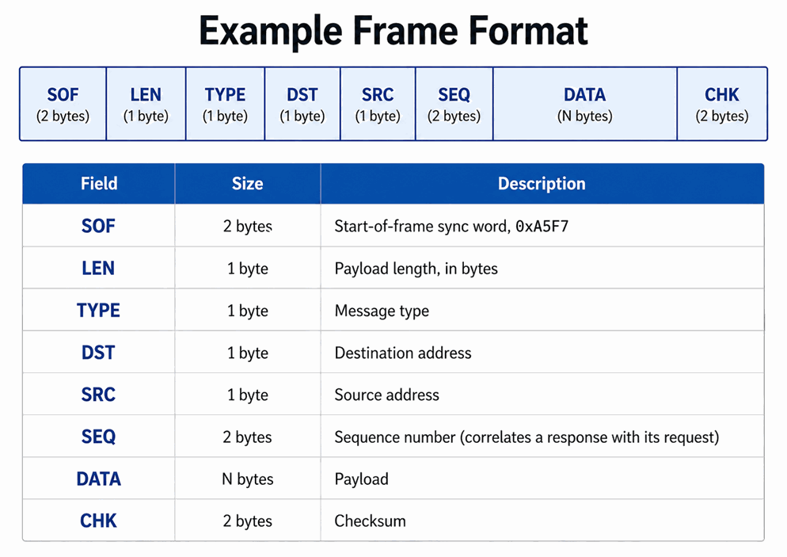

# Introduktion - ramar och serialisering

## Ramar i inbyggda system

### Bakgrund
L01-L08 slutade med tillståndsmaskiner som styrde ett enda kort: en blinkande lysdiod, en UART på
en FPGA. Projektet utgår från ett annat problem:
* Att få oberoende hårdvarudelar att utbyta information tillförlitligt över en delad ledning.
* Ingen av sidorna kan se in i den andra.

Det här är centralt i inbyggda system eftersom kommunikationen sker som råa byteströmmar, RAM och
flash är begränsade, och robusthet är kritisk.

I inbyggda system kommunicerar noder oftast över seriella gränssnitt som UART, SPI, I2C eller
RS-485. Data skickas som en följd av bytes, och att tolka den byteströmmen kräver en struktur. Den
strukturen kallas en **ram**.

En ram är en strukturerad representation av data som:
* Innehåller tydligt definierade fält.
* Har en definierad längd.
* Kan valideras (till exempel via en checksumma).
* Kan serialiseras till en bytearray (`std::uint8_t[]`).
* Kan deserialiseras från en bytearray.

Betrakta nod A som skickar värdet `0x2A` till nod B över en delad ledning, utan att något annat är
överenskommet i förväg:
* Hur vet B när ett nytt värde börjar i en ström av bitar som ser likadan ut mitt i ett värde som
  mellan två värden?
* Hur vet B hur långt (hur många bytes) värdet är?
* Hur vet B att bitarna den samplade inte förvanskades av elektriskt brus?
* Vad händer om två noder sänder samtidigt?

Varje riktigt protokoll besvarar de här med någon kombination av följande, var och en namngiven
här efter det fält den här kursens ram bär den i:
* **Ramning (`SOF`):** en igenkännbar startmarkör (och ofta slutmarkör), så att en mottagare kan
  avgöra var ett meddelande börjar (och var det slutar).
* **Ett längdfält (`LEN`):** så att mottagaren vet hur mycket nyttolast den ska vänta sig.
* **En checksumma (`CHK`):** extra bitar, beräknade ur nyttolasten, som låter mottagaren upptäcka
  (inte nödvändigtvis rätta) många sorters överföringsfel (bitvändningar, tappade bytes, och så
  vidare).
* **En regel för mediaåtkomst:** vad som händer när fler än en nod vill sända samtidigt.

Ett `TYPE`-fält sällar sig till dem för att säga vad meddelandet betyder, så att mottagaren kan
agera utifrån det.

---

### En liten men realistisk ram
För att göra det konkret: konstruera en ram för att skicka korta meddelanden mellan noder på en
delad, byteorienterad länk (UART, RS-485, ...):



Tre regler spelar roll så snart man börjar räkna ut de här fälten för hand:
* **Byteordning:** varje fält bredare än en byte (SOF, SEQ, CHK) är big-endian, mest signifikanta
  byte först.
* **LEN** räknar bara DATA-fältet, aldrig huvudet och aldrig CHK.
* **CHK** är en 16-bitars summa av varje byte från SOF till och med den sista nyttolastbyten, som
  slår runt vid spill. Den beräknas över den *serialiserade* byteströmmen snarare än över
  fältvärdena som heltal, så SOF bidrar med `0xA5 + 0xF7`, inte `0xA5F7` behandlat som ett enda
  16-bitarstal.

**Varför just DST, SRC och SEQ?** SOF, LEN, TYPE och CHK besvarar redan de fyra frågorna ovan. De
här tre finns eftersom en delad länk med fler än två deltagare väcker nya:
* **DST/SRC:** vem ramen är till och vem den är från, så att en nod kan ignorera trafik adresserad
  någon annanstans och ett svar kan hitta tillbaka. CAN besvarar det här helt annorlunda, som
  Appendix A visar.
* **SEQ:** matchar ett svar tillbaka mot *just den* förfrågan, inte någon annan som är i luften.

---

### Att välja SOF
* En enda synkbyte är lätt att träffa av misstag: vilken nyttolastbyte som helst som råkar vara
  lika med den ser ut som början på en ram.
* Två bytes är därför vanligt, och det här protokollet använder `0xA5F7`.
* SOF är det *första* en parser kontrollerar när den läser en ram:
  * Stämmer den inte kastas datan.
  * Parsern fortsätter söka efter nästa SOF.
* Lägg märke till vad det ger och inte ger:
  * Det gör en falsk synkronisering mycket mindre sannolik.
  * Det gör den inte omöjlig, eftersom nyttolastbytes fortfarande kan råka stava `A5 F7`.
  * Den kvarvarande risken är varför LEN och CHK ändå måste kontrolleras efteråt.

---

### Genomräknat exempel: PING och PONG
Anta att nod `0x01` pingar nod `0x02`, med sekvensnummer `0x0020` och utan nyttolast:
* `SOF = 0xA5F7`, `LEN = 0x00`, `TYPE = 0x00` (Ping), `DST = 0x02`, `SRC = 0x01`, `SEQ = 0x0020`.
* `CHK = 0xA5 + 0xF7 + 0x00 + 0x00 + 0x02 + 0x01 + 0x00 + 0x20 = 0x01BF`.

```text
SOF      LEN   TYPE   DST   SRC   SEQ      DATA   CHK
A5 F7    00    00     02    01    00 20    --     01 BF
```

Nod `0x02` svarar med en PONG:
* `SOF = 0xA5F7`, `LEN = 0x00`, `TYPE = 0x01` (Pong), `DST = 0x01`, `SRC = 0x02`, `SEQ = 0x0020`.
* `CHK = 0xA5 + 0xF7 + 0x00 + 0x01 + 0x01 + 0x02 + 0x00 + 0x20 = 0x01C0`.
* Lägg märke till att `DST` och `SRC` är omkastade, `SEQ` är oförändrad, och bara `TYPE` och de
  två adresserna skiljer sig från PING:en: identisk aritmetik med andra indata.

Det täcker tre av de fyra inledande frågorna, plus de extra som en delad länk med flera noder
väcker. Den fjärde står fortfarande öppen: vad händer om två noder sänder samtidigt? CAN besvarar
den annorlunda, och det är ämnet för Appendix A.

---

### Ramtyper
TYPE är en byte på ledningen, så en ramtyp färdas som ett teckenlöst heltal. Varje typ tilldelas
sitt eget ID enligt konvention:
* `Ping = 0`
* `Pong = 1`
* `StatusReq = 2`
* `StatusResp = 3`

Ytterligare typer som protokollet får fortsätter helt enkelt sekvensen.

Två följder värda att notera innan någon kod skrivs:
* Den mottagna byten är obetrodd indata. Varje värde mottagaren inte känner igen måste förkastas
  i stället för att agera på, precis som en felaktig SOF eller en felaktig checksumma.
* Att reservera ett ID direkt ovanför den sista riktiga typen, ett "okänt"-värde, gör den
  kontrollen till en enda jämförelse. Utan det behöver valideringen en lista över giltiga ID:n som
  måste hållas i takt varje gång en typ läggs till.

---

### En enkel 16-bitars checksumma
För den här kursen behöver en checksumma bara vara:
* Enkel att implementera.
* Enkel att testa.
* Tillräckligt bra för att fånga många slumpmässiga bitfel.

En 16-bitars summa uppfyller alla tre:
* Börja på `0`.
* För varje byte i intervallet: `sum += byte`.
* Resultatet är checksumman, modulo 2^16.

```cpp
/**
 * @brief Compute a simple 16-bit checksum (sum of bytes modulo 2^16).
 *
 * @param[in] data Pointer to the bytes to checksum.
 * @param[in] dataLen Number of bytes to checksum.
 *
 * @return The 16-bit checksum.
 */
std::uint16_t checksum16(const std::uint8_t* data, const std::size_t dataLen) noexcept
{
    if ((nullptr == data) || (0U == dataLen)) { return 0U; }
    std::uint16_t checksum{};
    for (std::size_t i{}; i < dataLen; ++i) { checksum += data[i]; }
    return checksum;
}
```

**En checksummas begränsningar, värda att vara tydlig med:**
* En checksumma upptäcker bara fel som ändrar den aritmetiska summan.
* En enda vänd bit ändrar alltid summan, så enbitsfel fångas alltid.
* De riktiga svagheterna ligger någon annanstans: två hela bytes som byter plats lämnar summan
  oförändrad, och *vissa* kombinationer av flera vända bitar tar ut varandra och slinker igenom
  oupptäckta.
* CRC:er:
  * Introduceras ordentligt i Appendix A i den här föreläsningen.
  * Implementeras i L13.
  * Fångar en mycket bredare, matematiskt välförstådd klass av fel.
  * Används därför av CAN i stället för en enkel summa.

Det här är inte lika starkt som en CRC, men det räcker för att öva ramning, parsning och robust
felhantering, vilket är vad den här introduktionen är till för.

---

### Serialisering och deserialisering
* **Serialisering** omvandlar strukturerad data till en följd av bytes (`std::uint8_t[]`) så att
  den kan skickas över ett gränssnitt.
* **Deserialisering** tolkar en mottagen bytearray och plockar ut den strukturerade datan igen:
  * Fälten valideras först (SOF, längd, typ, checksumma).
  * Först när varje kontroll passerat plockas datan ut.

Att validera före utplockning spelar roll eftersom UART och RS-485 levererar bytes som en ström,
så en mottagare ser rutinmässigt:
* Skräp mellan ramar.
* Tappade bytes.
* Förvanskade ramar.

I inbyggda system görs det här nästan alltid med:
* C-arrayer (`std::uint8_t buffer[Size]`).
* Pekare till de arrayerna vid anropsgränser (`std::uint8_t*`).
* En explicit längd (`std::size_t`).

Båda riktningarna behöver samma hantering av byteordning på varje flerbytesfält, vilket är
repetitivt och lätt att få subtilt fel. Två funktionsmallar tar bort upprepningen. Båda begränsar
`T` med `std::is_unsigned`, så var de än hamnar behöver de `<type_traits>`; `comm/def.hpp`
inkluderar bara `<cstddef>` och `<cstdint>`, så inkluderingen ligger på er:

```cpp
#include <type_traits>

/**
 * @brief Write a value to a buffer, most significant byte first.
 *
 *        The caller is responsible for the buffer being large enough.
 *
 * @tparam T The value type. Must be unsigned.
 *
 * @param[out] buf The buffer to write to.
 * @param[in] offset Value offset, i.e. the index at which to write the value.
 * @param[in] value  The value to write.
 */
template <typename T>
void writeToBuf(std::uint8_t* buf, const std::size_t offset, const T value) noexcept
{
    static_assert(std::is_unsigned<T>::value, "Failed to write to buffer: T must be unsigned!");
    constexpr std::size_t len{sizeof(T)};
    constexpr std::size_t msb{len - 1U};
    constexpr std::size_t bitsPerByte{8U};

    for (std::size_t i{}; i < len; ++i)
    {
        const std::size_t shift{bitsPerByte * (msb - i)};
        buf[offset + i] = static_cast<std::uint8_t>((value >> shift));
    }
}

/**
 * @brief Read a value from a buffer, most significant byte first.
 *
 * @tparam T The value type. Must be unsigned.
 *
 * @param[in] buf Buffer to read from.
 * @param[in] offset Value offset in the buffer.
 *
 * @return The retrieved value.
 */
template <typename T = std::uint8_t>
[[nodiscard]] T readFromBuf(const std::uint8_t* buf, const std::size_t offset) noexcept
{
    static_assert(std::is_unsigned<T>::value, "Failed to read from buffer: T must be unsigned!");
    constexpr std::size_t len{sizeof(T)};
    constexpr std::size_t msb{len - 1U};
    constexpr std::size_t bitsPerByte{8U};
    T value{};

    for (std::size_t i{}; i < len; ++i)
    {
        const std::size_t shift{bitsPerByte * (msb - i)};
        value |= static_cast<T>(buf[offset + i]) << shift;
    }
    return value;
}
```

**En fälla värd att namnge, eftersom kompilatorn inte fångar den.** Antalet bytes som skrivs är
`sizeof(T)`, härlett ur *argumentet*, inte ur fältet. Att skicka in en `std::size_t` där fältet är
en byte skriver **åtta** bytes och skriver i tysthet över fälten som följer:

```cpp
constexpr std::size_t payloadLen{0U};
writeToBuf(buf, FrameOffset::Len, payloadLen);                            // Writes 8 bytes (error).
writeToBuf(buf, FrameOffset::Len, static_cast<std::uint8_t>(payloadLen)); // Writes 1 byte.
```

Casta alltid till fältets egen bredd på anropsstället.

---

### Från papper till kod
Precis den här ramen görs körbar i C++ under [`code`](./code/):
* En `Frame`-struct som:
  * Serialiserar sig själv till en bytebuffert.
  * Deserialiserar sig själv tillbaka.
  * Förkastar allt med felaktig SOF, längd, typ eller checksumma.
* Att serialisera PING:en ovan producerar exakt de bytes som räknades ut ovan:
  * `A5 F7 00 00 02 01 00 20 01 BF`.
* [`comm/def.hpp`](./code/include/comm/def.hpp) tillhandahåller redan fältoffseten och
  fältlängderna, så ni behöver aldrig räkna bytepositioner för hand.
* Att göra typ-ID:na ovan till en C++-uppräkning, deklarera structen och implementera båda
  metoderna själva är del II av [ramövningarna](./intro_framing_exercises.md):
  * Övningen specificerar dem i sin helhet.
* En uppsättning enhetstester följer med koden, i
  [`test/frame_test.cpp`](./code/test/frame_test.cpp):
  * De kontrollerar båda metoderna mot ramarna som räknades ut på papper, byte för byte.
  * Ni skriver dem inte; `make` kör dem, och er uppgift är att få dem att passera.
  * De är också där fällorna dyker upp: en förvanskad ram som måste förkastas, och ett
    byteordningsmisstag som gör en `SEQ` på `0x7F05` till `0x057F`.

---

### Vad som kommer härnäst
En fråga från början av det här appendixet står fortfarande öppen: **vad händer om två noder
sänder samtidigt?**

Ingenting i det här ramformatet besvarar den. Ett synkord kan inte hjälpa, eftersom båda sändarna
skickar ett; en checksumma kan inte hjälpa, eftersom den bara rapporterar skadan i efterhand. Att
besvara den kräver ett annat slags protokoll, ett där bussens *elektriska* beteende avgör vem som
fortsätter och vem som faller ifrån, innan någon data går förlorad.

Det protokollet är CAN, och det är hela Appendix A:
* Varför en delad buss inte behöver någon master alls.
* Dominanta och recessiva bitar, och varför den ena alltid vinner.
* CAN-ramformatet, fält för fält.
* Bitstoppning, och arbitreringsmekanismen genomräknad för hand.

Appendix A återkommer också direkt till den här ramen: CAN bär **ingen destinationsadress**, så
DST/SRC-fälten ni just konstruerat har ingen motsvarighet alls där.

Det här är kursens enda C++-material. Appendix B gör sedan CAN:s fältbredder och tajming till
`can_def.vhd`, ett VHDL-paket av konstanter. Från den punkten och framåt använder kursen VHDL hela
vägen fram till kortet.

---

