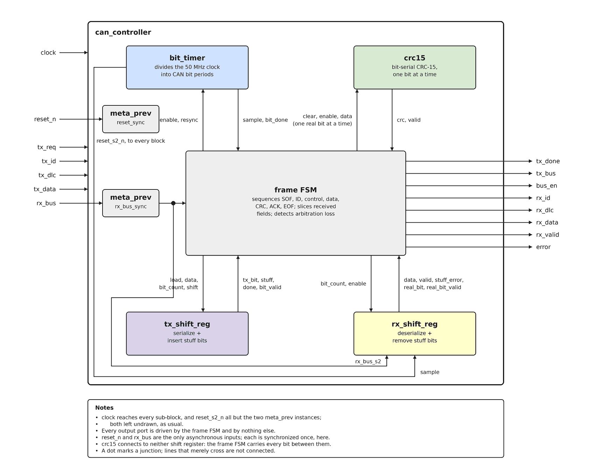
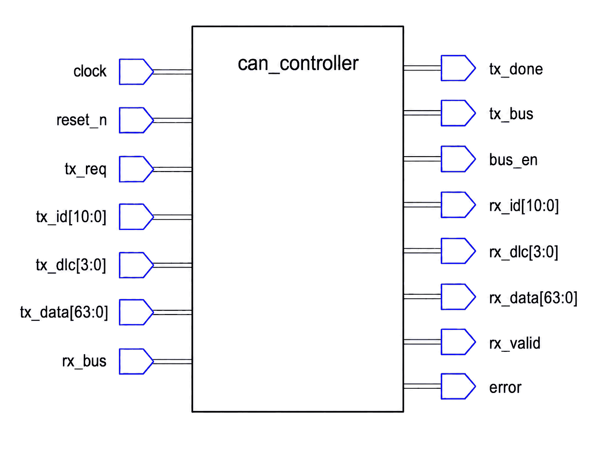

# Appendix A

## Från protokoll till blockschema

### Kontrollerns arkitektur
Varje regel från L10 avbildas på ett av fem block:
* **`bit_timer`** äger ingenting om *vad* som sänds, bara *när*. Den är det enda i den här
  konstruktionen som ens gränsar till en klockdomänövergång: den frilöper kontinuerligt så snart
  den är aktiverad, och resynkroniserar exakt en gång per ram, vid SOF (L10:s resonemang om
  "klockåtervinning", tillämpat).
* **`tx_shift_reg`/`rx_shift_reg`** äger bitstoppningen (L10) och ingenting annat: de serialiserar
  eller deserialiserar upp till 8 riktiga bitar i taget och sätter transparent in eller tar bort
  stoppbitar. De har ingen aning om huruvida bitarna de skiftar är ett ID, en databyte eller ett
  CRC-värde; det är `can_controller`s jobb.
* **`crc15`** äger CRC-15-beräkningen (L10), en bit i taget, utan någon föreställning om "ramar"
  eller "fält" den heller; den ackumulerar bara den bit den får, när den blir tillsagd.
* **`can_controller`** är det enda block som känner till det faktiska CAN-ramformatet: det
  sekvenserar genom SOF, arbitrering, kontrollfältet, data, CRC, ACK och EOF, i ordning, driver de
  andra fyra blocken och läser deras utgångar. Detektering av förlorad arbitrering bor också här,
  eftersom den specifikt handlar om att jämföra vad den här can_controller bestämde sig för att
  sända mot vad bussen faktiskt visar.



Diagrammet ritas utifrån block- och kopplingslistorna inuti
[`images/architecture.py`](./images/architecture.py); ändras arkitekturen är det det skriptet som
ska redigeras och köras om, snarare än att rita om för hand.

Två konventioner håller bilden läsbar. `clock` når varje delblock, och den synkroniserade
`reset_s2_n` når alla utom de två `meta_prev`-instanser som producerar den och dess
bussmotsvarighet; båda lämnas oritade, som brukligt i ett blockschema. Varje utgångsport
(`tx_done`, `tx_bus`, `bus_en`, `rx_id`, `rx_dlc`, `rx_data`, `rx_valid`, `error`) drivs av
ramtillståndsmaskinen och av ingenting annat.

Tre av de elva interna kopplingarna är värda att läsa två gånger, eftersom det är de som folk
ritar om fel ur minnet:
* De två linjerna vid `crc15` går i **motsatta** riktningar. `clear, enable, data` går upp in i
  den, en riktig bit i taget; `crc, valid` kommer tillbaka ner ur den. (`clear` är L13:s reset per
  ram - motorn måste börja varje ram på noll, och en avbruten ram skulle annars lämna rester efter
  sig; L16 driver den från `STATE_START`.)
* `rx_shift_reg` har **tre** linjer som anländer: `sample` från `bit_timer`, `rx_bus_s2` från
  synkroniseraren som L12 lägger till, och `bit_count, enable` från ramtillståndsmaskinen. Utan de
  två första har den ingen datakälla alls.
* `tx_shift_reg` och `rx_shift_reg` kopplas aldrig till varandra, och ingen av dem kopplas till
  `crc15`. Ramtillståndsmaskinen bär varje bit mellan dem. `rx_shift_reg` är på samma sätt det
  enda delblock som över huvud taget läser bussen, och till och med det läser den synkroniserade
  kopian snarare än porten; se "Vad kontrollern synkroniserar" nedan.

**Hur de nästlas.** Diagrammet ovan läses som en lagerbild, med det billigaste bekymret överst,
men den faktiska VHDL-hierarkin är inneslutning, inte en pipeline: `can_controller` instansierar
alla fyra av `bit_timer`, `crc15`, `tx_shift_reg` och `rx_shift_reg` inuti sig själv, vid sidan av
den `meta_prev`-synkroniserare som L12 lägger till. `can_controller` är därför den enda entitet ni
någonsin instansierar för hand, och hela kontrollern är en komponent utifrån sett, exakt som
registerbanken i L18 kommer att se den.

Två lager till sitter sedan ovanför den: `register_bank` (L18), som gör om de portarna på
registernivå till den registerkarta en drivrutin pollar, och `can_spi_node` (L19), toppnivån som
lägger till SPI-transporten och kortets pinnar. Båda hör till att nå kontrollern, inte till att
tala CAN, vilket är varför de dyker upp i de två sista föreläsningarna snarare än här.

Den här uppdelningen (ett block per *ansvar*, inte ett block per *ramfält*) är medveten:
`tx_shift_reg` återanvänds för ID:t, kontrollfältet, varje databyte och CRC-värdet, helt enkelt
omladdat med olika data och olika bitantal varje gång, i stället för att skriva nästan identisk
skiftlogik fem separata gånger.

---

### Att följa en ram genom blocken
Att namnge de fem blocken är inte samma sak som att veta hur de samarbetar. Det här avsnittet tar
en konkret ram, ID `0x123`, DLC `2`, databytesen `A1 B2`, och följer den genom arkitekturen ovan.
Det finns ingen VHDL här; frågan är bara vilket block som gör vad, och vad som passerar mellan
dem.

**Först, det enda block som räknar tid.** `bit_timer` delar upp 50 MHz-klockan i bitperioder och
avger två pulser per period: `sample`, 70 % in i perioden, när nivån på bussen hunnit stabilisera
sig, och `bit_done`, allra sist, när den aktuella biten är klar. Varje annat block agerar på en av
de två pulserna, och inget av dem räknar klockcykler mot bussen själv. Sändning rör sig på
`bit_done`, vid gränsen där en ny bit börjar. Mottagning rör sig på `sample`, mitt i en bit som
redan ligger där. Just den skillnaden är varför en mottagare läser det värde en sändare lagt ut, i
stället för att fånga det mitt i en förändring.

**Sändning: 60 bitar, 50 av dem genom ett register.** Med fältbredderna från L10 är den här ramen
`1` (SOF) + `11` (ID) + `1` (RTR) + `2` (IDE, r0) + `4` (DLC) + `16` (data) + `15` (CRC) =
**50 bitar i det stoppade området**, följt av en ostoppad svans på `1` + `1` + `1` + `7` =
**10 bitar**. Sextio bitar innan någon stoppbit satts in.

De 50 bitarna når bussen som **åtta laddningar av ett enda `tx_shift_reg`**:

| # | Grupp | Bitar |
|---|-------|-----:|
| 1 | SOF | 1 |
| 2 | Identifieraren, hög del | 8 |
| 3 | Identifieraren, låg del + RTR | 4 |
| 4 | IDE, r0, DLC | 6 |
| 5 | Databyte 0 (`A1`) | 8 |
| 6 | Databyte 1 (`B2`) | 8 |
| 7 | CRC, hög del | 8 |
| 8 | CRC, låg del | 7 |

`can_controller` laddar om samma 8-bitarsregister åtta gånger, varje gång med ett annat värde och
ett annat bitantal. Det är påståendet "ett block per ansvar" ovan, gjort konkret: identifieraren
är inget fält för skiftregistret, den är grupp 2. De återstående 10 svansbitarna når aldrig något
skiftregister alls; de är fasta recessiva nivåer, och `can_controller` driver dem direkt medan den
räknar `bit_done`-pulser.

Inom en grupp händer fyra saker per bit:
* `tx_shift_reg` producerar nästa bit. Laddningen presenterar den första omedelbart; varje
  `bit_done` därefter skiftar ut nästa. Registret avgör också, på egen hand, om en stoppbit ska
  sättas in, och annonserar på `stuff` vilken sorts bit det här var.
* `can_controller` gör om biten till bussnivåer. Dominant betyder `bus_en = '1'` med
  `tx_bus = '0'`; recessiv betyder `bus_en = '0'`, vilket släpper bussen. En nod driver aldrig
  recessivt aktivt (L10:s wired-AND).
* `crc15` matas med samma bit, men bara när den var en riktig. Stoppbitar hoppas över. `crc15` har
  ingen aning om vad en stoppbit är; att bli tillsagd när den *inte* ska ackumulera är hela dess
  gränssnitt på den här sidan.
* `can_controller` jämför `rx_bus` mot biten den just drev. Den jämförelsen är arbitreringen, och
  den stannar här snarare än i ett delblock eftersom den behöver både vad den här noden avsåg och
  vad bussen faktiskt visar, och `can_controller` är det enda block som håller båda.

Efter grupp 6 håller `crc15` CRC:n över allt som sänts hittills. `can_controller` läser den och
matar tillbaka den rakt in i `tx_shift_reg` som grupp 7 och 8. Lägg märke till vad det betyder:
motorn som beräknar CRC:n och registret som sänder den kopplas aldrig till varandra.
`can_controller` bär värdet över, vilket är varför inget av blocken behöver veta att ett CRC-fält
finns.

**Mottagning: samma väg, speglad.** `rx_shift_reg` samplar `rx_bus` på `bit_timer.sample`, tar
bort stoppbitar och rapporterar varje riktig bit på `real_bit`/`real_bit_valid`. De två signalerna
matar `crc15` precis som `tx_shift_reg`s gör vid sändning: samma instans, samma regel om att bara
ackumulera riktiga bitar, ingen lägesomkoppling någonstans (vilket är L13:s poäng om att en motor
gör båda jobben). Fullbordade grupper anländer på `data`, och `can_controller` skivar tillbaka dem
till `rx_id`, `rx_dlc` och `rx_data`. En stoppbit som uteblir höjer `stuff_error`, och
`rx_shift_reg` stannar där: den rapporterar brottet utan att avgöra vad det betyder. Att avgöra är
`can_controller`s jobb, och den bestämmer sig för att avbryta ramen och höja `error`.

**Vad genomgången visar.** Inget delblock vet vilket fält det hanterar. Vart och ett rapporterar
fakta om *bitar*: en är klar, den där sattes in, en stoppbit saknades, den här gruppen är
fullbordad. `can_controller` levererar varenda del av meningen. Tre saker följer, och alla tre är
värda att ha:
* De fyra delblocken går att testa utan CAN. Deras testbänkar i L12 till L15 driver bitmönster och
  kontrollerar bitmönster; inte en enda av dem behöver en hel ram för att vara meningsfull.
* `can_controller` är det enda block som skulle ändras om ramformatet gjorde det. Utökade
  29-bitars identifierare skulle till exempel betyda andra grupper, inte andra block.
* Varje koppling mellan block är en signal på en bit eller en byte med exakt en skrivare. Det finns
  ingen delad buss eller gemensam struktur som två block båda griper in i, vilket är det som håller
  kopplingsarbetet i L12 till L15 vid en port map i taget snarare än en omkonstruktion varje
  föreläsning.

---

### Kontrollerns gränssnitt
`can_controller`s portar är vad omvärlden ser, och de ligger fast resten av kursen: L12 till L17
lägger till delblock *inuti* den här entiteten utan att ändra en enda port. Två saker kopplas till
den, och varje port hör till en av dem.



**Bussidan, fem portar.** Det är de portar som når omvärlden som fysiska pinnar; de tre första
vetter mot CAN-transceivern:
* `rx_bus` är den aktuella bussnivån, en bit, direkt från transceivern och asynkron mot `clock`.
  Kontrollern synkroniserar den själv, med en `meta_prev`-instans som L12 bygger, så att kortets
  toppnivå kan koppla den här porten till en pinne och inte tänka mer på det. Kontrollern läser den
  för att ta emot, och också för att övervaka sina egna sändningar under arbitreringen.
* `tx_bus` är biten den här noden vill driva, och `bus_en` säger om den driver över huvud taget.
  Paret modellerar beteendet hos öppen dränering: `bus_en = '1'` med `tx_bus = '0'` drar bussen
  dominant, och `bus_en = '0'` släpper den så att en annan nod kan göra det. En nod driver aldrig
  recessivt aktivt; den släpper helt enkelt taget. Det är det som får L10:s wired-AND att fungera.
* `clock` är 50 MHz-systemklockan, och `reset_n` en **rå**, aktivt låg reset, direkt från en pinne.
  Precis som `rx_bus` är den asynkron, och precis som `rx_bus` synkroniserar kontrollern den själv.
  Den synkroniserade kopian är en intern signal som heter `reset_s2_n`, namnet L04:s övning
  `reset_sync` gav den och namnet varje delblock i projektet fortfarande tar.

**Sändningssidan, fem portar.** Det är dem en anropare fyller i för att sända en ram:
* `tx_id`, `tx_dlc` och `tx_data` bär själva ramen, typade som `id_t`, `dlc_t` och `data_t` från
  `can_def`. `tx_data` håller byte 0 i sina mest signifikanta bitar, i samma ordning som bussen
  sänder dem.
* `tx_req` begär sändning. Kontrollern agerar på den bara när den själv är i vila **och bussen
  också har varit ledig**, eftersom en nod inte får börja driva ovanpå en ram som redan pågår
  (L16). En begäran som höjs medan bussen är upptagen kastas i stället för att köas, så anroparen
  får begära igen.
* `tx_done` pulsar högt under en cykel så snart den här nodens egen ram har sänts färdigt.

**Mottagningssidan, fem portar.** De speglar sändningssidan exakt.
* `rx_id`, `rx_dlc` och `rx_data` håller den senast mottagna ramen, samma typer och samma
  byteupplägg som sina `tx_`-motsvarigheter.
* `rx_valid` pulsar högt under en cykel när en fullständig, giltig ram har anlänt.
* `error` är den enda port som *inte* är en puls: den går hög vid förlorad arbitrering, en
  stoppningsöverträdelse, en misslyckad CRC-kontroll eller en mottagen fjärram (en recessiv
  RTR-bit, L10), och stannar hög tills nästa ram börjar. En anropare som pollar den då och då ser
  ändå felet.

Fyra saker med det här gränssnittet är värda att lägga märke till nu, eftersom de formar allt som
följer:
* **Det finns ingen serialisering i det.** Anroparen lämnar över en identifierare, en längd och
  bytes. Varenda del av ramningen, stoppningen och CRC:n som L10 beskrev sker inuti, på vägen till
  `tx_bus`. Det är hela poängen med att bygga en kontroller.
* **Sändning och mottagning är symmetriska men inte samtidiga.** En nod sänder antingen sin egen
  ram eller tar emot någon annans, aldrig båda, så gränssnittets två halvor är aldrig aktiva
  samtidigt.
* **`tx_done`, `rx_valid` och `error` är hela statusgränssnittet.** Varje statusbit registerkartan
  erbjuder en drivrutin (L18) härleds ur någon av de tre.
* **Varje port på registersidan antas synkron mot `clock`.** `rx_bus` är undantaget, och det
  hanterar kontrollern själv med `meta_prev`. Resten, sändningsportarna en anropare driver och
  status- och mottagningsportarna den läser, förutsätter en anropare i samma klockdomän, vilket är
  exakt vad `register_bank` (L18) är. En anropare i en *annan* domän behöver en handskakning
  framför dem, inte en bredare `meta_prev`: att köra 64 bitar `tx_data` genom en
  bit-för-bit-synkroniserare tar bort metastabiliteten men låter fortfarande kontrollern låsa ett
  värde som aldrig skrevs, samma skevhetsproblem som L19 lägger ut för `SW`. En
  synkroniseringskedja är rätt verktyg för en bit vars grannar är oberoende, och fel verktyg för
  ett värde vars bitar måste stämma överens.

---

### Att skriva `can_controller.vhd`
Den här föreläsningen skriver filen från grunden, till `controller/can_controller.vhd`, bredvid det
utdelade `can_def.vhd`.

**Entiteten** deklarerar de femton portarna som beskrevs ovan, i exakt den här ordningen, vilket är
det `can_controller_tb` binder till:

```text
 1 clock       4 tx_id     7 rx_bus     10 bus_en    13 rx_data
 2 reset_n     5 tx_dlc    8 tx_done    11 rx_id     14 rx_valid
 3 tx_req      6 tx_data   9 tx_bus     12 rx_dlc    15 error
```

**Varje ingång först, sedan varje utgång**, vilket är den här kursens konvention överallt och är
varför `rx_bus` sitter sjua snarare än bredvid de bussutgångar den begreppsligt hör ihop med. Läs
blockschemat ovan rakt ned för dess vänstra kolumn och sedan dess högra, så får ni 1 till 15 i
ordning. Typerna kommer från `can_def`, så filen öppnar med `use work.can_def.all;` vid sidan av det
vanliga `ieee.std_logic_1164`, och portlistan blandar rent `std_logic` med paketets subtyper. De
första raderna sätter mönstret för alla femton:

```vhdl
library ieee;
use ieee.std_logic_1164.all;
use work.can_def.all;

entity can_controller is
    port(clock   : in std_logic;
         reset_n : in std_logic;
         tx_req  : in std_logic;
         tx_id   : in id_t;
         ...
```

Få **ordningen** exakt rätt, eftersom det är den allt binder till: `can_controller_tb` associerar
sina portar positionellt, och det gör varje instansiering i den här kursen. Namnen är era. Ett
omkastat par analyserar alldeles utmärkt i dag, och till skillnad från ett felstavat namn kommer det
inte att misslyckas med att analysera i L17 heller. Det kommer i tysthet att koppla ihop fel
signaler, och testbänken kommer att rapportera beteende som inte går ihop, sex föreläsningar senare.

**Arkitekturen börjar tom.** Inte en platshållare som ska bytas ut senare, utan genuint tom:

```vhdl
architecture behaviour of can_controller is
begin
end architecture;
```

Det analyserar och elaborerar rent, och `make build` bekräftar att det gör det. Skriv det,
kontrollera det, och titta på det ett ögonblick: en entitet utan något beteende alls är fortfarande
en fullständig designenhet. Sedan lägger resten av den här föreläsningen in det första inuti den.

**Varför skriva den nu, tom?** Därför att gränssnittet är ett beslut, och det är ett den här
föreläsningen är i läge att fatta. Ni vet vad en CAN-ram innehåller (L10), ni vet vilka block som
ska göra jobbet (det här appendixet), och ni vet vad en drivrutin så småningom behöver läsa och
skriva (registerkartan nedan). Allt L12 och framåt lägger till är *beteende bakom portar som redan
finns*.

Alternativet, att skriva delblocken först och upptäcka toppnivåns gränssnitt på slutet, är så
konstruktionen skulle växa fram om ingen hade tänkt på den i förväg. Det betyder också att formen på
det ni bygger förblir ett mysterium ända till den allra sista föreläsningen.

**Vad varje föreläsning lägger till.** Härifrån bygger varje föreläsning ett block och instansierar
det här, så att arkitekturen fylls i inifrån. L12 gör två, eftersom båda är små:

| Föreläsning | Lägger till i `can_controller` |
|---|---|
| L12 | `meta_prev` två gånger, som synkroniserar `reset_n` och `rx_bus`, sedan `bit_timer` |
| L13 | `crc15`, och signalerna som matar den en bit i taget |
| L14 | `tx_shift_reg` |
| L15 | `rx_shift_reg` |
| L16 | Den ramsekvenserande tillståndsmaskinen, sändningsvägen |
| L17 | Mottagningsvägen och arbitreringen, som fullbordar konstruktionen |

Filen måste analysera rent i vart och ett av de stegen, inte bara på slutet. `make build`
kontrollerar varje modul för sig så snart den finns, så en entitet som inte kompilerar fångas i den
föreläsning som skrev den.

---

### Vad kontrollern synkroniserar, och varför det är kontrollerns jobb
Ett beslut följer direkt ur den sista punkten, och det är värt att göra uttryckligt här eftersom
varje senare föreläsning hänger på det. `rx_bus` anländer från en transceiver på ett annat chip, och
`reset_n` från en knapp eller en övervakare, så ingenting i den här FPGA:n har någonsin styrt någon
av dem. Att sampla den ena direkt in i `clock`s domän kan lämna en vippa metastabil, problemet L04
löste med två vippor i serie.

De två är kontrollerns *enda* asynkrona ingångar, och de är asynkrona vem som än instansierar den,
så **kontrollern synkroniserar dem själv** i stället för att lämna det till kortets toppnivå. Den
som integrerar kopplar båda rakt till pinnar och tänker inte mer på det. Allt annat på entiteten är
registergränssnittet, som är ett annat kontrakt: ett som en anropare i den här klockdomänen
uppfyller gratis, och som en anropare i en annan domän måste uppfylla med en handskakning snarare än
en bredare synkroniserare.

Internt heter de synkroniserade kopiorna `reset_s2_n` och `rx_bus_s2`, enligt L04:s konvention från
`reset_sync`, och det är de namn varje delblock från L12 och framåt tar. **Inget block läser
någonsin `reset_n` eller `rx_bus` direkt**, arbitreringsjämförelsen i L17 inräknad. Modulen som
producerar dem, `meta_prev`, är L12:s, vid sidan av bittimern; den här föreläsningen slår fast att
kontrollern äger problemet, och nästa bygger det som löser det.

---

### En första titt på registerkartan
En parallellklass skriver en C++-drivrutin mot den här kontrollern, och talar med den genom
**register som nås över SPI** snarare än via VHDL-portar direkt. Ni bygger lagren som presenterar de
registren: `register_bank` i [L18](../../L18/README.md) och `spi_reg_bridge` i
[L19](../../L19/README.md). Hela kartan finns i
[`project/register_map.md`](../../../project/register_map.md) och transaktionsformatet i
[`project/spi_register_protocol.md`](../../../project/spi_register_protocol.md), och tillsammans är
de hela kontraktet mellan de två klasserna.

Den är värd en förhandstitt här, sju föreläsningar i förväg, eftersom det är exakt samma information
som `can_controller`s portar redan bär - de senare lagren ändrar informationens *form*, aldrig dess
innehåll:

| Begrepp (`can_controller`)      | Register i kartan            |
|---------------------------------|------------------------------|
| `tx_id`, `tx_dlc`, `tx_data`     | `TX_ID`, `TX_DLC`, `TX_DATA_LO`/`HI` |
| `tx_req`, `tx_done`              | `TX_SEND`, en bit i `STATUS` |
| `rx_id`, `rx_dlc`, `rx_data`     | `RX_ID`, `RX_DLC`, `RX_DATA_LO`/`HI` |
| `rx_valid`                        | en bit i `STATUS`, nollställd via `RX_ACK` |
| `error`                           | `ERROR_FLAGS`                |

Ha den här motsvarigheten i minnet genom L19: allt parallellklassens drivrutin läser eller skriver
är bara den här kontrollerns eget gränssnitt på portnivå, inslaget i register.

---

### Vad som kommer härnäst
L12 lägger in de första två blocken i den arkitektur ni just påbörjat: `meta_prev.vhd`,
synkroniseraren som det här appendixet argumenterade för att kontrollern äger, och `bit_timer.vhd`,
det första blocket där inne med någon aning om vad CAN är. Det är också där GHDL-flödet får sitt
tredje steg, att köra en testbänk, eftersom L12 är den första föreläsningen med en att köra.
`crc15.vhd` följer i L13.

Härifrån växer konstruktionen bara inåt: portarna är fastslagna, och varje återstående föreläsning
lägger till beteende bakom dem.

---

