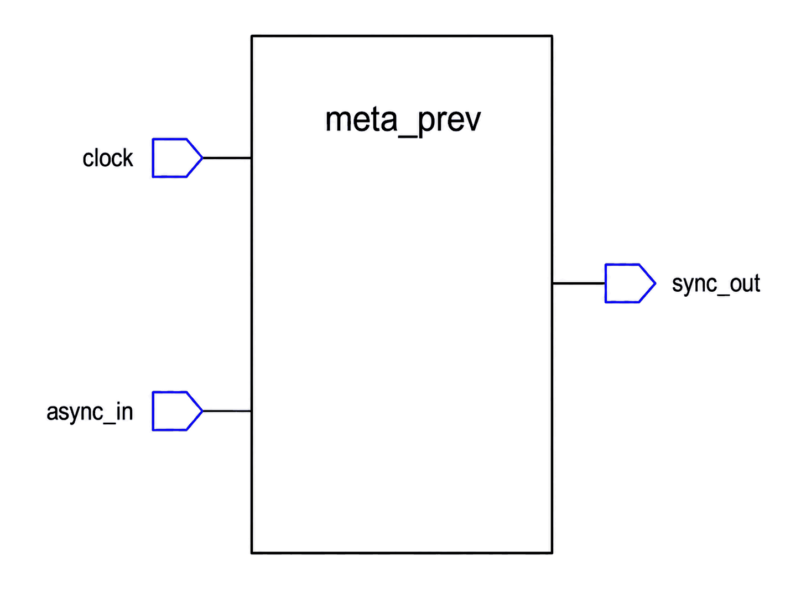

# Appendix A

## Att konstruera `meta_prev.vhd`
`rx_bus` anländer från en transceiver på ett annat chip, och `reset_n` från en knapp eller en
övervakare, så ingenting i den här FPGA:n har någonsin styrt någondera. Att sampla en av dem direkt
in i `clock`s domän kan lämna en vippa metastabil, vilket är problemet L04 löste med två vippor i
serie. Ni har byggt den här modulen förut, som `sync` i L05 övning 4; den här är samma idé, skriven
en gång, ordentligt, för att behållas i den här designen.

L11 avgjorde redan *att* kontrollern synkroniserar sina egna två asynkrona ingångar, och varför: de
är asynkrona vem som än instansierar `can_controller`, så kontrollern äger dem och en integratör
kopplar båda rakt till pinnar utan att tänka mer på det. Den här föreläsningen bygger modulen som
gör det. Den är den första av två den här föreläsningen skriver, och den enda modulen i hela kursen
som inte innehåller någonting alls om CAN, vilket är precis därför den är återanvändbar nog att
sluta med tre instanser vid L19.

---

### Gränssnitt



| Port / generic | Riktning | Typ | Betydelse |
|------|-----|------|---------|
| `WIDTH`      | generic | `natural := 1` | Antal oberoende bitar att synkronisera. |
| `clock`      | in  | `std_logic` | 50 MHz systemklocka, domänen som korsas *in i*. |
| `async_in`   | in  | `std_logic_vector(WIDTH-1 downto 0)` | Den eller de asynkrona ingångarna. |
| `sync_out`   | out | `std_logic_vector(WIDTH-1 downto 0)` | Samma bitar, säkra att använda i den här domänen. |

`meta_prev_tb` binder sina portar positionellt, som allt i den här kursen gör, så ordningen och
typerna ovan måste stämma exakt. **Generic-mappningen är också positionell**, så `WIDTH` måste vara
modulens enda generic (eller åtminstone dess första). Den instansierar modulen två gånger, en gång
med standardbredden och en gång med bredd 4, så att både standardvärdet och genericen övas. Den är
också den enda modulen här som inte läser något paket alls, så den behöver varken `can_def` eller
något annat.

---

### Beteende
Två vippor per bit, i serie, på `clock`s stigande flank: den första kan bli metastabil, och den
andra ger den en hel klockperiod att stabilisera sig innan något nedströms ser den. `sync_out`
följer därför `async_in` efter exakt två stigande flanker.

Tre saker skiljer sig från modulen `sync` ni skrev i L05 övning 4, och alla tre är avsiktliga:
* **Ingen resetport.** L05:s `sync` tog en `reset_s2_n`. Den här tar ingen: efter två klockflanker
  håller en synkroniserare riktig data oavsett vad den startade från. Att stryka porten är också det
  som låter *samma* modul synkronisera en reset, utan cirkulariteten i att en resetsynkroniserare
  behöver en synkroniserad reset. Testbänken klockar igenom den ursprungliga nivån innan den
  kontrollerar någonting, av precis det skälet.
* **Ingen generic `PRESET`.** L05 argumenterade utförligt för att det säkra resetvärdet beror på vad
  signalen *betyder*, och att bara den instansierande designen vet det. Det argumentet handlade om
  de två cyklerna efter reset, och det överlever inte att reseten stryks: utan resetgren finns inget
  värde att förinställa. Det som ersätter det är anroparens skyldighet att ignorera `sync_out` under
  de två första flankerna, vilket är samma skyldighet uttryckt annorlunda.
* **`SIZE` heter `WIDTH`.** Samma generic, samma uppgift, omdöpt till namnet varje delblock i det
  här projektet använder.

Den här designen instansierar den tre gånger, alla med `WIDTH = 1`: två gånger inuti
`can_controller`, för `reset_n` och för `rx_bus`, och en gång på `can_spi_node`s toppnivå för dess
egen reset (L19). En modul, tre instanser, inga kopior. Genericen gör ändå skäl för sin plats -
testbänken övar `WIDTH = 4`, och en synkroniserare skriven för en bit är en synkroniserare ni
kopierar nästa gång ni behöver fyra.

En reservation att nämna redan nu, eftersom L19 lutar sig mot den: en synkroniserare hanterar
metastabilitet, inte *skevhet*. Den andra vippan gör det överväldigande osannolikt att ett
metastabilt värde fortplantar sig (aldrig omöjligt; sannolikheten faller exponentiellt med
stabiliseringstiden, vilket är därför två vippor är den accepterade avvägningen), men varje bit
korsar fortfarande oberoende, så två bitar som ändras tillsammans kan landa en klocka isär. Det är
skälet till att en synkroniserare inte är ett generellt svar för en buss vars bitar måste hålla
ihop - och det är därför `can_spi_node` synkroniserar sin reset med den här modulen men lämnar
SPI-ledningarna till `spi_slave`, som ramar in dem, snarare än att bredda en `meta_prev` över dem.

---

### Vad testbänken låser fast
* `sync_out` följer `async_in` efter exakt två stigande flanker: inte en (en enda vippa är ingen
  synkroniserare) och inte tre.
* Detsamma gäller från hög till låg som från låg till hög.
* Med `WIDTH = 4` anländer alla fyra bitarna tillsammans, två flanker efter att ingången ändrats.
* En stabil ingång lämnar `sync_out` stabil.

Det här är den första testbänken i kursen som faktiskt *körs* snarare än bara analyseras, så det är
också här det tredje GHDL-steget anländer. L11 analyserade och elaborerade; se
[referensen för simuleringsflödet](../../../info/simulation_workflow.md) för vad `ghdl -r` tillför
och varför `--assert-level=error` inte är valfritt.

---

### Att lägga in den i `can_controller`
`meta_prev`s portar är vektorer även vid bredd 1, så en skalär port behöver en enelementssignal på
vardera sidan. I arkitekturens deklarativa del (mellan `is` och `begin`):

```vhdl
    -- meta_prev, synchronizing the two inputs that arrive from off-chip.
    signal reset_n_v, reset_s2_n_v : std_logic_vector(0 downto 0);
    signal rx_bus_v,  rx_bus_s2_v  : std_logic_vector(0 downto 0);
    signal reset_s2_n, rx_bus_s2   : std_logic;
```

och efter `begin`:

```vhdl
    reset_n_v(0) <= reset_n;
    rx_bus_v(0)  <= rx_bus;

    reset_s2_n <= reset_s2_n_v(0);
    rx_bus_s2  <= rx_bus_s2_v(0);

    reset_sync: entity work.meta_prev
        port map(clock, reset_n_v, reset_s2_n_v);

    rx_bus_sync: entity work.meta_prev
        port map(clock, rx_bus_v, rx_bus_s2_v);
```

Två instanser i stället för en med `WIDTH => 2`. Båda bitarna skulle åka med tillsammans alldeles
utmärkt, eftersom de är oberoende och skevhet mellan dem inte betyder något, men en namngiven
instans per angelägenhet läser sig bättre på diagrammet, och att senare låta reseten hävdas
asynkront skulle då inte riva upp någonting.

Från och med nu **tar varje block `reset_s2_n`, aldrig `reset_n`, och varje block som läser bussen
läser `rx_bus_s2`, aldrig `rx_bus`**. Det är hela skälet till att de här två instanserna finns, det
gäller `bit_timer` redan i nästa appendix, och det är lätt att glömma igen när `rx_shift_reg`
kopplas in i L15.

---

### Vad som kommer härnäst
[Appendix B](./b_bit_timer.md) bygger `bit_timer`, den här föreläsningens andra modul och det första
blocket i designen som har någon aning om vad CAN är. Den går in i samma arkitektur, på samma sätt,
och den tar `reset_s2_n` från instansen ni just kopplade in.

---

