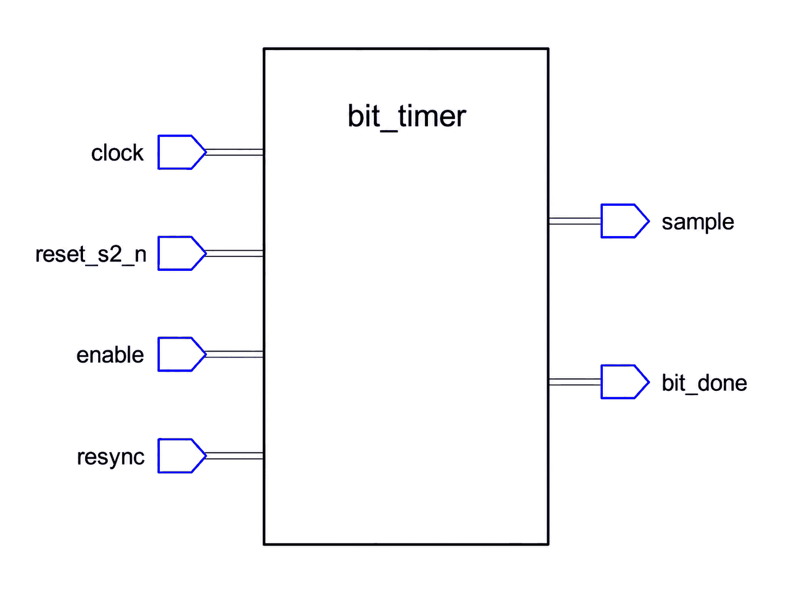

# Appendix B

## Att konstruera `bit_timer.vhd`
`bit_timer` delar 50 MHz-systemklockan i CAN-bitperioder och producerar två encykelspulser som
resten av kontrollern går på: en som markerar var i biten bussen ska samplas, en som markerar
bitens slut. Konstruera den utifrån kontraktet och beteendet nedan, och verifiera sedan mot den
utdelade testbänken, utan att gripa efter någon referens.

---

### Gränssnitt



| Port | Riktning | Typ | Betydelse |
|------|-----|------|---------|
| `clock`      | in  | `std_logic` | 50 MHz systemklocka. |
| `reset_s2_n` | in  | `std_logic` | Aktiv låg reset, synkroniserad med två vippor. |
| `enable`     | in  | `std_logic` | Kör räknaren medan `'1'`; håller den medan `'0'`. |
| `resync`     | in  | `std_logic` | Tvingar räknaren tillbaka till tick 0 på nästa klockflank. |
| `sample`     | out | `std_logic` | Flagga som anger att bussen ska samplas. |
| `bit_done`   | out | `std_logic` | Flagga som anger att den här biten är klar och att nästa börjar. |

Inga generics. `bit_timer_tb` binder sina portar **positionellt**, som allt i den här kursen gör, så
ordningen och typerna ovan måste stämma exakt. Namnen är era; att behålla de här får
föreläsningstexten och er kod att tala om samma signaler.

Ur `can_def` (L10) behövs `TICKS_PER_BIT` (= 50, ticken i en bitperiod) och `SAMPLE_TICK` (= 35,
alltså 70 % in, sent nog för att bussen ska ha hunnit stabilisera sig).

---

### Beteende
En enda fritt löpande räknare över `0 .. TICKS_PER_BIT - 1` räcker. Vid varje klockflank: ge båda
pulserna förvalet `'0'` och sedan, i prioritetsordning:
1. **`reset_s2_n = '0'`:**
    * Nollställ räknaren och båda pulserna.
2. **`resync = '1'`:**
    * Starta om bitperioden; sätt räknaren tillbaka till `0`.
    * Det här vinner över `enable`, och används en gång per ram, vid SOF, så att den här nodens
      bittajming börjar om från början, i linje med den flank som inleder ramen i stället för var en
      tidigare räkning råkade stå.
3. **`enable = '1'`:**
    * Pulsa `sample` under det enda tick där `counter = SAMPLE_TICK`.
    * Vid `counter = TICKS_PER_BIT - 1`, sätt `bit_done` och låt räknaren slå runt till `0`; annars
      öka den.
4. **annars (avstängd):**
    * Håll räknaren, båda pulserna låga.

Det här är samma idiom med räknare och prioriterade grenar som L07:s `timer`, bara med två
pulsutgångar i stället för en.

En notering om `enable`, eftersom det är den enda porten vars slutliga användning inte är uppenbar.
Den naturliga gissningen är att `can_controller` håller timern medan bussen är ledig, och det visar
sig att den inte gör det: L16:s regel för ledig buss räknar recessiva **bitperioder**, så timern
måste fortsätta gå även i `STATE_IDLE`, och den färdiga designen binder `enable` högt i varje
tillstånd. Bygg porten ändå; testbänken kontrollerar den, och en timer som inte går att stoppa är
ett sämre byggblock än en som går.

---

### En bitperiod, tick för tick
Reglerna ovan är lättare att lita på när de setts på en tidsaxel. Med `TICKS_PER_BIT = 50` och
`SAMPLE_TICK = 35` ser en aktiverad bitperiod ut så här. Varje kolumn är en stigande klockflank;
`counter` är värdet processen ser vid den flanken, och de två raderna under den är pulserna som den
flanken producerar.

```text
counter      0   1   2  ..  34  35  36  ..  48  49   |   0   1  ..
sample       0   0   0  ..   0   1   0  ..   0   0   |   0   0  ..
bit_done     0   0   0  ..   0   0   0  ..   0   1   |   0   0  ..
```

Tre saker att läsa ur det. Båda utgångarna är **ett tick breda**, inte nivåer. `sample` kommer vid
tick 35 och `bit_done` vid tick 49, så **`sample` slår alltid till först, 14 tick tidigare i samma
period**; en mottagare läser bussen 70 % in och först därefter tar perioden slut. Och periodgränsen
är omslaget från 49 tillbaka till 0, vilket är samma flank som `bit_done` markerar.

**Nu samma bild med en `resync`.** Anta att timern är 20 tick in i en period när SOF anländer och
`can_controller` pulsar `resync`:

```text
tick        19  20  21  22  ..  55  56  ..  69  70  71
resync       0   1   0   0  ..   0   0  ..   0   0   0
counter     19  20   0   1  ..  34  35  ..  48  49   0
sample       0   0   0   0  ..   0   1  ..   0   0   0
bit_done     0   0   0   0  ..   0   0  ..   0   1   0
```

Räknaren kastas mitt i räkningen och startar om, så `counter` och `tick` stämmer inte längre
överens. Det som spelar roll är följden: `bit_done` anländer vid tick **70**, en hel
`TICKS_PER_BIT` efter omsynkroniseringen, snarare än vid tick 49 där den avbrutna perioden skulle ha
slutat. Noden har antagit sändarens bitgräns i stället för sin egen, vilket är hela poängen med
`resync` och exakt vad testbänkens fjärde fall mäter.

Lägg också märke till att `resync` startar om perioden trots att `enable` är hög hela tiden; det är
därför den står över `enable` i prioritetsordningen.

---

### Vad testbänken låser fast
* Hållen i reset stannar `sample` och `bit_done` på `'0'`.
* Medan `enable = '0'` går räknaren aldrig framåt; båda pulserna stannar på `'0'`.
* Medan den är aktiverad pulsar `sample` exakt vid `SAMPLE_TICK` och `bit_done` exakt vid det sista
  ticket, en gång per period.
* Efter en `resync` mitt i en period kommer nästa `bit_done` exakt `TICKS_PER_BIT` tick senare, inte
  där den avbrutna perioden skulle ha tagit slut.

---

### Att lägga in den i `can_controller`
`bit_timer` sällar sig till de två `meta_prev`-instanserna från [Appendix A](./a_meta_prev.md) inuti
toppnivån som skrevs i L11, och är det första blocket där inne som vet något om CAN. Att instansiera
den är samma tvådelade ändring i `controller/can_controller.vhd` som `meta_prev` var, och den tar
`reset_s2_n` från synkroniseraren ni kopplade in nyss snarare än porten `reset_n`.

Deklarera först de fyra signaler som instansen kopplas till, i arkitekturens deklarativa del (mellan
`is` och `begin`):

```vhdl
    -- bit_timer.
    signal bt_enable, bt_resync, bt_sample, bt_bit_done : std_logic;
```

Instansiera sedan själva entiteten, efter `begin`:

```vhdl
    bit_timer1: entity work.bit_timer
        port map(clock, reset_s2_n, bt_enable, bt_resync, bt_sample, bt_bit_done);
```

Ingenting driver `bt_enable` eller `bt_resync` än, och ingenting läser `bt_sample` eller
`bt_bit_done`; tillståndsmaskinen som gör bådadera är L16:s. Det är väntat i det här läget. Det som
spelar roll nu är att `can_controller.vhd` fortfarande analyserar rent, vilket `make build`
kontrollerar så snart filen finns, och att `bit_timer` själv passerar `bit_timer_tb`.

---

### Vad som kommer härnäst
Med både `meta_prev` och `bit_timer` på plats håller `can_controller` två av sina fem inre block och
fortfarande inget rambeteende. L13 bygger `crc15`, en bitseriell CRC-15-motor som drivs en bit i
taget av den av `tx_shift_reg`/`rx_shift_reg` som är aktiv. `bit_timer` och `crc15` är de två
byggblock `can_controller` (L16) lutar sig mot innan någon bitstoppning kommer in i bilden.

---

