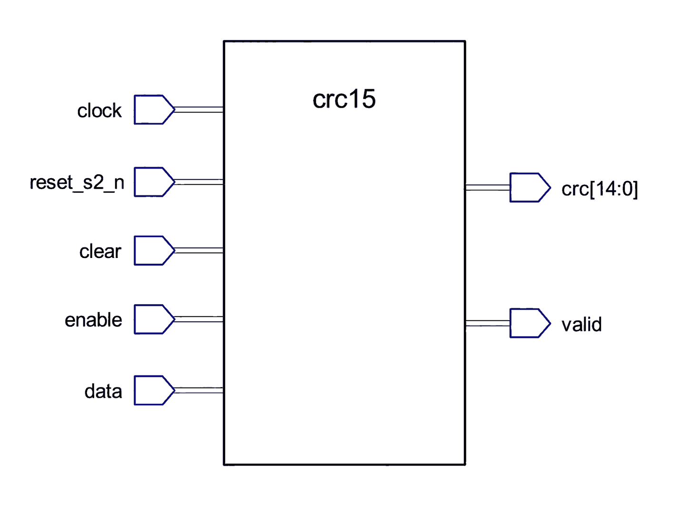

# Appendix A

## Att konstruera `crc15.vhd`
CAN:s CRC-15 beräknas **bitseriellt**: en bit inmatad per aktiverad klockflank, utan något
separat "beräkna checksumman nu"-steg. Egenskapen som gör den här kursens konstruktion enkel:
**exakt samma motor, körd på exakt samma sätt, både genererar en CRC och kontrollerar en.**
Konstruera den utifrån kontraktet och rekursionen nedan, och verifiera sedan mot den utdelade
testbänken.

### Gränssnitt



| Port | Riktning | Typ | Betydelse |
|------|-----|------|---------|
| `clock`      | in  | `std_logic` | 50 MHz systemklocka. |
| `reset_s2_n` | in  | `std_logic` | Aktiv låg, synkroniserad reset. |
| `clear`      | in  | `std_logic` | Återför registret till idel nollor vid den här flanken, utan en reset. |
| `enable`     | in  | `std_logic` | Integrera `data` i registret vid den här flanken när `'1'`. |
| `data`       | in  | `std_logic` | Den aktuella biten, biten som sänds (TX) eller nyss samplats av bussen (RX). |
| `crc`        | out | `crc_t`     | Registrets aktuella 15-bitars CRC-värde. |
| `valid`      | out | `std_logic` | `'1'` närhelst registret för närvarande läser idel nollor. |

Inga generics. `crc15_tb` binder sina portar **positionellt**, så ordningen och typerna ovan är
det som måste stämma; namnen är era.
`crc_t` (en 15-bitars vektor), dess bredd `CRC_WIDTH` och polynomet `CRC_POLY` kommer från
`can_def` (L10).

### Rekursionen
Håll ett 15-bitars register (`crc_t`), nollställt till idel nollor av `reset_s2_n`. Vid varje
klockflank där `enable = '1'`, integrera en bit:

```text
feedback = crc(CRC_WIDTH-1) xor data      -- Inkommande bit XOR registrets översta bit.
shifted  = crc skiftat ett steg vänster, ny lägsta bit '0'
crc      = shifted xor CRC_POLY           -- om feedback = '1'
         = shifted                        -- annars
```

Det är hela motorn, femton vippor och en skiftning XOR-grindad av polynomets avgreningar. När
`enable` är `'0'`, håll registret oförändrat. Driv `crc` kontinuerligt från registret, och
`valid` som "registret är idel nollor".

`clear` gör med registret vad `reset_s2_n` gör, men den är ett **synkront kommando, inte en
reset**: den hör hemma inuti den klockade grenen, prövad före `enable` så att den vinner när båda
är höga vid samma flank. Vik inte in den i det asynkrona resetvillkoret; det skulle göra `clear`
asynkron och nivåkänslig, en annan konstruktion som råkar passera testbänken (som alltid håller
`clear` över en hel klockcykel). Gränssnittstabellen säger "vid den här flanken" och menar det.
Den finns eftersom motorn återanvänds för varje ram och håller inget eget tillstånd per ram:
`can_controller` pulsar den en gång i början av varje ram (L16). En ram som får löpa till slut
återför registret till noll av sig själv, genom generera-sedan-kontrollera-egenskapen nedan, så
på den lyckliga vägen ändrar `clear` ingenting. En ram som *avbryts* halvvägs gör inte det, och
det är det fallet den finns till för.

### En motor, två jobb
* **Generera:**
  * Aktivera motorn över SOF till och med datafältets slut.
  * Läs sedan `crc`; det är värdet som ska sändas som ramens CRC-fält.
* **Kontrollera:**
  * Aktivera den över SOF till och med datafältet *och fortsätt sedan*, och mata in det
    *mottagna* CRC-fältets egna bitar också.
  * Om ramen anlände intakt driver det registret tillbaka till exakt noll, en egenskap hos
    aritmetiken, inte något motorn blivit tillsagd att förvänta sig. `valid` rapporterar precis
    det.
  * `can_controller` (L17) kontrollerar `valid` bara vid just den punkten; den behöver ingen
    andra, separat kontrollkrets.

Båda jobben förbrukar **bara riktiga bitar**. Stoppbitar (L14) kommer aldrig in i CRC:n på
någondera sidan av länken; anroparens grindning av `enable` är det som håller dem ute (L16 och
L17 bygger precis det), och motorn själv vet aldrig att de finns. Det är därför `crc15` inte
behöver någon kunskap om ramfält eller stoppning: den som driver `enable` har redan tagit de
besluten.

Båda jobben förutsätter att registret börjar en ram på noll, vilket är exakt vad `clear`
garanterar. Lägg märke till hur mycket som vilar på det: en nod som överger en ram halvvägs (den
förlorar arbitreringen, eller ser en stoppningsöverträdelse, eller underkänns i CRC-kontrollen,
allt sådant som L17 gör) slutar mata motorn med ett *partiellt* värde i den. Utan en
nollställning per ram får nästa ram den resten som utgångsvärde, så noden beräknar en CRC ingen
annan håller med om och beräknar en felaktig kontroll på allt den tar emot, för varje ram från då
till reset. En enda avbruten ram skulle ta noden ur bussen permanent.

`valid` läser `'1'` vid reset också, före någon data alls; meningslöst där, meningsfullt bara vid
kontrollpunkten ovan.

### Ett genomräknat exempel, för hand
Börja med det enklaste fallet. Mata in en enda `1` i en nyss resettad motor: `feedback` är
`0 xor 1 = 1`, `shifted` är fortfarande idel nollor, så `crc` blir `0 xor CRC_POLY`, polynomet
självt. Det är det första testbänken kontrollerar, och en bra rimlighetskontroll på er egen kod.

Nu fyra bitar, `1001`, MSB först. `top` är registrets bit 14 *före* flanken, och `CRC_POLY` är
`100010110011001`:

```text
         top  data  fb   shifted          xor poly   crc
reset      -     -   -   -                       -   000000000000000
bit 1      0     1   1   000000000000000        ja   100010110011001
bit 2      1     0   1   000101100110010        ja   100111010101011
bit 3      1     0   1   001110101010110        ja   101100011001111
bit 4      1     1   0   011000110011110       nej   011000110011110
```

Läs en rad i taget så slutar motorn se ut som aritmetik. Varje flank gör samma tre saker: XOR:a
den inkommande biten med biten som faller av toppen, skifta vänster, och XOR:a tillbaka polynomet
bara om det resultatet var `1`.

Två rader är värda att stanna vid. **Bit 2** matar in en `0` och utlöser ändå XOR:en, eftersom
`1`:an som lämnar toppen är det som sätter `feedback`; den inkommande biten är bara halva
beslutet. **Bit 4** matar in en `1` och utlöser den *inte*, eftersom den översta biten också är
`1` och de två tar ut varandra. Det är därför en CRC svarar på *var* en bit sitter och inte bara
på hur många ettor det finns, och det är den egenskap övning 3 använder för att fånga en
förvanskning som en enkel summa inte kan se.

Lägg också märke till att varje rads `shifted`-kolumn är föregående rads `crc` skiftad ett steg
vänster, med en `0` som kommer in nedifrån. Ingenting adderas någonsin i den låga änden;
registrets innehåll kommer helt och hållet från polynomet som XOR:as in om och om igen vid olika
förskjutningar.

### Vad testbänken låser fast
* Strax efter reset är `crc` idel nollor och `valid = '1'`.
* En enda `'1'`-bit ger `crc = CRC_POLY`.
* `clear` återför ett laddat register till idel nollor utan att `reset_s2_n` rörs.
* En 19-bitars sekvens av SOF+ID+RTR+kontrollfält ger en CRC som stämmer med ett värde beräknat
  oberoende i Python (inte härlett ur den här VHDL-koden).
* Att mata den nyss beräknade CRC:ns egna bitar rakt in igen återför registret till idel nollor
  (`valid = '1'`), generera-sedan-kontrollera-egenskapen.

---

### Att lägga in den i `can_controller`
Samma tvådelade ändring som L12:s, ett block längre in. I `controller/can_controller.vhd`, lägg
till signalerna under `bit_timer`-gruppen:

```vhdl
    -- crc15.
    signal crc_clear, crc_enable, crc_data_in, crc_valid : std_logic;
    signal crc_value                                     : crc_t;
```

och instansen under `bit_timer1`:

```vhdl
    crc1: entity work.crc15
        port map(clock, reset_s2_n, crc_clear, crc_enable, crc_data_in, crc_value, crc_valid);
```

Lägg märke till att `crc15` kopplas till ingenting annat än klockan, resetten och sina egna
signaler: den tar sina bitar från vilket skiftregister som än är aktivt, och båda de registren är
ännu oskrivna. Kopplingen som förenar dem är L16:s, och den är ett enda uttryck snarare än en
port map.

---

### Vad som kommer härnäst
L14-L15 bygger `tx_shift_reg`/`rx_shift_reg`, modulerna som avgör vilka bitar som når `crc15` och
när, via bitstoppning.

---

