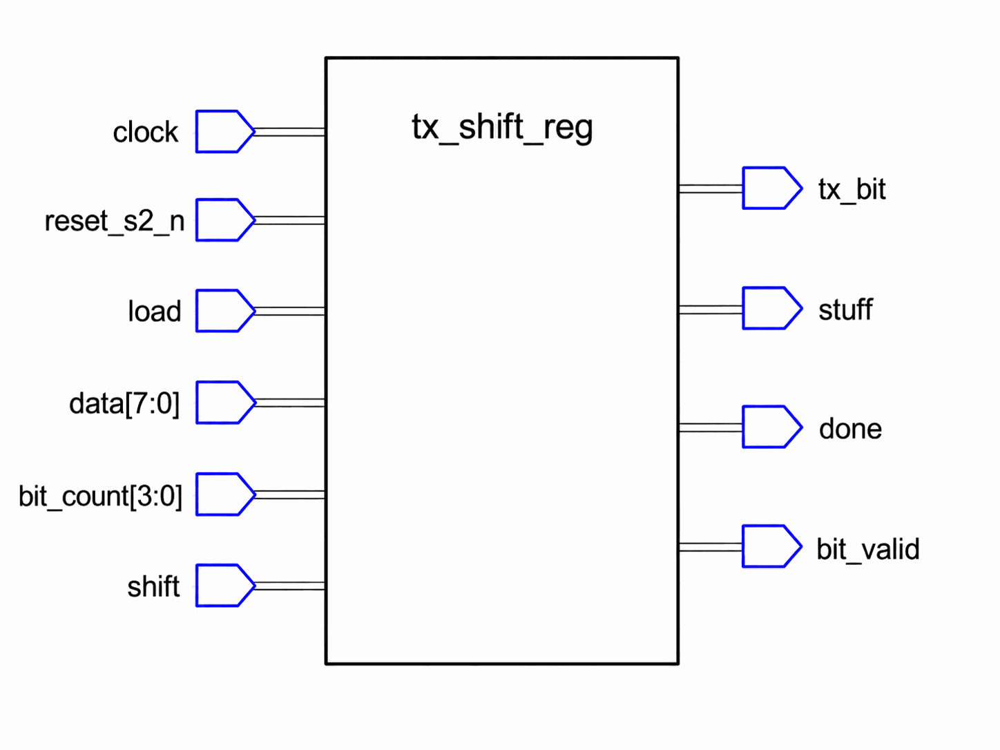

# Appendix A

## Att konstruera `tx_shift_reg`
`tx_shift_reg` serialiserar ut en grupp på upp till 8 bitar MSB först på bussen och **sätter in** en
stoppbit efter fem lika utsända bitar i rad. Dess spegelbild, `rx_shift_reg` (som *kastar* de
stoppbitarna), är L15.

Själva stoppbitsregeln är oförändrad från L10, där ni tillämpade den på papper på en hel bitföljd i
taget, med möjlighet att se tillbaka över de bitar ni redan hade skrivit ned. Här körs den
kontinuerligt, en bit per klocka, utan någon följd att se tillbaka över och utan något
"buffertslut" att stanna vid: vad regeln än behöver minnas måste bo i ett register.
`can_controller` (L16-L17) återanvänder **ett enda** `tx_shift_reg` för varje stoppat fält (SOF,
arbitreringsfältets ID och RTR i grupper, kontrollfältet, varje databyte, CRC:n i grupper), och
laddar om det / ändrar dess bitantal grupp för grupp. Den ostoppade svansen (CRC-avgränsare,
ACK-plats och ACK-avgränsare, EOF) är fasta bitar som `can_controller` driver direkt, förbi det här
registret.

Konstruera modulen utifrån kontraktet och beteendet nedan, och verifiera sedan mot den utdelade
testbänken.

---

### Gränssnitt



| Port | Riktning | Typ | Betydelse |
|------|-----|------|---------|
| `clock`, `reset_s2_n` | in | `std_logic` | 50 MHz klocka, synkroniserad aktiv låg reset. |
| `load`      | in  | `std_logic` | Låser `data`/`bit_count` som nästa grupp **och** presenterar dess första bit den här cykeln. |
| `data`      | in  | `byte_t`    | Gruppen, med sina `bit_count` giltiga bitar packade i de **mest** signifikanta bitarna (första biten som sänds är bit 7). |
| `bit_count` | in  | `std_logic_vector(3 downto 0)` | Antal giltiga bitar i `data`, 1-8. |
| `shift`     | in  | `std_logic` | Pulsar en gång per CAN-bit (från `bit_timer.bit_done`) för att driva strömmen framåt. |
| `tx_bit`    | out | `std_logic` | Registrerad bit att driva under den kommande bitperioden. |
| `stuff`     | out | `std_logic` | `'1'` på just den skiftning som lägger ut en stoppbit; maskar bort den biten ur CRC-matningen (L16). |
| `done`      | out | `std_logic` | Pulsar när gruppen är helt utsänd (se tajmingen). |
| `bit_valid` | out | `std_logic` | `'1'` den enda cykel då en ny bit lades ut på `tx_bit`. |

`tx_bit` är den enda utgången som är en *nivå*, hållen tills nästa bit presenteras. `stuff`, `done`
och `bit_valid` är alla **pulser på en cykel**: ge dem förvalet `'0'` högst upp i den klockade
processen och höj dem bara i den gren som förtjänar dem, samma idiom som `bit_timer` använder för
`sample`/`bit_done`. Det spelar störst roll för `bit_valid` och `stuff`, eftersom `can_controller`
bygger `crc15`s enable av paret, som `bit_valid and not stuff` (L16): `bit_valid` säger att en bit
lades ut, och `stuff` maskar bort de utlagda bitar som CRC:n aldrig får se, eftersom CRC:n bara
omfattar riktiga bitar (L10). Håll `bit_valid` som en nivå i stället, så integrerar motorn samma
bit vid varje klockflank under bitperioden, femtio gånger om, och förstör CRC:n i tysthet.

`load` och `shift` utesluter varandra inom en cykel; `can_controller` aktiverar aldrig båda.
`tx_shift_reg_tb` binder **positionellt**, så ordningen och typerna ovan är det som måste stämma;
namnen är era.

---

### Vad modulen måste minnas
Börja där inledningen pekade: pappersversionen av stoppbitsregeln såg *tillbaka över följden*, och
hårdvaran har ingen följd att se tillbaka över. Så innan någon process skrivs, lista vad som måste
bo i ett register. Allt nedan följer av modulens två uppgifter - att hålla en grupp i rörelse, och
att hålla stoppbitsregeln ärlig - och varje regel i resten av det här appendixet talar i termer av
exakt de här fem signalerna:

```vhdl
signal shift_reg    : byte_t;                     -- Remaining chunk bits, next one in bit 7.
signal bits_left    : natural range 0 to 8;       -- Real bits of the chunk still to present.
signal last_bit     : std_logic;                  -- The bit most recently placed on the wire.
signal consecutive  : natural range 0 to MAX_RUN; -- Current run length; 0 = none.
signal stuff_pending: std_logic;                  -- A stuff bit is owed on the next shift.
```

* **`shift_reg` och `bits_left` är gruppen i flykt.** Registret håller de osända bitarna
  vänsterjusterade så att "nästa bit" alltid är `shift_reg(7)`; `bits_left` är hur många riktiga
  bitar som återstår. Mer grupphållning än så finns inte.
* **`last_bit` och `consecutive` är L10-regelns minne**, och tillsammans kallas de nedan för
  **följdspåraren**: biten som senast sändes, och hur många lika bitar i rad den avslutade.
  `MAX_RUN` lika bitar - fem, en konstant som `can_def` tillhandahåller, eftersom länkens båda
  ändar måste vara exakt överens om den - är en full följd; paret är allt regeln någonsin behövde
  av att "se tillbaka". Båda skrivs på exakt ett ställe, en procedur som processen deklarerar för
  ändamålet (nedan).
* **`stuff_pending` är regelns enbitsskuld.** När en följd når fem sänds stoppbiten *inte*
  omedelbart - den femte biten behöver fortfarande sin egen fulla period på bussen. Att nå fem
  *armerar* därför bara en insättning, och den här flaggan bär skulden vidare till nästa `shift`.

Utgångarna registreras i samma process: `tx_bit` är en nivå, hållen tills nästa bit ersätter den;
`stuff`, `done` och `bit_valid` är encykelspulserna som gränssnittsavsnittet beskrev, som förval
låga högst upp i processen och höjda bara i den gren som förtjänar dem.

---

### Processen, uppifrån och ned
En klockad process håller allt ovanstående. Genomgången nedan följer koden i den ordning den
skrivs, så varje rad har ett hem innan nästa dyker upp; kodfragmenten är processens deklarativa del
följd av på varandra följande skivor av en enda `if`/`elsif`-kedja, och lagda i följd inuti
skelettet nedan, vars resetgren ni fyller i utifrån dess enradiga beskrivning, är de hela
processen. En rad använder `to_integer(unsigned(...))`, så filen behöver
`use ieee.numeric_std.all;` vid sidan av `ieee.std_logic_1164` och `work.can_def`.
**Följdspåraren**, de få rader som håller stoppbitsregeln ärlig, behövs på alla tre ställen där en
bit kan läggas ut. Den skrivs **en gång**, som en procedur processen deklarerar åt sig själv, och
anropas från vart och ett av dem.

**Skelettet.** Processen deklarerar sin egen procedur före `begin`; sedan asynkron reset först,
allt annat på den stigande flanken:

```vhdl
process(clock, reset_s2_n) is
    -- One procedure, the run tracker (below).
begin
    if (reset_s2_n = '0') then
        -- Clear everything.
    elsif (rising_edge(clock)) then
        -- Defaults, then the load branch or the shift branch.
    end if;
end process;
```

**Följdspåraren, skriven en gång.** Varje gren som lägger ut en bit behöver samma få rader, så de
bor i en procedur som deklareras i processens egen deklarativa del, mellan `process(...) is` och
`begin`:

```vhdl
    -- The run tracker: runs on the bit just placed on the wire.
    procedure track_run(new_bit: in std_logic) is
    begin
        if ((new_bit = last_bit) and (consecutive /= 0)) then
            consecutive <= consecutive + 1;
            if (consecutive = MAX_RUN - 1) then -- Run reaches MAX_RUN.
                stuff_pending <= '1';
            end if;
        else
            consecutive <= 1;                   -- Start a new run.
        end if;
        last_bit <= new_bit;
    end procedure;
```

Det här är kursens första underprogram, så fyra saker om det innan något anropar det:

* **Den når signalerna direkt.** `last_bit`, `consecutive` och `stuff_pending` är
  arkitektursignaler, synliga inuti proceduren eftersom proceduren är deklarerad inuti processen,
  som ligger inuti arkitekturen. De är inte parametrar och ska inte vara det; bara den *utlagda
  biten* skiljer sig mellan anroparna, och det är den enda parameter som finns.
* **Att deklarera den inuti processen är det som gör signaltilldelningarna lagliga alls.** Ett
  underprogram får tilldela en signal bara i två situationer: signalen är en formell parameter av
  klassen `signal`, eller underprogrammet är deklarerat inuti en process, och då använder dess
  tilldelningar den processens drivare, precis som om raderna hade skrivits på varje anropsställe.
  Den här proceduren vilar på det andra fallet. Flytta upp den oförändrad till arkitekturens
  deklarativa del så slutar den kompilera, ett fel per tilldelning: *signal "consecutive" is not a
  formal parameter*. Att träda `consecutive`, `last_bit` och `stuff_pending` genom som formella
  parametrar av klassen `signal` skulle uppfylla regeln, till priset av tre extra argument vid
  varje anrop och en verklig fråga om vilken process som äger drivarna. Deklarerad här kan bara den
  här processen anropa den, så bara den här processen driver dem.
* **Tajmingen är oförändrad.** En `in`-parameter evalueras vid anropet, så `new_bit` bär det värde
  före flanken som anroparen skickade in, och signalläsningarna inuti kroppen är också från före
  flanken (regeln om variabler kontra signaler från L05). Proceduren beter sig precis som samma
  rader skrivna inline.
* **Syntesen inlinar den.** Resultatet är samma logik replikerad under varje anropares grenvillkor;
  ingenting delas, multiplexas eller anropas vid körning. Det här är faktorisering på källkodsnivå,
  och nätlistan blir identisk hur som helst.

Två detaljer inuti kroppen, och en om var den anropas:

* **`consecutive = MAX_RUN - 1` betyder "följden är nu full".** Läsningen ger värdet före flanken,
  så jämförelsen sker mot följdlängden *innan* den här biten förlängde den. Den semantiken är precis
  rätt här, och det är därför koden jämför mot `MAX_RUN - 1` och inte `MAX_RUN`.
* **Håll reda på vilket `if` som äger vilken gren.** `consecutive <= 1` är det *yttre* `if`-satsens
  `else` (varje utlagd bit som bryter följden startar en ny), och `last_bit <= new_bit` står efter
  hela `if`-satsen och uppdateras vid *varje* utläggning, lika eller inte. Häng någon av dem på den
  inre `MAX_RUN - 1`-kontrollen, så startar en bruten följd aldrig om, eller så fryser `last_bit`.
* **Anropa den från en gren som lägger ut en bit, aldrig från processens toppnivå.** Ingenting på
  ledningen ändras under de dryga fyrtionio klockflanker som ligger mellan presentationerna, så ett
  anrop som körs vid varje flank räknar spökbitar. Grupper vet den ingenting om åt något håll:
  ledningen har ingen aning om var en grupp slutar och nästa börjar, så det har inte spåraren
  heller.

**Reset nollställer allt**: utgångarna, gruppen (`shift_reg`, `bits_left`) och följdspåraren
(`last_bit`, `consecutive`, `stuff_pending`). Det här är det **enda** stället spåraren någonsin
nollställs. `load` får inte röra den: stoppningen ser den utsända strömmen som sammanhängande över
hela ramen, så en följd som avslutar en grupp och fortsätter in i nästa tvingar fortfarande fram en
stoppbit precis vid gränsen. (Det är scenariot med kedjad omladdning, test 3 i testbänken: en grupp
slutar med fyra `'1'`:or, nästa öppnar med en `'1'`, och stoppbiten landar före den gruppens andra
riktiga bit.)

**Förvalen härnäst, och bara de här tre.** Pulsutgångarna faller vid varje klockflanks början,
`bit_timer`-idiomet, så grenarna nedan bara *höjer* dem:

```vhdl
stuff     <= '0';
done      <= '0';
bit_valid <= '0';
```

`stuff_pending` hör **inte** hemma här, hur mycket den än liknar dem. Den är tillstånd, inte en
puls: armerad vid den skiftning som fullbordar en följd, betald vid *nästa* skiftning, en hel
bitperiod (femtio klockflanker) senare. Ge den förvalet lågt här, så avdunstar skulden vid den
första lediga flanken däremellan, och då stoppar modulen helt enkelt aldrig in något. Den skrivs på
exakt tre ställen: nollställd vid reset, armerad inuti `track_run`, och nollställd av den gren som
betalar den.

**`load = '1'` presenterar den första biten omedelbart.** En bitperiod börjar i samma ögonblick som
den föregående gruppens sista `bit_done` går, vilket också är när nästa grupps `load` går. Om
`load` bara låste data och väntade på den första `shift`-pulsen skulle den första perioden
fortfarande visa den föregående gruppens sista bit, en hel bit försent. Så grenen lägger ut
`data(7)` nu, för registret i förväg förbi den, sätter `bits_left` till `bit_count - 1`, och kör
sedan den utlagda biten genom följdspåraren:

```vhdl
if (load = '1') then
    tx_bit    <= data(7);                 -- Output the first bit immediately.
    shift_reg <= data(6 downto 0) & '0';  -- Remove the output bit and prepare the next one.
    bits_left <= to_integer(unsigned(bit_count)) - 1;  -- bit_count is 1-8 by contract:
                                                       -- 0 would underflow bits_left here.
    bit_valid <= '1';                     -- Indicate that a valid bit has been output.

    track_run(data(7));                   -- data(7) was just placed on the wire.
```

Anropet är varken valfritt eller en detalj: `load` lägger ut en bit på ledningen, så spåraren måste
se den som vilken annan som helst. Utelämna det, så ligger följdräkningen en bit efter under resten
av ramen; test 1 i testbänken fångar det vid skiftning 5, där stoppbiten som de fem `'1'`:orna
förtjänat uteblir.

**`shift = '1'` gör exakt en av tre saker** (aldrig i samma cykel som `load`; det är därför grenen
är ett `elsif`), prövade i den här prioritetsordningen. Först den stoppbit som är skyldig, om det
finns någon:

```vhdl
elsif (shift = '1') then
    if (stuff_pending = '1') then
        tx_bit        <= not last_bit;  -- The stuff bit inverts the run.
        stuff         <= '1';
        bit_valid     <= '1';
        stuff_pending <= '0';           -- The debt is paid.

        track_run(not last_bit);        -- A stuffed bit is a placed bit like any other.
```

En stoppbit går genom spåraren precis som en riktig, och att skicka in `not last_bit` är det som
gör att det blir rätt utan något specialfall: inuti kroppen är jämförelsen `new_bit = last_bit` då
falsk per konstruktion, så anropet tar `else`-vägen och gör precis det regeln vill, startar om
följden på 1 med stoppbitens eget värde i `last_bit`. Ingenting armerar någon ny skuld här heller,
eftersom armeringen sitter i den gren som inte kan tas. Gruppen själv gör inga framsteg:
`shift_reg` och `bits_left` lämnas orörda.

Härnäst den *avslutande* skiftningen:

```vhdl
    elsif (bits_left = 0) then
        done <= '1';                    -- The closing shift changes nothing else.
```

Varje bit har lagts ut och den sista har nu fått sin fulla period på bussen; `tx_bit` i synnerhet
behåller sitt värde. I annat fall: sänd nästa riktiga bit, samma form som `load`-grenen med
`shift_reg(7)` i `data(7)`:s ställe:

```vhdl
    else
        tx_bit    <= shift_reg(7);            -- Output the next bit.
        shift_reg <= shift_reg(6 downto 0) & '0';
        bits_left <= bits_left - 1;
        bit_valid <= '1';

        track_run(shift_reg(7));              -- May arm a stuff bit for the next shift.
    end if;
end if;
```

Prioritetsordningen är bärande: en väntande stoppbit går före den avslutande skiftningen, och det
är det som får specialfallet nedan att fungera utan någon extra kod; en grupp vars *sista* riktiga
bit fullbordar en följd får ändå sin stoppbit utsänd innan `done` går. (`load` har aldrig någon
utestående stoppbit att bekymra sig om: `can_controller` laddar bara efter `done`, och `done`
kommer efter att varje väntande stoppbit har sänts.)

---

### Utgångarnas tajming, den del testbänken låser exakt
* `tx_bit` sätts av **både** `load` och `shift`; den avslutande skiftningen lämnar den oförändrad.
* `stuff` pulsar bara vid den skiftning som faktiskt lägger ut en stoppbit, aldrig vid `load` (en
  grupps första bit kan *utlösa* en stoppbit, men den stoppbiten sänds vid en senare skiftning).
* `done` pulsar **inte** vid den skiftning som presenterar gruppens sista riktiga bit eller
  stoppbit; den biten behöver först sin egen fulla period på bussen. Den pulsar en skiftning
  senare, vid den avslutande skiftningen, som inte presenterar något nytt. Att låta `done` gå
  tidigt skulle låta `can_controller` ladda nästa grupp en hel bitperiod för tidigt.
* `bit_valid` är `'1'` vid `load` och vid varje skiftning som lägger ut en ny bit (riktig eller
  stoppbit), och `'0'` vid den avslutande skiftningen. Konsumenter som för `tx_bit` vidare bit för
  bit grindar på `bit_valid`, inte på "load eller shift", annars skulle de sampla den avslutande
  skiftningens oförändrade `tx_bit` som en dubblett. `crc15` är den konsument som spelar roll, och
  den behöver `stuff` också: L16 grindar dess enable på `bit_valid and not stuff`, eftersom en
  stoppbit läggs ut på ledningen men aldrig får gå in i CRC:n.
* Specialfall: om `bit_count = 1` och den enda biten utlöser en stoppbit, väntar `done` ändå på att
  stoppbiten sänts först.

---

### En grupp, presentation för presentation
Fyra tajmingregler samspelar här, och prosa är ett dåligt sätt att se dem. Nedan följer en komplett
grupp: `data = "11111000"`, `bit_count = 8`, laddad in i ett nyss resettat register. Varje rad är
en *presentation*, antingen `load` eller en `shift`-puls, och visar utgångarna efter den. Det här
är samma sekvens som `tx_shift_reg_tb` kontrollerar i sitt första test, så er egen modul måste
återge den rad för rad.

```text
          databit  tx_bit  stuff  bit_valid  done  consecutive
ladda           1       1      0          1     0            1
skifta 1        2       1      0          1     0            2
skifta 2        3       1      0          1     0            3
skifta 3        4       1      0          1     0            4
skifta 4        5       1      0          1     0            5
skifta 5        -       0      1          1     0            1
skifta 6        6       0      0          1     0            2
skifta 7        7       0      0          1     0            3
skifta 8        8       0      0          1     0            4
skifta 9        -       0      0          0     1            4
```

Tio presentationer för att sända åtta bitar. Var och en av de fyra reglerna syns i den:
* **`load` presenterar omedelbart.** Första raden har redan databit 1 på `tx_bit`, med `bit_valid`
  hög. Ingen `shift` har hänt ännu. Hade `load` bara låst gruppen skulle den här raden fortfarande
  visa den *föregående* gruppens sista bit, och hela ramen skulle gå en bitperiod försent.
* **Följdräkningen driver allt.** Den klättrar från 1 till 5 över de fem `'1'`:orna, och vid
  skiftning 4 når den fem. Det lägger inte ut någon stoppbit; det *armerar* en till nästa
  presentation.
* **`stuff` är en presentation bred och bär inga data.** Skiftning 5 driver `not last_bit`,
  markerar `stuff = '1'` och nollställer följden till 1. Databitkolumnen visar `-`: gruppen har inte
  gjort några framsteg, vilket är varför åtta databitar behöver nio bitläggande presentationer här.
  `bit_valid` är fortfarande `'1'`, eftersom en bit verkligen lades ut på ledningen; den var bara
  inte en av era.
* **`done` släpar med en, och `bit_valid` markerar skillnaden.** Skiftning 8 lägger ut den sista
  riktiga biten, och `done` förblir låg, eftersom den biten ännu inte fått sin bitperiod på bussen.
  Skiftning 9 är den avslutande skiftningen: `tx_bit` håller sitt tidigare värde, ingenting nytt
  läggs ut, `bit_valid` faller till `'0'`, och först nu pulsar `done`.

Den sista raden är den som är värd att stirra på. `tx_bit` läser fortfarande `'0'`, precis som vid
skiftning 8, så vad som helst som grindar enbart på `shift` skulle mata `crc15` med samma bit en
andra gång och tyst korrumpera checksumman. `bit_valid` är den enda utgången som skiljer "en bit
lades ut" från "en period förflöt", vilket är varför den finns och varför L16 grindar CRC:n på den.

Lägg slutligen märke till att `consecutive` slutar på 4 **på en följd av `'0'`:or**, och **inte**
nollställs. Nästa `load` ärver både räkningen och `last_bit`, så om den gruppen öppnar med en `'0'`
når följden fem redan vid sin allra första bit och en stoppbit tvingas fram före dess andra. Öppnar
den i stället med en `'1'` bryts följden och räkningen börjar om på 1. Det är samma mekanism som
den kedjade omladdningen i testbänkens test 3, där en grupp i stället ärver en följd av fyra
`'1'`:or och öppnar med en `'1'`.

---

### Vad testbänken låser fast
* `"11111000"` ger en stoppbit (`'0'`) direkt efter den femte `'1'`:an; en följd på exakt fyra
  stoppas **inte**.
* Att ladda `"10101010"` direkt efter en grupp som slutade med fyra `'1'`:or (utan reset emellan)
  tvingar fram en stoppbit före den här gruppens andra riktiga bit, vilket bevisar att
  följdtillståndet lever kvar över `load`.
* `bit_valid` är `'1'` vid load och vid varje skiftning med riktig bit eller stoppbit, `'0'` vid
  den avslutande skiftningen; `done` pulsar bara vid just den avslutande skiftningen.
* `bit_valid` är tillbaka på `'0'` cykeln *efter* varje presentation, så en version som håller
  nivån underkänns även om den lägger ut varje bit korrekt.

---

### Att lägga in den i `can_controller`
Tredje blocket, samma redigering. Signalgruppen i `controller/can_controller.vhd` är större här,
eftersom `tx_shift_reg` har mer att säga:

```vhdl
    -- tx_shift_reg.
    signal txsr_load                                          : std_logic;
    signal txsr_data                                          : byte_t;
    signal txsr_bit_count                                     : std_logic_vector(3 downto 0);
    signal txsr_shift                                         : std_logic;
    signal txsr_tx_bit, txsr_stuff, txsr_done, txsr_bit_valid : std_logic;
```

```vhdl
    tx_shift_reg1: entity work.tx_shift_reg
        port map(clock, reset_s2_n, txsr_load, txsr_data, txsr_bit_count, txsr_shift,
                 txsr_tx_bit, txsr_stuff, txsr_done, txsr_bit_valid);
```

En enda instans, återanvänd för varje stoppat fält i varje ram. Om det fortfarande ser förvånande
ut, läs om det här appendixets inledning: registret laddas om med en ny byte och ett nytt
`bit_count` per fält, vilket är precis det som gör att en kopia räcker. (Ta `reset_s2_n`-kopplingen
som den är tills vidare; L17 byter den mot en reset per ram, av ett skäl bara arbitreringen kan
visa.)

---

### Vad som kommer härnäst
L15 bygger `rx_shift_reg`, mottagarsidans spegelbild: deserialisering, avstoppning och flaggning av
brott mot stoppbitsregeln. L16 sätter sedan båda registren i arbete inuti `can_controller`.

---

