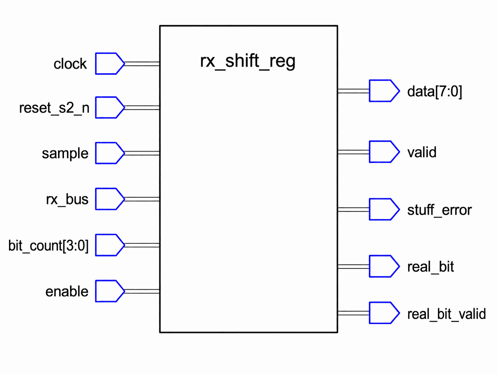

# Appendix A

## Att konstruera `rx_shift_reg` (spegelbilden av `tx_shift_reg`)
`rx_shift_reg` är mottagarsidans spegelbild av L14:s `tx_shift_reg`: den deserialiserar en grupp
MSB först från bussen och **kastar** de stoppbitar som `tx_shift_reg` satte in, och flaggar för
ett brott om en väntad stoppbit uteblir. Följdräkningen och regeln om fem lika i rad är identiska,
bara omvända. `can_controller` (L17) återanvänder **ett enda** `rx_shift_reg` för varje stoppat
fält i en inkommande ram, och ändrar dess `bit_count` mellan grupperna; den ostoppade svansen
(CRC-avgränsare, ACK, ACK-avgränsare, EOF) läser den direkt, förbi det här registret.

Konstruera modulen utifrån kontraktet och beteendet nedan, och verifiera sedan mot den utdelade
testbänken.

---

### Gränssnitt



| Port | Riktning | Typ | Betydelse |
|------|-----|------|---------|
| `clock`, `reset_s2_n` | in | `std_logic` | 50 MHz klocka, synkroniserad aktiv låg reset. |
| `sample`      | in  | `std_logic` | En puls per CAN-bit (`bit_timer.sample`) som markerar när `rx_bus` ska läsas. |
| `rx_bus`      | in  | `std_logic` | Bussnivån, giltig vid sampelpunkten. |
| `bit_count`   | in  | `std_logic_vector(3 downto 0)` | Antal **riktiga** bitar att samla in, 1-8; läses live, får ändras mellan grupper. |
| `enable`      | in  | `std_logic` | Avgör om `sample`-pulser behandlas. |
| `data`        | out | `byte_t`    | Den insamlade gruppen, **högerjusterad** i sina lägsta `bit_count` bitar. |
| `valid`       | out | `std_logic` | Pulsar när `bit_count` riktiga bitar samlats in. |
| `stuff_error` | out | `std_logic` | Pulsar om en väntad stoppbit inte inverterar. |
| `real_bit`    | out | `std_logic` | Den enda avstoppade bit som accepterades vid det här samplet. |
| `real_bit_valid` | out | `std_logic` | `'1'` vid ett sampel som accepterade en riktig bit; `'0'` vid en kastad stoppbit. |

`data` och `real_bit` är nivåer; `valid`, `stuff_error` och `real_bit_valid` är **pulser på en
cykel**, satta till `'0'` som förval högst upp i den klockade processen, precis som
`tx_shift_reg`s (L14). `real_bit_valid` är den som biter: `can_controller` grindar `crc15`s enable
direkt på den (L17), så en nivå som ligger kvar till nästa sampel matar in samma bit under en hel
bitperiod och förstör CRC:n i tysthet. Testbänken kontrollerar att den fallit igen cykeln efter
varje sampel, av precis det skälet.

Det finns ingen `load`: samplingen sker mitt i perioden (`sample`, inte `bit_done`), när alla
noders signaler har hunnit stabilisera sig. En sändare ändrar bussen vid en periodgräns, så en
mottagare som också agerade på `bit_done` skulle läsa i samma ögonblick som nivån ändras; L12:s
tick-spår visar de två pulserna och de 14 tickerna mellan dem. `can_controller` ändrar bara
`bit_count` mellan grupperna; `valid` rapporterar själv varje grupps fullbordan.
`rx_shift_reg_tb` binder **positionellt**, så ordningen och typerna ovan är det som måste stämma;
namnen är era.

---

### Vad modulen måste minnas
Som i L14: lista tillståndet innan någon process skrivs. Mottagarsidan har samma två uppgifter,
speglade - hålla en grupp *under påfyllning*, och hålla stoppbitsregeln ärlig - plus en som den
inte hade: att *förutsäga* var sändaren måste ha satt in en stoppbit. Varje regel nedan talar i
termer av exakt de här fem signalerna:

| Signal | Typ | Håller |
|---|---|---|
| `data_reg` | `byte_t` | De insamlade riktiga bitarna, fyllda från höger. |
| `collected` | heltal, 0 till 8 | Antal riktiga bitar som hittills accepterats mot den här gruppen. |
| `last_bit` | `std_logic` | Biten som senast samplades av bussen. |
| `consecutive` | heltal, 0 till `MAX_RUN` | Längden på den aktuella följden; 0 betyder ingen. |
| `stuff_expected` | `std_logic` | Nästa samplade bit måste vara en stoppbit. |

* **`data_reg` och `collected` är gruppen som fylls på.** Varje accepterad bit skiftas in från
  höger: de sju lägsta bitarna flyttas upp ett steg och den nya biten hamnar i bit 0, vilket är där
  högerjusteringen kommer ifrån, och `collected` räknar accepterade bitar mot `bit_count`. Registret
  bakom `data` måste vara den här interna signalen, med `data` tilldelad från den med en konkurrent
  tilldelning utanför processen: en `out`-port kan inte *läsas*, och en skiftning är en
  läs-modifiera-skriv.
* **`last_bit` och `consecutive` är samma följdspårare som L14:s**, tecken för tecken: biten som
  senast låg på ledningen, och hur lång den identiska följd den avslutade är. Länkens båda sidor
  kör samma spårare över samma bitar, mot samma `MAX_RUN` från `can_def`; det är det som håller
  dem överens om var stoppbitarna hör hemma. Som i L14 skrivs paret från en enda procedur som
  processen deklarerar (nedan).
* **`stuff_expected` är spegelbilden av L14:s `stuff_pending`** - samma flagga med motsatt
  uppgift. Sändarens flagga säger "jag är *skyldig* en stoppbit härnäst"; mottagarens säger
  "nästa bit gör klokt i att *vara* en". Samma armeringsvillkor (en följd som når fem), samma
  tajming (kontrolleras vid nästa händelse), motsatt riktning på skyldigheten - och mottagarens
  version kan bli *besviken*, och det är där `stuff_error` kommer ifrån.

Utgångarna registreras i samma process: `data` och `real_bit` är nivåer; `valid`, `stuff_error`
och `real_bit_valid` är encykelspulserna som gränssnittsavsnittet beskrev, som förval låga högst
upp i processen och höjda bara i den gren som förtjänar dem.

---

### Processen, uppifrån och ned
En klockad process håller allt ovanstående, plus den konkurrenta tilldelningen av `data` från
`data_reg` utanför den. Processen har samma form som L14:s: asynkron reset först, och på den
stigande flanken först förvalen och sedan den enda arbetande grenen. Appendixet säger vad den måste
göra; hur det uttrycks i VHDL är ert. **Följdspåraren** är regel för regel L14:s, med bara flaggan
omdöpt efter vad den nu betyder: samma procedur, deklarerad inuti den här modulens process och
anropad från varje gren som tar en bit av ledningen utom en, och undantaget noteras där det
uppstår.

#### Följdspåraren, skriven en gång
L14:s procedur `track_run` och dess tre regler, med `stuff_expected` i stället för
`stuff_pending`; den enda omdöpningen är hela skillnaden på mottagarsidan. Allt som L14:s appendix
säger om idiomet (varför den läser signalerna direkt, varför den deklareras inuti processen i
stället för i arkitekturen, varför en `in`-parameter bevarar tajmingen före flanken, och varför
syntesen inlinar den) gäller här oförändrat.

#### Reset och förval
**Reset nollställer allt**: gruppen (`data_reg`, `collected`), följdspåraren (`last_bit`,
`consecutive`, `stuff_expected`) och utgångarna. Det här är det **enda** stället spåraren
någonsin nollställs. Grupperna nollställer den inte: sändarens ström är sammanhängande över hela
ramen, så mottagarens bild av den måste vara det också.

**Förvalen härnäst, och bara de här tre.** `valid`, `stuff_error` och `real_bit_valid` sätts till
`'0'` först vid varje stigande flank, så grenarna nedan bara *höjer* dem.

`stuff_expected` hör **inte** hemma bland dem, av exakt samma skäl som `stuff_pending` inte hörde
hemma bland L14:s förval: den är tillstånd, armerad vid det sampel som fullbordar en följd och
avgjord vid *nästa* sampel, en hel bitperiod (femtio klockflanker) senare. Ge den förvalet lågt så
avdunstar förutsägelsen innan den kan förfalla, och då blir stoppbitar varken kastade eller
kontrollerade. Den skrivs på exakt tre ställen: nollställd vid reset, armerad av följdspåraren, och
nollställd när förutsägelsen förfaller (båda utfallen nedan).

#### Samplingsgrenen
**`sample = '1'` och `enable = '1'` samtidigt är den enda arbetande grenen**; det finns ingen `load`
på mottagarsidan. Den gör exakt en av tre saker, prövade i den här prioritetsordningen:

1. **Den väntade stoppbiten kom** (`stuff_expected = '1'` och `rx_bus` skiljer sig från
   `last_bit`): `stuff_expected` nollställs, eftersom förutsägelsen är avgjord, och följdspåraren
   körs på `rx_bus`. Ingenting annat ändras.
2. **Den väntade stoppbiten uteblev** (`stuff_expected = '1'` och `rx_bus` lika med `last_bit`):
   `stuff_error` pulsar, `stuff_expected` nollställs, och `consecutive` sätts direkt till 1.
   Följdspåraren körs **inte** här.
3. **Annars, en riktig bit:**
   * `rx_bus` skiftas in i `data_reg` från höger.
   * `real_bit` blir `rx_bus`, och `real_bit_valid` pulsar.
   * Om `collected` läser `bit_count - 1` fullbordar den här biten gruppen: `valid` pulsar och
     `collected` blir 0. Annars räknas `collected` upp.
   * Följdspåraren körs på `rx_bus`, vilket kan armera en stoppbit till nästa sampel.

Den anlända stoppbiten i fall 1 *kastas*: ingen skiftning, ingen ändring av `collected`, och
`real_bit_valid` förblir `'0'`, eftersom en stoppbit aldrig är en riktig bit (det här är biten som
`crc15` inte får se). Att köra spåraren på den är spegelbilden av L14:s stoppgren: en kastad
stoppbit resynkar spåraren precis som en utsänd gör, eftersom ledningen inte skiljer riktiga
bitar från stoppbitar och spåraren inte heller får göra det. Här behöver den inget särskilt
argument, eftersom att `rx_bus` skiljer sig från `last_bit` är fallets eget villkor, så spåraren tar
vägen för en ny följd per konstruktion och startar om räkningen på 1.

I fall 2 är sex identiska bitar i rad omöjliga på en korrekt stoppad buss, så `stuff_error` pulsar.
Det snyggaste för resten är att nollställa flaggan, inte acceptera något, och starta om
följdräkningen vid den brytande biten (`last_bit` håller redan dess värde), eftersom det inte är
den här modulens uppgift att avgöra vad ett brott *betyder*. Omstarten är inte valfri prydlighet:
utan den ligger `consecutive` kvar på `MAX_RUN`, nästa identiska bit räknar upp den, och signalens
deklarerade intervall överskrids; testbänken matar in en bit förbi brottet för att låsa fast
precis det. Det här är också det enda fall följdspåraren inte kan tjäna, och av samma skäl:
`rx_bus` är lika med `last_bit` här, så spåraren skulle ta vägen för en fortsatt följd med
`consecutive` redan på `MAX_RUN`. Den brytande biten är undantaget från regeln proceduren kodar, så
dess omstart skrivs ut för sig. `can_controller` behandlar brottet som fatalt och avbryter
mottagningen (L17), precis som en riktig kontroller skulle göra.

Jämförelsen i fall 3 är läsningen av signalen före flanken från L14: `collected` mot
`bit_count - 1` är samma idiom som jämförelsen mot `MAX_RUN - 1` i följdspåraren, tillämpat på
gruppens fullbordan. Ingenting annat händer vid en gruppgräns:
`bit_count` läses live, så nästa grupp börjar helt enkelt med nästa accepterade bit i den bredd
`can_controller` satt vid det laget, och `data_reg` nollställs *inte*; den nya gruppens bitar
skiftas in under vad den gamla gruppen än lämnade ovanför dem (övning 3 handlar om precis det).

Två spegelnoteringar värda att stanna vid:
* **Det finns inget avslutande sampel.** L14:s `done` var tvungen att släpa en skiftning, eftersom
  en sänd bit ändå behövde sin fulla period på bussen. En mottagare samplar mitt i perioden, när
  biten redan fått sin stabiliseringstid, så i samma ögonblick som den sista riktiga biten
  accepteras är gruppen helt enkelt *där*: `valid` går vid just det samplet, utan något att vänta
  på.
* **`data`/`valid` är gruppvisa, `real_bit`/`real_bit_valid` bitvisa.** En hel grupp är för grov
  för `crc15`, som behöver varje riktig bit när den anländer; `real_bit`/`real_bit_valid`
  exponerar exakt den enda accepterade biten, mottagarsidans motsvarighet till `tx_shift_reg`s
  par `bit_valid`/`stuff`. Motsvarighet, inte spegelbild: på sändarsidan bär stoppbitar
  fortfarande `bit_valid = '1'` och anroparen maskar bort dem med `stuff`, medan den kastade
  stoppbiten här aldrig höjer `real_bit_valid` alls, så `real_bit_valid` ensam är redan
  CRC-grindningen (L17).

---

### En grupp, sampel för sampel
Att ta emot är inte helt enkelt L14 baklänges. En sändare *bestämmer sig* för att sätta in en
stoppbit; en mottagare *förutsäger* en och måste sedan kontrollera om den faktiskt kom. Den
skillnaden är där båda den här modulens intressanta utgångar kommer ifrån.

Här är ledningssekvensen som `tx_shift_reg` producerade för `"11111000"` i L14, anländande till
ett nyss resettat `rx_shift_reg` med `bit_count = 8`. Varje rad är en `sample`-puls. `följd` är
antalet lika bitar i rad efter samplet, och `data` visar registret fyllas nedifrån.

```text
            rx_bus     åtgärd  real_bit  real_bit_valid  följd      data  valid
sampel 1         1  acceptera         1               1     1  00000001      0
sampel 2         1  acceptera         1               1     2  00000011      0
sampel 3         1  acceptera         1               1     3  00000111      0
sampel 4         1  acceptera         1               1     4  00001111      0
sampel 5         1  acceptera         1               1     5  00011111      0
sampel 6         0      kasta         -               0     1  00011111      0
sampel 7         0  acceptera         0               1     2  00111110      0
sampel 8         0  acceptera         0               1     3  01111100      0
sampel 9         0  acceptera         0               1     4  11111000      1
```

Nio sampel för att återvinna åtta bitar, exakt de nio presentationer L14:s sändare behövde för
att skicka dem. Tre rader bär lärdomen:
* **Sampel 5** tar den femte `'1'`:an i rad. Ingenting kastas här. Att nå fem betyder bara att
  *nästa* bit förväntas vara en stoppbit; den här biten är riktig och samlas in som vanligt.
* **Sampel 6** är den kastade stoppbiten. `real_bit_valid` faller till `'0'` och `data` rör sig
  inte: gruppen gör inga framsteg. Det här är raden som spelar roll för L13:s motor, eftersom
  `crc15` inte får se den här biten. Följden resynkar till 1 och tar stoppbitens eget värde som
  början på den nya följden.
* **Sampel 9** fullbordar den åttonde *riktiga* biten, så `valid` pulsar och `data` läser
  `11111000`, den ursprungliga gruppen. Stoppbiten har försvunnit utan att `can_controller`
  någonsin fått veta att den fanns.

Lägg märke till att `data` fylls från höger, en position per accepterad bit. Efter nio sampel
råkar gruppen uppta alla åtta bitarna, men en 6-bitarsgrupp skulle sluta med sina bitar i
`data(5 downto 0)` och lämna det som ligger ovanför i fred. Det är högerjusteringen, och övning 3
handlar om vad som sitter ovanför.

**När stoppbiten inte kommer.** Samma mekanism, en bit annorlunda. Sex `'0'`:or i rad där den
sjätte skulle ha inverterat:

```text
            rx_bus      väntat     åtgärd  real_bit_valid  följd  stuff_error
sampel 1         0  riktig bit  acceptera               1     1            0
sampel 2         0  riktig bit  acceptera               1     2            0
sampel 3         0  riktig bit  acceptera               1     3            0
sampel 4         0  riktig bit  acceptera               1     4            0
sampel 5         0  riktig bit  acceptera               1     5            0
sampel 6         0   stopp '1'      brott               0     1            1
```

Brottet upptäcks vid sampel **6**, inte sampel 5. Fem identiska bitar är fullt lagliga och krävs
till och med innan någon stoppbit alls existerar; det är den sjätte, som anländer där en
inverterad bit var skyldig, som är omöjlig på en korrekt stoppad buss. `stuff_error` pulsar under
en cykel och modulen fortsätter samla in; att avgöra vad ett brott *betyder* hör till
`can_controller`, som avbryter ramen (L17).

---

### Vad testbänken låser fast
* Ledningssekvensen för `"11111000"` (stoppbit efter den femte `'1'`:an) avstoppas tillbaka till
  `"11111000"`, `valid` pulsar vid det sista samplet, och `real_bit_valid` är `'0'` vid den
  kastade stoppbiten och `'1'` (med `real_bit = rx_bus`) vid varje riktig bit.
* `real_bit_valid` är tillbaka på `'0'` cykeln *efter* varje sampel, så en version som håller
  nivån underkänns även om den avstoppar perfekt.
* Sex `'1'`:or i rad höjer `stuff_error` vid det sjätte samplet, och en sjunde identisk bit
  accepteras som vanligt efteråt: följdräkningen startade om vid den brytande biten i stället för
  att räkna förbi `MAX_RUN`.
* En 6-bitarsgrupp pulsar `valid` vid sitt sjätte sampel, inte sitt åttonde, och landar
  högerjusterad i `data(5 downto 0)`.
* En 3-bitarsgrupp som matas in omedelbart därefter, **utan någon reset emellan**, plockar upp
  den nya `bit_count` och landar i `data(2 downto 0)`. Det här är den omdimensionering från grupp
  till grupp som `can_controller` utför mellan varje fält, och övning 3 handlar om vad som sitter
  ovanför de låga bitarna.

---

### Att lägga in den i `can_controller`
Det sista av de fyra CAN-blocken, och det första vars port map kopplas till något annat än
klockan och sina egna signaler:

```vhdl
    -- rx_shift_reg.
    signal rxsr_bit_count                     : std_logic_vector(3 downto 0);
    signal rxsr_enable                        : std_logic;
    signal rxsr_data                          : byte_t;
    signal rxsr_valid,    rxsr_stuff_error    : std_logic;
    signal rxsr_real_bit, rxsr_real_bit_valid : std_logic;
```

```vhdl
    rx_shift_reg1: entity work.rx_shift_reg
        port map(clock, reset_s2_n, bt_sample, rx_bus_s2, rxsr_bit_count, rxsr_enable,
                  rxsr_data, rxsr_valid, rxsr_stuff_error, rxsr_real_bit, rxsr_real_bit_valid);
```

Två av kopplingarna där är värda att stanna vid. `sample` kommer direkt från `bit_timer1`:s
utsignal, så mottagarvägen samplar på samma 70-procentstick som resten av designen tajmar mot;
ingenting däremellan bestämmer när bussen ska läsas. Och bussnivån är `rx_bus_s2`, utgången från
L12:s instans `rx_bus_sync`, **inte** porten `rx_bus` själv. `rx_shift_reg` är det enda block som
läser bussen, och det läser den synkroniserade kopian; ingenting i designen läser den råa
pinnen. (Som med `tx_shift_reg`: ta `reset_s2_n`-kopplingen som den är tills vidare; L17 flyttar
båda skiftregistren till en reset per ram.)

Med det här håller `can_controller`s arkitektur alla fyra CAN-delblocken och deras signaler, vid
sidan av L12:s `meta_prev`, och inget rambeteende alls. Varje återstående koppling mellan dem är
L16:s tillståndsmaskin.

---

### Vad som kommer härnäst
`can_controller` håller nu alla fyra CAN-delblocken, kopplade till signaler som ingenting driver
och ingenting läser. L16 skriver tillståndsmaskinen som äntligen sätter dem i arbete, och
sekvenserar en utsänd CAN-ram fält för fält.

---

