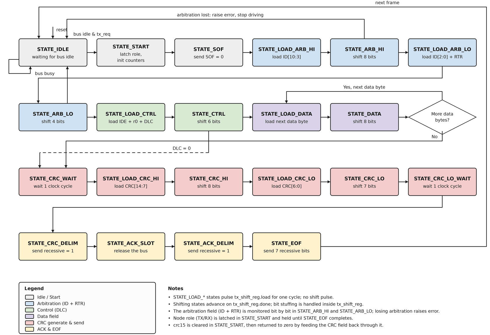

# Appendix A

## Att konstruera `can_controller.vhd` (del 1: sändning)

`can_controller` är det enda block som känner till det faktiska CAN-ramformatet (L10). Den
instansierar `bit_timer`, `crc15`, `tx_shift_reg` och `rx_shift_reg` internt och sekvenserar en hel
ram fält för fält. Den här föreläsningen bygger **sändvägen** (en nod som skickar en komplett ram);
L17 lägger till mottagning och arbitrering. Konstruera sändvägen utifrån kontraktet och
ramuppställningen nedan.

### Gränssnitt

Entiteten och dess femton portar skrevs i L11 och är oförändrade; se
[L11 Appendix A](../../L11/appendix/a_architecture_and_register_map.md) för vad var och en är till
för. Ingenting i den här föreläsningen eller i L17 ändrar dem: hela `can_controller`s sänd- och
mottagarbeteende byggs *innanför* ett gränssnitt som legat fast sedan L11.

Två påminnelser som spelar roll för tillståndsmaskinen nedan:
* `can_controller_tb` binder **positionellt**, så portordningen som fastställdes i L11 är det som
  måste stämma; namnen är era.
* `tx_bus` och `bus_en` hör ihop. Att driva bussen dominant betyder `bus_en = '1'` med
  `tx_bus = '0'`; att släppa den betyder `bus_en = '0'`. En nod driver aldrig recessivt aktivt.

### En nod, två roller
En nod antingen **sänder** sin egen begärda ram eller **tar emot** någon annans, aldrig båda för
samma ram. En registrerad `role` (`'1'` = sänder, `'0'` = tar emot), låst en gång per ram på den
flank som lämnar `STATE_IDLE` för `STATE_START` och hållen tills ramen är slut, avgör vilka av
delblockens portar som spelar roll. Båda vägarna ut ur `STATE_IDLE` kräver **en buss som har legat
ledig**: med det etablerat startar `tx_req = '1'` en sändning (`role = '1'`), och i annat fall
startar ett dominant `rx_bus_s2` (någon annans SOF) en mottagning (`role = '0'`). Följ
`role = '1'`-vägen i den här föreläsningen.

**Varför "en buss som har legat ledig" gör verkligt arbete.** Villkoret förtjänar sin plats två
gånger om, av olika skäl vid vardera ingången.

**Vid mottagaringången** betyder en dominant bit i sig inte att en ram börjar; de flesta bitarna i
de flesta ramar är dominanta. `STATE_IDLE` måste skilja den dominanta bit som *inleder* en ram från
de många dominanta bitarna inuti en, och en nod i `STATE_IDLE` har ingen ramkontext att skilja dem
åt med.

Två frestande regler misslyckas båda:
* **En dominant nivå.** Slår till på vilken dominant bit som helst, så en nod som sitter i
  `STATE_IDLE` medan en annan nod sänder försöker omedelbart "ta emot" en ram som redan är halvvägs
  klar.
* **En flank från recessiv till dominant.** Låter som L10:s beskrivning av SOF, men bitstoppning
  tvingar fram en övergång efter var femte lika bit, så flanker i båda riktningarna, den från
  recessiv till dominant inräknad, förekommer ständigt mitt inne i en ram. Flanktestet slår till
  inom några få bitar från nivåtestet.

Regeln som faktiskt fungerar är en **räkning av recessiva bitperioder**, och dess tröskel kräver ett
steg mer omsorg än stoppbitsregeln ensam. Inuti det stoppade området garanterar L10:s regel ingen
följd längre än fem lika bitar. Men svansen är ostoppad och nästan helt recessiv: en kvitterad ram
slutar med ACK-avgränsaren plus EOF, åtta recessiva bitperioder i rad, och en ram som ingen
kvitterar visar tio (CRC-avgränsare, recessiv ACK-lucka, ACK-avgränsare, EOF). En tröskel på sex
till tio skulle förklara bussen ledig medan en rams egen svans fortfarande passerade över den, och
ett väntande `tx_req` skulle då driva ut SOF över någons sista EOF-bitar. Räkna recessiva
bitperioder i `STATE_IDLE` och kräv **elva**, samma antal som riktig CAN ger en nod som måste bedöma
om bussen är ledig utan någon ramkontext: den kvitterade svansen på åtta plus standardens
intermission på tre bitar, och förbi även den tio bitar långa svansen hos en okvitterad ram. Först
när räkningen är full betyder ett dominant `rx_bus_s2` SOF. Två följder för resten av designen:

* `bit_timer` måste fortsätta gå i `STATE_IDLE`, eftersom räkningen sker i bitperioder.
* Reset måste starta räkningen **full**. En nod som kommer ur reset har ingen anledning att tro att
  en ram pågår, och startade den tom skulle den strunta i den första ramen på bussen.

**Vid sändaringången** svarar samma räkning på en annan fråga: får den här noden börja driva bussen
över huvud taget? Riktig CAN säger att en nod bara får börja sända på en ledig buss, och skälet är
inte artighet. Arbitrering avgör en tvist enbart mellan noder som startade vid *samma* SOF, genom
att jämföra vad var och en sände mot vad bussen läser, bit för bit, ned genom identifieraren. En nod
som startar mitt inne i en ram deltar aldrig i den tävlingen; den driver bara dominanta bitar över
någon annans fält. Ramen som pågår korrumperas, och skadan dyker upp i andra änden som ett
stoppbitsbrott eller ett CRC-fel, utan att något pekar tillbaka på noden som orsakade den. Så
`tx_req` väntar också på räkningen.

Tillsammans håller de här villkoren `error` observerbar. En nod som förlorar arbitreringen (L17)
faller tillbaka till `STATE_IDLE` medan vinnaren fortfarande driver bussen, och `STATE_START`
nollställer `error`. Under någon av de två misslyckade mottagarreglerna ovan skulle den gå in i
`STATE_START` igen inom några få bitperioder och sudda den `error` den just höjt; med sändaringången
ogrindad skulle en anropare som fortfarande håller `tx_req` hög sudda den redan nästa cykel. Att
grinda båda betyder att förloraren väntar, korrekt, på nästa ram, och att en anropare som pollar
`error` då och då fortfarande ser felet.

### Ramen, fält för fält

Diagrammet ritas från samma tillståndsmaskin som det här appendixet går igenom, av
[`images/fsm.py`](./images/fsm.py); ändrar ni tillståndsmaskinen, redigera det skriptet och kör om
det i stället för att rita om för hand.

Varje **stoppat** fält går genom `tx_shift_reg` som en grupp, sänd MSB först. Varje fält får **två**
tillstånd: ett `STATE_LOAD_*` på en cykel som pulsar `tx_shift_reg.load`, och sedan
skifttillståndet som väntar på `tx_shift_reg.done`.

| Tillstånd | Fält | Bitar | Sänt värde | Stoppat |
|--------|-------|-----:|-------------------|:-------:|
| `STATE_START` / `STATE_SOF` | SOF | 1 | dominant `'0'` | ja |
| `STATE_LOAD_ARB_HI` / `STATE_ARB_HI` | ID hög | 8 | `tx_id(10 downto 3)` | ja |
| `STATE_LOAD_ARB_LO` / `STATE_ARB_LO` | ID låg + RTR | 4 | `tx_id(2 downto 0)`, sedan `RTR='0'` | ja |
| `STATE_LOAD_CTRL` / `STATE_CTRL` | Kontroll | 6 | `IDE='0'`, `r0='0'`, sedan 4 bitars `tx_dlc` | ja |
| `STATE_LOAD_DATA` / `STATE_DATA` | Databyte | 8 | aktuell byte, upprepad `DLC` gånger | ja |
| `STATE_CRC_WAIT` | (stabilisering) | 0 | låt `crc15` stabilisera sig, lås sedan in den i `crc_tx` | nej |
| `STATE_LOAD_CRC_HI` / `STATE_CRC_HI` | CRC hög | 8 | `crc_tx(14 downto 7)` | ja |
| `STATE_LOAD_CRC_LO` / `STATE_CRC_LO` | CRC låg | 7 | `crc_tx(6 downto 0)` | ja |
| `STATE_CRC_LO_WAIT` | (stabilisering) | 0 | låt `crc_valid` stabilisera sig (L17 kontrollerar den här) | nej |
| `STATE_CRC_DELIM` | CRC-avgränsare | 1 | recessiv | nej |
| `STATE_ACK_SLOT` | ACK-lucka | 1 | recessiv (mottagaren driver dominant, L17) | nej |
| `STATE_ACK_DELIM` | ACK-avgränsare | 1 | recessiv | nej |
| `STATE_EOF` | EOF | 7 | recessiv | nej |

Noteringar om skiftregistrets laddningar:
* `tx_shift_reg.data` är en `byte_t`, alltid 8 bitar, och sänder de översta `bit_count` av dem
  (L14). En grupp som är smalare än en byte är alltså **vänsterjusterad och nollutfylld** vid
  laddning, och utfyllnaden sänds aldrig. Tabellen ovan namnger varje grupp efter dess riktiga
  bitar; utfyllnaden är mekanisk.
* Kontrollbyten laddas som `"00" & tx_dlc & "00"` med `bit_count = 6`, så de sex sända bitarna är
  de sex översta: `0, 0, DLC[3:0]`.
* Den låga CRC-gruppen laddas som `crc_tx(6 downto 0) & '0'` med `bit_count = 7`.
* Den låga ID-gruppen laddas som `tx_id(2 downto 0) & '0' & "0000"` med `bit_count = 4`: de tre
  återstående bitarna av identifieraren, och sedan den alltid dominanta RTR som avslutar
  arbitreringsfältet.
* Data väljer en byte ur `tx_data` per `data_byte_idx`; loopa `STATE_LOAD_DATA`/`STATE_DATA` en
  gång per byte, `DLC` gånger (hoppa direkt till `STATE_CRC_WAIT` när `DLC = 0`).
* `tx_dlc` över 8 ligger utanför kontraktet: L10:s DLC kodar 0 till 8, och byteloopen går utanför
  `data_byte_idx`s intervall för allt större. Riktiga kontrollrar begränsar kodningarna 9 till 15
  till åtta byte; den här designen kräver helt enkelt att anroparen inte skickar en sådan.

De **ostoppade** avslutande fälten (CRC-avgränsare, ACK-lucka, ACK-avgränsare, EOF) går inte genom
`tx_shift_reg`; de är fasta bitantal som drivs direkt, en bit per `bit_timer.bit_done`, identiskt
för båda rollerna.

### Vad ni lägger till i arkitekturen
`can_controller.vhd` håller redan entiteten (L11), synkroniseraren `meta_prev` (L12) och alla fyra
CAN-delblocksinstanserna med de signaler de kopplas till (L12 till L15). Den håller inget
rambeteende alls. Allt nedan är nytt i den här föreläsningen. Appendixet säger vad maskinen måste
göra; hur det uttrycks i VHDL är ert.

**Tillstånden** är de i fälttabellen ovan: `STATE_IDLE`, `STATE_START`, `STATE_SOF`, ett
`STATE_LOAD_*`-tillstånd och ett skifttillstånd per stoppat fält, de två stabiliseringstillstånden
`STATE_CRC_WAIT` och `STATE_CRC_LO_WAIT`, och de fyra tillstånden i svansen. Tjugoen tillstånd i
en uppräknad typ, med samma mönster som L08.

**Minnet.** Utöver `state` måste maskinen komma ihåg följande mellan klockflankerna. Namnen är de
appendixet använder; att behålla dem får texten och er kod att tala om samma signaler.

| Signal | Håller | Efter reset |
|---|---|---|
| `role` | `'1'` medan noden sänder den här ramen, `'0'` medan den bara tar emot. Låses en gång per ram. | `'0'` |
| `idle_bits` | Antal recessiva bitperioder i rad som setts i `STATE_IDLE`, mättat vid 11 ("En nod, två roller" ovan). | **11**, inte 0 |
| `data_byte_idx` | Numret på den databyte som sänds eller tas emot. | 0 |
| `field_bit_count` | Nedräkningen genom EOF:s sju bitar. | 0 |
| `crc_tx` | Ramens egen CRC, låst i `STATE_CRC_WAIT` ("Att fånga CRC:n" nedan). | nollor |
| `rx_id_acc`, `rx_dlc_acc`, `rx_data_acc` | Ackumulatorerna för den ram som tas emot. | nollor |

De tre ackumulatorerna `rx_*_acc` används inte förrän i L17; att deklarera dem med resten håller
ihop gruppen i stället för att dela den över två föreläsningar.

**Den aktuella databyten** är byte nummer `data_byte_idx` i `tx_data`, räknat från vänster: byte 0
är bitarna 63 downto 56, byte 1 är 55 downto 48, och så vidare. Välj ut den med en konkurrent
tilldelning utanför processerna, så att laddtillståndet för data kan läsa den direkt.

**Vilken process driver vad.** Beteendet delas på två processer: en **kombinatorisk** som driver
delblocken per tillstånd, och en **sekventiell** som för tillståndsmaskinen framåt och uppdaterar
minnet. Uppdelningen är värd att fastställa innan beteendet beskrivs, eftersom varje regel i de två
avsnitten nedan landar i en av dem, och vilken det är ska inte vara någon gåta:

* Den **kombinatoriska** processen driver varje ingång på delblocken (`bt_enable`, `bt_resync`, de
  fyra `txsr_*`-ingångarna, de två `rxsr_*`-ingångarna i L17) och bussparet `tx_bus`/`bus_en`. Ge
  dem alla ett förval högst upp och skriv över per tillstånd, i samma stil som `bit_timer`s egna
  grenar.
* `bt_enable` är `'1'` i **varje** tillstånd, `STATE_IDLE` inräknat, eftersom räkningen i
  `STATE_IDLE` mäts i bitperioder. Porten finns för att `bit_timer` ska kunna hållas, och den här
  designen vill aldrig det; [L12:s kontrollfråga](../../L12/README.md#kontrollfrågor) handlar om
  precis detta.
* `txsr_shift` är `bt_bit_done`, men bara under sändning och bara i **skifttillstånden**, aldrig i
  ett `STATE_LOAD_*`-tillstånd. Det är det som håller L14:s löfte om att "`load` och `shift`
  utesluter varandra": ett laddtillstånd utfärdar en laddning och inget annat.
* Den **sekventiella** processen äger `state` och bokföringen (`role`, `idle_bits`,
  `data_byte_idx`, `field_bit_count`, `crc_tx`, ackumulatorerna `rx_*_acc`) och varje utgångsport på
  registersidan: `tx_done`, `rx_valid`, `error` och `rx_*`-registren. Bussparet förblir
  kombinatoriskt, drivet per tillstånd enligt ovan. `tx_done` och `rx_valid` är pulser på en cykel,
  så ge dem förvalet `'0'` vid varje flank och höj dem där de hör hemma.
* `error` nollställs av `reset_s2_n` såväl som av `STATE_START`. Den är en nivå som en anropare
  pollar, så den måste läsa `'0'` ur reset i stället för vad nu en vippa råkade starta upp som.
* `tx_id`, `tx_dlc` och `tx_data` låses **inte** vid `STATE_START`; laddtillstånden läser dem live,
  vart och ett i det ögonblick dess grupp laddas. Det är en medveten förenkling och den lägger
  skyldigheten på anroparen: håll alla tre stabila från `tx_req` till `tx_done`. Ett registerblock i
  samma klockdomän gör det gratis, och det är precis den anropare L11:s gränssnitt förutsätter.

Avsnitten som följer beskriver sändarhalvan av båda processerna och de konkurrenta tilldelningarna
runt `crc15`. Varje ställe där L17 fyller på något är utpekat, så att inget senare
blir en överraskning, bara en ifyllnad. Läs dem vid sidan av diagrammet ovan.

### Den kombinatoriska processen
Den driver delblockens ingångar och bussparet utifrån `state`, med förvalen först och
överskrivningarna per tillstånd efter. Tre saker att hålla i huvudet innan reglerna. Varje
`STATE_LOAD_*`-tillstånd laddar sin grupp, och det parade skifttillståndet håller samma `bit_count`.
`txsr_shift` är `bt_bit_done` bara i skifttillstånden, aldrig i ett `STATE_LOAD_*`-tillstånd: `load`
presenterar redan den nya gruppens första bit under laddcykeln (L14), så ett dedikerat laddtillstånd
på en cykel är det som håller L14:s löfte om att "`load` och `shift` utesluter varandra"; att få det
här om bakfoten är ramnivåns version av det enbitsfel i tajmingen som L14 varnade för. Och bussen
har öppen dränering: en nod driver bara *aktivt* när biten är dominant, i annat fall släpper den, så
att en annan nod kan dra samma ledning dominant under samma period (mekanismen som L17:s
arbitrering vilar på).

**Förvalen**, satta först varje gång processen körs:

| Signal | Förval | Kommentar |
|---|---|---|
| `bt_enable` | `'1'` | Aldrig hållen; tomgångsräkningen behöver den. |
| `bt_resync` | `'0'` | |
| `txsr_load`, `txsr_shift` | `'0'` | |
| `txsr_data`, `txsr_bit_count` | nollor | |
| `rxsr_enable`, `rxsr_bit_count` | `'0'`, nollor | Mottagarsidan kommer i L17. |
| `tx_bus`, `bus_en` | `'1'`, `'0'` | Bussen släppt, om inget tillstånd driver den dominant. |

**Laddningarna.** Vad varje grupp laddar, och med vilken bredd:

| Tillstånd | `txsr_data` | `txsr_bit_count` |
|---|---|---|
| `STATE_START` | `"00000000"`: SOF, en dominant bit | `"0001"` |
| `STATE_LOAD_ARB_HI` / `STATE_ARB_HI` | `tx_id(10 downto 3)` | `"1000"` |
| `STATE_LOAD_ARB_LO` / `STATE_ARB_LO` | `tx_id(2 downto 0) & '0' & "0000"`: ID låg, sedan RTR | `"0100"` |
| `STATE_LOAD_CTRL` / `STATE_CTRL` | `"00" & tx_dlc & "00"`: IDE, r0, DLC | `"0110"` |
| `STATE_LOAD_DATA` / `STATE_DATA` | den aktuella databyten | `"1000"` |
| `STATE_LOAD_CRC_HI` / `STATE_CRC_HI` | `crc_tx(14 downto 7)` | `"1000"` |
| `STATE_LOAD_CRC_LO` / `STATE_CRC_LO` | `crc_tx(6 downto 0) & '0'` | `"0111"` |

* `txsr_load = '1'` och `txsr_data` enligt tabellen bara i laddtillståndet, alltså `STATE_START`
  eller `STATE_LOAD_*`, och bara när `role = '1'`.
* `txsr_bit_count` enligt tabellen i båda tillstånden i ett par, oavsett roll. I `STATE_START` bara
  när `role = '1'`.
* `STATE_START` driver dessutom `bt_resync = '1'`, i båda rollerna: SOF blir den här nodens
  bitgräns.

**Skiftningen.** När `role = '1'` är `txsr_shift = bt_bit_done` i skifttillstånden `STATE_SOF`,
`STATE_ARB_HI`, `STATE_ARB_LO`, `STATE_CTRL`, `STATE_DATA`, `STATE_CRC_HI` och `STATE_CRC_LO`. I
ett laddtillstånd aldrig, och det är det som håller laddning och skiftning isär.

**Bussen.** `bus_en = '1'` och `tx_bus = '0'` precis när `role = '1'`, `txsr_tx_bit = '0'`, och
`state` är `STATE_SOF` eller något av laddnings- och skifttillstånden från `STATE_LOAD_ARB_HI` till
och med `STATE_CRC_LO`. Varje annat tillstånd släpper bussen. En mottagares enda dominanta bit,
ACK-luckan, kommer i L17.

Avgränsningen till just de tillstånden förtjänar sin egen mening: `txsr_tx_bit` är en nivå och
håller sitt senaste värde i all evighet, så en oavgränsad version fortsätter driva efter den grupp
som producerade den. En ram vars CRC slutar på en dominant bit skulle fortfarande dra ned bussen
genom hela svansen, och en nod som sitter i `STATE_IDLE` med `role` fortfarande `'1'` från sin förra
ram skulle hålla hela bussen dominant för alltid. Svansens fält är recessiva för båda rollerna och
driver ingenting, med det enda undantaget en mottagares ACK-lucka (L17).

**Känslighetslistan.** Processen läser `state`, `role`, `bt_bit_done`, `tx_id`, `tx_dlc`, den
aktuella databyten, `crc_tx` och `txsr_tx_bit`, och var och en av dem måste stå i dess
känslighetslista. Projektet analyseras med `--std=93`, där `process(all)` inte finns, och en signal
som saknas i listan ger en simulering som inte stämmer med den hårdvara syntesen bygger.

### Den sekventiella processen
Den äger `state`, minnet och utgångsportarna på registersidan.

**Reset** (`reset_s2_n = '0'`): `state` blir `STATE_IDLE`, minnet får värdena i tabellen ovan, och
`tx_done`, `rx_valid`, `error`, `rx_id`, `rx_dlc` och `rx_data` nollställs.

**Vid varje stigande flank** går `tx_done` och `rx_valid` först till `'0'`, eftersom de är pulser på
en cykel; `error` är en nivå och håller sitt värde. Sedan gäller reglerna för det tillstånd maskinen
står i.

**`STATE_IDLE`** räknar och väntar:
* Vid varje `bt_sample`: är `rx_bus_s2 = '1'`, räkna upp `idle_bits`, men inte förbi 11; är den
  `'0'`, nollställ `idle_bits`.
* Är `idle_bits` 11: med `tx_req = '1'`, sätt `role` till `'1'` och gå till `STATE_START`; annars,
  med `rx_bus_s2 = '0'`, sätt `role` till `'0'` (någon annans SOF, L17) och gå till `STATE_START`.
  I båda fallen nollställs `idle_bits`, och den nollställningen vinner över räkningen på samma
  flank.

`STATE_IDLE` räknar recessiva bitperioder vid sampelpunkten och mättar vid 11; ett dominant sampel
nollställer räkningen. Ingenting lämnar tillståndet förrän räkningen är **full**, vad `tx_req` och
`rx_bus_s2` än gör, så en `tx_req`-puls som anländer medan bussen är upptagen **förkastas**, den
köas inte; anroparen begär om (L11:s portbeskrivning av `tx_req` säger redan det).

**Resten av ramen.** Tillstånden som är gemensamma för båda rollerna är `STATE_START`,
`STATE_CRC_WAIT` och de fyra i svansen. I alla andra gäller övergångarna nedan bara när
`role = '1'`, och mottagarens villkor fyller L17 i.

| Tillstånd | Går vidare när | Till | Dessutom |
|---|---|---|---|
| `STATE_START` | nästa flank | `STATE_SOF` | `error`, `data_byte_idx` och `rx_data_acc` nollställs |
| `STATE_SOF` | `txsr_done = '1'` | `STATE_LOAD_ARB_HI` | |
| varje `STATE_LOAD_*` | nästa flank | parets skifttillstånd | laddningen utfärdas av den kombinatoriska processen |
| `STATE_ARB_HI` | `txsr_done = '1'` | `STATE_LOAD_ARB_LO` | L17 lägger till arbitreringskontrollen |
| `STATE_ARB_LO` | `txsr_done = '1'` | `STATE_LOAD_CTRL` | L17 lägger till arbitreringskontrollen; RTR är dominant och kan aldrig vara biten som förlorar |
| `STATE_CTRL` | `txsr_done = '1'` | `STATE_CRC_WAIT` om `tx_dlc` är 0, annars `STATE_LOAD_DATA` | |
| `STATE_DATA` | `txsr_done = '1'` | `STATE_CRC_WAIT` om `data_byte_idx + 1` är lika med `tx_dlc` (den sista byten), annars `STATE_LOAD_DATA` | räkna upp `data_byte_idx` när fler byte återstår |
| `STATE_CRC_WAIT` | nästa flank | `STATE_LOAD_CRC_HI` | lås `crc_value` i `crc_tx` |
| `STATE_CRC_HI` | `txsr_done = '1'` | `STATE_LOAD_CRC_LO` | |
| `STATE_CRC_LO` | `txsr_done = '1'` | `STATE_CRC_LO_WAIT` | |
| `STATE_CRC_LO_WAIT` | nästa flank | `STATE_CRC_DELIM` | en klockcykel, inte en bitperiod; mottagaren kontrollerar `crc_valid` här (L17) |
| `STATE_CRC_DELIM` | `bt_bit_done = '1'` | `STATE_ACK_SLOT` | |
| `STATE_ACK_SLOT` | `bt_bit_done = '1'` | `STATE_ACK_DELIM` | sändaren har släppt bussen; en mottagare kvitterar här (L17) |
| `STATE_ACK_DELIM` | `bt_bit_done = '1'` | `STATE_EOF` | sätt `field_bit_count` till 6, EOF:s nedräkning |
| `STATE_EOF` | `bt_bit_done = '1'` med `field_bit_count` 0 | `STATE_IDLE` | pulsa `tx_done` om `role = '1'` (L17 låser `rx_*` här); vid varje tidigare `bt_bit_done`, räkna ned `field_bit_count` |

`STATE_START` behöver inget eget för SOF-laddningen eller resynken, eftersom den kombinatoriska
processen utfärdar båda utifrån tillståndet självt; uppsättning som måste *minnas*, att
nollställa `error`, byteindexet och ackumulatorn för mottagen data, är det som landar här.
`rx_data_acc` behöver nollställningen eftersom en mottagen ram bara skriver de byte dess DLC täcker
(L17): en fembytesram som anländer efter en åttabytesram måste rapportera nollor i byte 5 till 7,
inte den förra ramens
rester. `rx_id_acc` och `rx_dlc_acc` skrivs alltid i sin helhet, så de behöver ingen. (`crc15`
nollställs också av det här tillståndet: "Att nollställa `crc15`" nedan.)

LOAD/skift-paren följer alla samma form: laddtillståndet går vidare efter sin enda cykel, och
skifttillståndet väntar på `tx_shift_reg.done`. En tajmingnotering innan vågformerna överraskar er:
L14 beskrev `load` som att den utfärdas i samma ögonblick som den förra gruppens sista `bit_done`,
och här utfärdas den två klockflanker senare, en för att tillståndsmaskinen ska hinna se `txsr_done`
och en för själva LOAD-tillståndet. Varje grupps första bit når därför ledningen omkring 40 ns in i
sin bitperiod på 1000 ns; sampelpunkten vid 70 % absorberar det med marginal, och förskjutningen
ackumuleras inte, eftersom varje grupp startar om från samma `bit_done`.

`STATE_CRC_WAIT` är en tom cykel så att den sista databiten hinner integreras klart innan
`crc_value` läses, och dess verkliga uppgift är låsningen: båda CRC-grupperna laddas från `crc_tx`,
aldrig från den levande motorn ("Att fånga CRC:n" nedan förklarar vad som går fel annars).

I svansen bugar skiftregistret och går, och tillståndsmaskinen räknar själv `bt_bit_done`-pulser.
`STATE_CRC_LO_WAIT` är en klockcykel för en sändare, **inte** en bitperiod: `tx_shift_reg.done`
pulsar vid den avslutande skiftningen, som själv är ett `bit_done`, så sändaren står redan på en
bitgräns och svansen kan börja omedelbart; att vänta en hel period skulle trycka ut en extra
recessiv bit på ledningen. (En mottagare väntar *däremot* ett helt `bit_done` här, och kontrollerar
`crc_valid` medan den väntar; L17.)

Svansens tillstånd behöver inget `role`-test för att gå vidare, eftersom båda rollerna räknar samma
hela bitperioder genom samma fält; bara det som händer *inuti* dem skiljer sig, och de skillnaderna
är alla L17:s.

### Att fånga CRC:n
`STATE_CRC_WAIT` låser `crc_value` i `crc_tx`, och båda CRC-grupperna laddas från `crc_tx` snarare
än från motorn. Den omvägen ser överflödig ut och är det inte, av ett skäl värt att följa noga,
eftersom det är det enda stället i den här designen där två regler som var för sig är korrekta
tillsammans bildar en bugg.

Regel ett: motorn fortsätter gå genom CRC-fältet, eftersom det är det som återför den till noll
("Att mata `crc15`" nedan). Regel två: varje grupp laddas när dess `STATE_LOAD_*`-tillstånd körs.

Sätt nu ihop dem. `STATE_LOAD_CRC_HI` körs först och läser rätt värde. Sedan skiftar `STATE_CRC_HI`
ut åtta bitar, och var och en av dem går tillbaka in i motorn, som pliktskyldigt för registret
vidare. När `STATE_LOAD_CRC_LO` väl körs är `crc_value` **inte längre ramens CRC**: det är registret
åtta bitar längre fram, vilket för en korrekt ram betyder de återstående sju CRC-bitarna
uppskiftade med nollor inskiftade under dem. Ladda `crc_value(6 downto 0)` där, och ramens sista sju
CRC-bitar går ut som sju nollor, i varje ram, alltid.

Felet är tyst på värsta tänkbara sätt. Sändaren är fullkomligt nöjd; ingenting den kan se är fel.
Mottagarens motor når inte noll, så den rapporterar ett CRC-fel, och det uppenbara stället att leta
på är mottagarvägen, vilket är helt i sin ordning. Att låsa värdet en gång, i det ögonblick det är
färdigt och innan något annat rör motorn, tar bort samspelet helt.

### Att mata `crc15`
`crc15` måste se varje riktig bit från SOF till och med slutet av **CRC-fältet**, och inga andra.
Grinda dess enable på `tx_shift_reg.bit_valid` (`'0'` vid varje grupps avslutande skiftning, så att
den oförändrade biten inte matas in två gånger), och stäng ute stoppbitarna och mottagarvägen. Som
regel, skriven som två konkurrenta tilldelningar utanför processerna:

* `crc_enable` är `'1'` precis när `txsr_bit_valid = '1'`, `txsr_stuff = '0'` och `role = '1'`.
* `crc_data_in` är `txsr_tx_bit`.

Tre saker följer av att regeln inte har något villkor på tillståndet.

**CRC-fältet matas tillbaka in i motorn, och det är avsiktligt.** Värdet som sänds ligger tryggt i
`crc_tx`, så ingenting behöver läsa motorn igen när `STATE_CRC_WAIT` väl fångat det, och regeln har
inget villkor på tillståndet som skulle stoppa matningen vid datafältet. På sändarsidan är
återmatningen bara harmlös: L13:s egenskap generera-och-sedan-kontrollera betyder att ett meddelande
följt av sin egen CRC återför registret till noll, och `STATE_START`s nollställning ("Att nollställa
`crc15`" nedan) lämnar hur som helst över en fräsch motor till nästa ram. Där återmatningen
förtjänar sin plats är på **mottagarsidan**: L17:s CRC-kontroll *är* observationen att registret
återvänt till noll när det mottagna CRC-fältet gått in, och den observationen finns bara därför att
CRC-fältet matas tillbaka. En regel för båda rollerna, varje riktig bit från SOF till och med slutet
av CRC-fältet, är det som låter en enda motor generera på en nod medan den kontrollerar på en annan.

**Svansen utesluter sig själv.** CRC-avgränsare, ACK-lucka, ACK-avgränsare och EOF går aldrig genom
`tx_shift_reg` alls, så `txsr_bit_valid` är redan låg över allihop. Inget villkor på tillståndet
behövs för att hålla dem utanför checksumman.

**`role` är platshållaren för mottagarsidan.** Med `role = '0'` håller regeln `crc15` avstängd,
vilket är korrekt för L16 (bara sändning) men inte för den färdiga kontrollern. L17 ersätter regeln
med en som matar `rx_shift_reg.real_bit` på `rx_shift_reg.real_bit_valid` under mottagning;
sändarhalvan är oförändrad av det.

### Att nollställa `crc15`
Ännu en konkurrent tilldelning, och det är den som gör motorn säker att återanvända ram efter ram:
`crc_clear` är `'1'` medan tillståndsmaskinen står i `STATE_START`, och `'0'` annars.

På den lyckliga vägen gör den ingenting alls, eftersom en ram som körs hela vägen redan har återfört
registret till noll. Den finns där för de ramar som *inte* blir klara. L17 ger den här noden tre
sätt att överge en ram halvvägs (den förlorar arbitreringen, den ser ett stoppbitsbrott, dess
CRC-kontroll misslyckas), och vart och ett lämnar motorn med ett halvfärdigt värde och ingen utsikt
att någonsin nå noll av sig själv. Varje ram noden sänder därefter skulle bära en CRC beräknad ur
den resten, och varje ram den tog emot skulle underkännas i kontrollen, tills någon tryckte på
reset.

Två saker är värda att lägga märke till. `STATE_START` är rätt hem för den eftersom det redan är
tillståndet "sätt upp den här ramen", vid sidan av att nollställa `error` och byteindexet;
nollställningen hör hemma där snarare än bland CRC-tillstånden. Och `can_controller_tb` kan inte
fånga en utebliven nollställning, eftersom ingen av dess två scenarier låter en nod sända igen efter
ett avbrott. Det gör det här till en regel att få rätt genom resonemang snarare än genom att vänta
på en röd testbänk, samma lärdom som `crc_tx` gav i "Att fånga CRC:n": de tysta felen är de man ska
resonera sig fram till i förväg.

---

### Vad som kommer härnäst
L17 färdigställer `can_controller`: mottagarrollen (tajmingen för `rx_shift_reg`s enable och den
enda cykelns föregripande) och detekteringen av förlorad arbitrering, varefter `can_controller_tb`
körs för första gången. L19 tar sedan isär den testbänken, kapslar in designen för kortet och gör
bring-up på DE0-CV.

---

