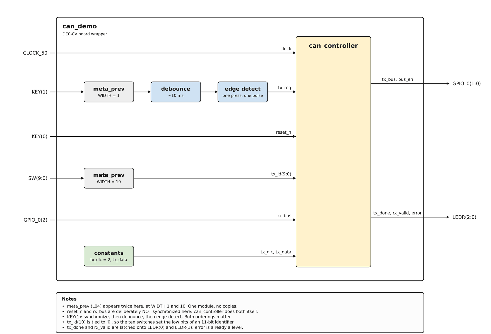

# Appendix B

## Att konstruera `can_spi_node.vhd` (projektets toppnivå)
`can_controller` är **inte** den entitet som ska upp på kortet, och det är värt att vara precis
med. Dess gränssnitt ligger på registernivå: `tx_id` är 11 bitar, `tx_dlc` 4, `tx_data` 64, plus
`tx_req` och fem statusutgångar. Ingenting på ett DE0-CV erbjuder ett så brett gränssnitt, och i
det färdiga systemet kommer de ingångarna från drivrutinens register snarare än från en mänsklig
hand.

L18 byggde lagret som gör dem nåbara - `register_bank`, som gör om pulser till pollbara nivåer -
och det här passet bygger transporten framför det. Den sista modul projektet bygger är alltså
`can_spi_node.vhd`: toppnivån som binder ihop `spi_slave`, `spi_reg_bridge`, `register_bank` och
`can_controller` till en nod, och exponerar exakt två saker mot omvärlden, SPI och CAN-bussen.

Till skillnad från varje annan modul i projektet kommer den utan egen testbänk, och det är
avsiktligt: varje block inuti den har redan en, och det som återstår - pinnar, kopplingar och
spänningsnivåer - är precis det en simulering inte kan modellera. Kortet är dess testbänk, och
bring-up-stegen nedan är hur man läser den.

---

### Gränssnitt

| Port | Riktning | Typ | Betydelse |
|------|-----|------|---------|
| `clock` | in | `std_logic` | 50 MHz-oscillatorn på kortet (`CLOCK_50`). Konstruktionens enda klocka. |
| `reset_n` | in | `std_logic` | Rå, aktiv låg reset, direkt från en pinne. Asynkron; den här nivån synkroniserar den. |
| `sclk` | in | `std_logic` | SPI-klockan från mastern. Används aldrig som klocka; se L18. |
| `mosi` | in | `std_logic` | Ut från mastern, in i slaven. |
| `ss` | in | `std_logic` | Chip select, aktiv låg. Ramar in transaktionen. |
| `miso` | out | `std_logic` | Ut från slaven, in i mastern. |
| `rx_bus` | in | `std_logic` | CAN-bussens nivå, direkt från pinnen och asynkron. `can_controller` synkroniserar den själv. |
| `tx_bus` | out | `std_logic` | Biten den här noden vill driva. |
| `bus_en` | out | `std_logic` | Om den driver över huvud taget. |

De tre bussportarna är det gränssnitt på digitalsidan som en riktig CAN-transceiver presenterar
(L10), och det är därför de lämnar konstruktionen som tre separata signaler i stället för en
ledning. Att göra en enda fysisk ledning av dem är ett jobb på kortnivå, och nästa avsnitt handlar
om det.

Det finns inga generics. Allt konstruktionen behöver som en pinne inte kan leverera är antingen en
konstant i `can_def` eller ett register som drivrutinen skriver.

---

### Beteende: strukturellt, och det är poängen
`can_spi_node` har ingen tillståndsmaskin, ingen protokollkunskap och nästan ingen logik alls. Den
har exakt tre uppgifter:

* **Instansiera de fyra blocken och koppla dem på rad.** `spi_slave` gör om SCK/MOSI/SS till
  bytes; `spi_reg_bridge` gör om bytes till registeråtkomster; `register_bank` gör om
  registeråtkomster till signaler på kontrollernivå; `can_controller` gör om dem till en ram. Varje
  gräns är ett av de kontrakt som redan verifierats av en utdelad testbänk, så om kedjan beter sig
  illa sitter felet i en koppling här, inte i ett block.
* **Synkronisera reseten.** En enda `meta_prev`-instans tar den råa `reset_n` och producerar den
  `reset_s2_n` som varje delblock tar. `can_controller` är undantaget som bekräftar regeln: den
  äger sin resetsynkroniserare internt, vid sidan av den för `rx_bus`, så den här nivån matar den
  med den råa `reset_n` och synkroniserar bara åt blocken på SPI-sidan. Det ger tre
  `meta_prev`-instanser i hela konstruktionen - två inuti `can_controller`, en här.
* **Låt portarna mot kontrollern gå rakt över.** `register_bank`s
  `tx_id`/`tx_dlc`/`tx_data`/`tx_req` till `can_controller`, och dess
  `tx_done`/`rx_id`/`rx_dlc`/`rx_data`/`rx_valid`/`error` tillbaka. Port till port, ingenting
  emellan. L18 konstruerade de två gränssnitten så att de speglar varandra just för att det ska
  stämma.

Om en regel i den här filen någonsin behöver nämna ett CAN-fält eller en SPI-byte hör den hemma i
en annan fil. Det är testet att tillämpa medan ni skriver den.

---

### Att få ut bussen på en ledning
`tx_bus` och `bus_en` är ett *par*, inte en signal: konstruktionen säger "driv dominant", "släpp",
aldrig "driv recessivt". Två noders push-pull-utgångar knutna till en ledning skulle slåss med
varandra i samma ögonblick som den ena drev låg och den andra hög. Två sätt att få den delade
ledningen att uppföra sig:

**Med en transceiver**, vilket är vad en riktig nod använder: `tx_bus` går till dess TXD, dess RXD
kommer tillbaka som `rx_bus`, och transceivern sköter arbetet med öppen dränering analogt.

**Utan en**, med två DE0-CV kopplade direkt ihop för tvånodsdemot, gör FPGA:ns egen I/O jobbet.
Välj en GPIO-pinne och driv den med öppen dränering:

```vhdl
GPIO_0(2) <= '0' when ((bus_en = '1') and (tx_bus = '0')) else 'Z';
rx_bus    <= GPIO_0(2);
```

med en pull-up som återställer `'1'` medan varje nod släppt ledningen - FPGA:ns svaga pull-up
aktiverad på den pinnen i Pin Planner, eller ett externt motstånd. Det är L10:s wired-AND-regel
gjord fysisk, i en enda konkurrent tilldelning. `GPIO_0(0)` och `GPIO_0(1)` är värda att driva med
`tx_bus` och `bus_en` oregistrerade också, enbart för att en logikanalysator ska kunna se vad noden
*avsåg* vid sidan av vad ledningen faktiskt gjorde; varje oanvänt index drivs `'Z'`.

Ingenting här synkroniseras, av samma skäl som `reset_n` inte synkroniseras innan den når
`can_controller`: kontrollern äger sina egna asynkrona ingångar, så pinnen dras rakt till porten
`rx_bus`.

Pinnindexen är en bekvämlighet i Pin Planner, inte ett krav. Vilka tre pinnar som helst på listen
fungerar, så länge två ihopkopplade kort är överens; se
[Quartus-flödet](../../../info/quartus_workflow.md), avsnitt 5.

---

### Valfritt: en wrapper på kortnivå för felsökning
Allt ovanstående går bara att nå över SPI, vilket betyder att när länken inte fungerar har ni ingen
möjlighet att se in i den. En liten wrapper med knappar och lysdioder, som står bredvid
`can_spi_node` i stället för att ersätta den, är värd en timme om bring-upen kör fast - och de tre
beslut den tvingar fram är värda att förstå oavsett om ni bygger den eller inte.

Wrappern driver `register_bank`s portar direkt från `KEY` och `SW` och låser dess statusutgångar på
`LEDR`:



* **En hållen knapp måste bli en encykelspuls**, och inte bara för snygghetens skull. En knapp som
  hålls i några millisekunder är hundratusentals klockcykler vid 50 MHz. Mata in det rakt i
  `tx_req` så startar kontrollern en ny ram i samma ögonblick som den förra tar slut, om och om
  igen - och varje passage genom starttillståndet suddar `error` innan något hunnit läsa det.
  Alltså: **synkronisera** den råa pinnen med en `meta_prev`, **studsfiltrera** den synkroniserade
  nivån med en räknare som accepterar ett nytt värde först när det legat kvar i ungefär 10 ms, och
  **därefter** flankdetektera den. Alla tre, i den ordningen: att flankdetektera före
  studsfiltreringen ger en puls per studs, och att studsfiltrera före synkroniseringen matar
  räknaren med en signal som aldrig samplats säkert. Det här är samma konvertering som
  `register_bank` utför för `TX_SEND` (L18), och det är därför banken gör wrappern valfri snarare
  än nödvändig.
* **En omkopplarbank är bedömningsfrågan.** Tio omkopplare som korsar in i klockdomänen
  synkroniseras bit för bit, vilket tar bort metastabiliteten men inte *skevheten*: två omkopplare
  som slås om samtidigt kan landa en klocka isär, så `tx_id` skulle kortvarigt kunna läsa ett värde
  som aldrig stod på omkopplarna. Det är acceptabelt bara därför att en människa ställer in dem och
  sedan låter dem vara. Koppla samma tio bitar till något som ändras varje cykel och en
  bit-för-bit-synkroniserare är helt fel verktyg - då krävs en handskakning, eller en kodning där
  bara en bit ändras i taget. Värt att säga rakt ut, eftersom "bredda bara synkroniseraren" är en
  vana som förr eller senare biter ifrån. L12 appendix A gör samma poäng om `meta_prev`s
  bredd-generic.
* **Statuslysdioder behöver låsas**, eftersom `tx_done` och `rx_valid` är pulser på 20 ns. Det är
  samma problem som `register_bank` löser åt drivrutinen, och att lösa det två gånger på två
  ställen är precis så de två kopiorna glider isär - så driv lysdioderna från bankens STATUS-bitar
  i stället för från kontrollerns pulser, så förblir wrappern en wrapper.

---

### Bring-up på DE0-CV:n
Korten är utdelade, så ingenting här kräver att ni äger ett. Bring-upen demonstreras på två DE0-CV
och lämnas sedan över så att ni får ta ett varv, och konstruktionen som läggs in är den
`can_spi_node` ni byggt.

* När konstruktionen passerar simuleringen fullt ut
  ([Appendix A](./a_system_verification.md)s systemtestbänk med två noder), syntetisera och
  programmera `can_spi_node`: New Project Wizard, enheten `5CEBA4F23C7N`, Pin Planner, Compile,
  Programmer. Stegen står i [`info/quartus_workflow.md`](../../../info/quartus_workflow.md), som är
  den auktoritativa referensen för det här flödet, ända ner till tillägget för Cyclone V-enheter
  och till att få USB-Blastern synlig för Programmer - läs dess avsnitt 8b innan ni kopplar in
  något, och notera att `CLOCK_50` är den enda pinne ni inte får välja fritt.
* Båda halvorna av bring-upen, CAN-sidan mellan två kort och SPI-sidan mot hatten, står som åtta
  steg i [föreläsningens README](../README.md). De är ordnade så att vart och ett utesluter en
  felklass innan nästa beror på den. Ta dem i ordning, och motstå frestelsen att hoppa till
  steg 8.
* En sak om SPI-kopplingen är värd att förstå innan ni rör den: den behöver ingen
  nivåomvandlare, eftersom `PORTC` matas från `VDDIO2` som ligger på kortets 3,3 V. Varje
  nivå FPGA:n ser är då en nivå den är specificerad för, och de 3,3 V FPGA:n driver tillbaka läses
  mot en 3,3 V-tröskel i stället för en 5 V-tröskel. Hade SPI0 legat kvar på sin förvalda mux,
  `PA4`-`PA7` i `VDD`-domänen, hade 5 V gått rakt in i en ingång som inte är 5 V-tolerant - en
  koppling som ofta ser ut att fungera, och som ibland förstör pinnen, banken eller båda.
* Finns en fysisk breakout med CAN-transceiver är kopplingen `tx_bus` (`GPIO_0(0)`) till
  transceiverns TXD, dess RXD tillbaka till `rx_bus`, och dess standby- eller lägespinne (STB, RS
  eller S, enligt databladet) bunden till normalläge; den är *inte* en enable per bit och kan inte
  växlas i bittakt. Lägg märke till att `bus_en` går ingenstans: en transceivers TXD är redan i
  praktiken öppen dränering (låg driver dominant, hög släpper), så enable-halvan av paret
  absorberas av transceivern, och eftersom L16 driver `tx_bus` recessivt så fort `bus_en` är låg
  förloras ingenting på att bara koppla TXD.
* Utan transceiver är ett ensamt kort vars busslinje inte bär annat än pull-upen redan en
  loopback: drivningen med öppen dränering ovan gör att noden läser tillbaka exakt den nivå den
  driver. Det räcker för att se en fullständig ram på riktiga pinnar, med `tx_bus`/`bus_en` som
  växlar fält för fält på en logikanalysator via `GPIO_0(0)`/`GPIO_0(1)`, sedan `tx_done` som
  pulsar vid slutet av EOF, och `error` som aldrig går hög.
* En loopback är också där L12:s sampelpunkt på 70 % i tysthet gör rätt för sig. Nodens egen signal
  tar nu en riktig rundtur, ut genom en pad, längs ledningen, in igen, och genom
  `rx_bus`-synkroniserarens två vippor, till en kostnad av en handfull klockcykler. Med
  `TICKS_PER_BIT = 50` och `SAMPLE_TICK = 35` läser noden bussen 35 ticker in i en bit den började
  driva vid tick 0, så dess eget eko har sedan länge stabiliserat sig och arbitreringsövervakningen
  läser aldrig fel på det. Att sampla vid bitperiodens *början* skulle i stället läsa ekot av biten
  före, och arbitreringsövervakningen (sänd recessivt, läs dominant, L17) skulle rapportera en
  falsk förlust vid den första recessiva bit som följer på en dominant.
* En loopback kan medvetet inte visa noden *ta emot* den ramen. `can_controller` låser
  `role = '1'` för hela ramen och `rx_shift_reg` går bara medan `role = '0'` (L17), så en sändare
  avkodar aldrig sin egen trafik; det är precis därför systemtestbänken behöver två noder. Att ta
  emot på hårdvara kräver en andra nod, och det är därför passet använder **två kort**: deras
  busslinjer på `GPIO_0(2)` knutna ihop till en ledning (plus gemensam jord), där drivningen med
  öppen dränering ovan gör den delade ledningen till ett wired-AND precis som uttrycket `bus_line`
  i `can_controller_tb` modellerar det. Tryck på `KEY(1)` på det ena kortet och `LEDR(1)` tänds på
  det andra.
* **Det andra kortet sluter den lucka [Appendix A](./a_system_verification.md) kallar den största.**
  Testbänkens två noder delar en `clock`: `resync` fasriktar dem fortfarande vid varje SOF, men
  deras timrar kan aldrig *driva isär* mitt i ramen. Två kort har två kristaller, som går på 50 MHz
  bara inom den tolerans komponenterna är specificerade till, så deras bitperioder skiljer sig
  verkligen åt, och mottagaren frikör på sin egen timer resten av ramen - ett femtiotal bitar för
  en tvåbytesram - efter sin enda `resync` vid SOF. Ärlig aritmetik håller förväntningarna i
  schack: vid typiska
  kristalltoleranser på några tiotals ppm är driften över en ram en liten bråkdel av en tick, så
  det demot synligt bevisar är att hela kedjan fungerar över genuint oberoende klockor från en
  godtycklig startfas; hur mycket drift konstruktionen skulle tåla innan sampelpunkten vandrar av
  biten är beräkningen i Appendix C övning 5(d).

---

### Hur produktionsklara CAN-kontrollrar går längre
Den här kursens kontroller är medvetet förenklad: en undervisningskonstruktion snarare än en
certifierbar. Anmärkningsvärda luckor, värda att namnge uttryckligen:
* **Bara standardramar med data:** ledningsformatet är en bit-exakt standard-CAN-dataram, RTR
  inräknad, men det finns inga 29-bitars utökade identifierare (mottagaren kontrollerar inte ens
  IDE, så en utökad ram skulle tolkas fel tills dess CRC-kontroll misslyckas, L17), och en fjärrram
  (en recessiv RTR) avvisas med `error` i stället för att besvaras med de begärda data.
* **Inga felramar och ingen återhämtning från bus-off:** en riktig CAN-nod räknar sändnings- och
  mottagningsfel och går in i alltmer begränsade tillstånd (error-passive, bus-off) för att skydda
  en frisk buss från en trasig nod; den här kursens `can_controller` avbryter bara den pågående
  ramen lokalt.
* **Ingen detektering av bit- eller formfel:** den här sändaren jämför vad den sände mot vad bussen
  läste bara under arbitreringen (L17). En riktig kontroller övervakar varje bit den sänder,
  flaggar för ett bitfel i samma ögonblick som bussen säger emot utanför arbitreringsfältet och
  ACK-luckan, och kontrollerar vid mottagning att svansens fasta fält har sina föreskrivna värden.
* **Ingen omsändning vid uteblivet kvitto:** en riktig kontroller försöker om automatiskt. Den här
  konstruktionen märker inte ens saken, eftersom sändaren aldrig läser tillbaka ACK-luckan.
* **Ingen acceptansfiltrering och ingen mottagningsbuffring:** varje ram på bussen landar i samma
  enda uppsättning `rx_*`-portar, och en andra ram som anländer innan drivrutinen läst den första
  skriver helt enkelt över den. Produktionsklara kontrollrar erbjuder identifierarfilter i hårdvara
  och en mottagnings-FIFO eller en uppsättning brevlådor. Det här är den lucka parallellklassens
  drivrutin känner mest direkt, och L18 appendix A visar exakt var den blir synlig på registernivå.
* **En fast modell för bittajmingen:** den här kursen samplar vid en fast punkt på 70 %;
  produktionsklara kontrollrar exponerar konfigurerbara propagerings- och fassegment och en
  synchronization jump width, avstämda efter busslängd och antal noder.
* **En avbruten mottagning (efter förlorad arbitrering) kastas helt enkelt**, i stället för att
  sömlöst fortsätta ta emot den ram som vann; en riktig nod fortsätter ta emot oavsett vem som vann
  bussen. Den här konstruktionens nod väntar ut resten av ramen i `STATE_IDLE` (L16:s regel om
  ledig buss) och tar vid från nästa.
* **En förenklad regel om ledig buss:** den här konstruktionen kräver elva recessiva bitperioder,
  samma antal som riktig CAN begär av en nod som ansluter sig till busstrafiken, innan någon nod
  får lämna `STATE_IDLE`. Riktig CAN är mer finkornig: en nod som just deltagit i en ram får sända
  igen redan efter den 3-bitars intermission som följer på EOF, och en nod som varit bus-off väntar
  in 128 förekomster av elva recessiva bitar innan den får ansluta sig igen.

---

### Registerkartan i sammanfattning
Varje port på registersidan av `can_controller` motsvarar ett register som parallellklassens
C++-drivrutin läser eller skriver; de återstående fem (`clock`, `reset_n` och de tre bussignalerna)
är fysiska och ingen drivrutin ser dem någonsin. Motsvarigheten är inte längre en plan, som den var
när L11 först ritade den här tabellen - `register_bank` (L18) är modulen som förverkligar den, så
läs högerkolumnen som "registret banken presenterar vid det indexet":

| `can_controller`-port             | Register i kartan                    |
|-----------------------------------|--------------------------------------|
| `tx_id`, `tx_dlc`, `tx_data`       | `TX_ID`, `TX_DLC`, `TX_DATA_LO`/`HI`  |
| `tx_req`, `tx_done`                | `TX_SEND`, en bit i `STATUS`         |
| `rx_id`, `rx_dlc`, `rx_data`       | `RX_ID`, `RX_DLC`, `RX_DATA_LO`/`HI`  |
| `rx_valid`                          | en bit i `STATUS`, nollställd via `RX_ACK` |
| `error`                             | `ERROR_FLAGS`                        |

Den motsvarigheten är där drivrutinsarbetet börjar: allt parallellklassen skriver mot står i
[registerkartan](../../../project/register_map.md), och ingenting i den här konstruktionens VHDL.

---

### Konstruktionen, sedd i backspegeln
Varje föreläsning från L10 och framåt lade till exakt ett ansvar, aldrig duplicerat någon
annanstans:

| Block | Äger | Byggt i |
|---|---|---|
| `can_def` | Delade konstanter och subtyper som varje annat block är överens om | L10 |
| `meta_prev` | Att få en asynkron signal säkert in i den här klockdomänen, utan någon aning om vad signalen betyder | L12 |
| `bit_timer` | *När* det ska samplas eller skiftas, utan någon aning om vad som sänds | L12 |
| `crc15` | Beräkningen av CRC-15, en bit i taget, utan någon aning om vad en "ram" är | L13 |
| `tx_shift_reg`/`rx_shift_reg` | Bitstoppning och avstoppning, utan någon aning om vad ett ID eller en databyte är | L14-L15 |
| `can_controller` | Det enda block som känner till det faktiska CAN-ramformatet, arbitreringen inräknad | L11 (portar), L16-L17 (beteende) |
| `register_bank` | Pulser till pollbara nivåer, och registerkartans semantik; ingen aning om vad SPI eller CAN är | L18 |
| `spi_slave` | Bytes av en seriell ledning, säkert in i 50 MHz-domänen; ingen aning om vad ett register är | utdelad, läses i L18 |
| `spi_reg_bridge` | Fembytestransaktionen; ingen aning om vad något enskilt register betyder | L19 |
| `can_spi_node` | Kopplingarna, och pinnarna bussen bor på. Ingen egen logik | L19 |

Det är hela noden: fyra små block med ett ansvar var och ett delat paket komponerade inuti
`can_controller`, och sedan tre lager till framför den, där vart och ett bara känner till det under
sig. `can_spi_node` står utanför dem alla, eftersom att anpassa sig till ett visst kort är en annan
sak än att tala CAN, eller SPI, eller register.

Läs tabellen uppifrån och ned så är den också en lista över vad som skulle behöva ändras för att nå
ett annat system. Byt ut `spi_slave` och `spi_reg_bridge` mot ett I2C-par så är allt under dem
orört. Byt ut `can_controller` mot en annan protokollmotor så flyttar registerkartan men inte
transporten. Det är vad gränserna köpte.

---

